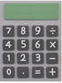

# Conteúdo do Curso de Python

## 🔜 ❎ **Seção 1 - Informações e avisos importantes + Boas vindas**

___

 ❎ 1 - Informações e avisos importantes + Boas vindas

❎ 2 - Assista antes de prosseguir com as aulas (atualizando 20/12/2022)
___

## 🔜 ❎ **Seção 2 - Python + VS Code: Preparando meu ambiente de desenvolvimento**

___

❎ 3 - Introdução a seção

❎ 4 - Ubuntu 22 - Instalação básica do Python e o VS Code

```bash
sudo apt update -y
sudo apt upgrade -y
sudo apt install git curl build-essential -y
sudo apt install gcc make default-libmysql client-dev libssl-dev -y
sudo apt install python3.10-full python3.10-dev -y

cd Area de Trabalho
mkdir projeto
cd projeto
ls
python --version
python3 --version
python3 -V
python3 -m venv venv
source venv/bin/activate
python -v
which python
python -m pip install pip --update
# baixar o instalador do Vs Code no site da microsoft
sudo dpkg -i nome do arquivo
rm -E projeto
```

❎ 5 - Ubuntu 22 - Instalação Completa do Python e do VS Code (``pyenv`` e zsh)

```bash
# Executar comandos a seguir para atualizar os pacotes

sudo apt update -y
sudo apt upgrade -y

# Só o Python

sudo apt install python3.10-full python3.10-dev -y

# Instalar pacotes a seguir

sudo apt install git curl build-essential dkms perl wget -y
sudo apt install gcc make default-libmysqlclient-dev libssl-dev -y
sudo apt install -y zlib1g-dev libbz2-dev libreadline-dev libsqlite3-dev llvm \
libncurses5-dev libncursesw5-dev \
xz-utils tk-dev libffi-dev liblzma-dev python3-openssl git

# Pyenv

curl -L <https://github.com/pyenv/pyenv-installer/raw/master/bin/pyenv-installer> | bash

# Seguir instruções do Pyenv

# Baixar e instalar VS Code: <https://code.visualstudio.com/download>

# Abaixo tudo é opcional

# Instalar e configurar ZSH

sudo apt install zsh -y
chsh -s /bin/zsh
zsh

# Instalar Oh-my-zsh! -> <https://ohmyz.sh/>

sh -c "$(curl -fsSL <https://raw.github.com/ohmyzsh/ohmyzsh/master/tools/install.sh>)"

# Instalar Spaceship Prompt

# <https://github.com/spaceship-prompt/spaceship-prompt>

git clone <https://github.com/spaceship-prompt/spaceship-prompt.git> "$ZSH_CUSTOM/themes/spaceship-prompt" --depth=1
ln -s "$ZSH_CUSTOM/themes/spaceship-prompt/spaceship.zsh-theme" "$ZSH_CUSTOM/themes/spaceship.zsh-theme"

# Mudar ~/.zshrc -> ZSH_THEME="spaceship"

# Instalar Zsh Autosuggestions

# <https://github.com/zsh-users/zsh-autosuggestions>

git clone <https://github.com/zsh-users/zsh-autosuggestions> ${ZSH_CUSTOM:-~/.oh-my-zsh/custom}/plugins/zsh-autosuggestions

# Instalar Zsh Syntax Highlighting

# <https://github.com/zsh-users/zsh-syntax-highlighting>

git clone <https://github.com/zsh-users/zsh-syntax-highlighting.git> ${ZSH_CUSTOM:-~/.oh-my-zsh/custom}/plugins/zsh-syntax-highlighting

# Mudar plugins

# plugins=(git zsh-autosuggestions zsh-syntax-highlighting)

# Font optional (<https://github.com/pdf/ubuntu-mono-powerline-ttf>)

mkdir -p ~/.fonts
git clone <https://github.com/pdf/ubuntu-mono-powerline-ttf.git> ~/.fonts/ubuntu-mono-powerline-ttf
fc-cache -vf
```

❎ 6 - Windows 11 - Instalando o Python e o VS Code

❎ 7 - macOS - Instalando o Python e o VS Code

```bash
/bin/bash -c "$(curl -fsSL https://raw.githubusercontent.com/Homebrew/install/HEAD/install.sh)"
```

❎ 8 - Para iniciantes: sobre as próximas aulas de configurações e instalações

❎ 9 - Para iniciantes: configurações VS Code (Parte 1)

❎ 10 - Para iniciantes: configurações VS Code (Parte 2)

❎ 11 - Para iniciantes: configurações VS Code (Parte 3)

❎ 12 - Para iniciantes: VS Code em Linux e Mac OS (assista mesmo se estiver em Windows)

___

## 🔜 ❎ **Seção 3 Iniciando na programação com Python (Lógica de programação básica)**

___

❎ 13 - o que vamos aprender? Devo seguir essa seção?

❎ 14 - Me ajude a produzir conteúdo gratis

❎ 15 - Criando meu primeiro módulo Python(*.py)

❎ 16 - o interpretador do Python + comentários de código

```python

"""
DocString
E escrever o que eu
quiser
asdfasdfd
"""

''' Usar para escrever suas notas '''

# Permite escrever um comentário

print(123)  # Na frente

# Abaixo

print(456)
```

❎ 17 - Docstring como comentários

🎀  Conectado a aula anterior

❎  17.1 - Teste 1 - Sobre cometários [Questionário 1](https://mastercredd.github.io/Curso_de_Python_do_Basico_Ao_Avancado/question/#perguntas-teste-1)

❎ 18 - A função ``print``

```python

print(12, 34, 1011, sep="", end='#')
print(56, 78, sep='-', end='\n')
print(9, 10, sep='-', end='\n')
```

❎ 19 - Tipo ``str`` (``string``) - Introdução aos tipos de dados

```python

"""
DocString
Python = Linguagem de programação
Tipo de tipagem = Dinâmica / Forte
str -> string -> texto
Strings são textos que estão dentro de aspas
"""

print(1234)

# Aspas simples
print('Luiz Otávio')
print(1, 'Luiz "Otávio"')

# Aspas duplas
print("Luiz Otávio")
print(2, "Luiz 'Otávio'")

# Escape
print("Luiz \"Otávio\"")

# r
print(r"Luiz \"Otávio\"")

```

❎ 19.1 - Teste 2 - Sobre ``print`` e ``str`` [Questionário 2](https://mastercredd.github.io/Curso_de_Python_do_Basico_Ao_Avancado/question/#perguntas-teste-2)

❎ 20 - Tipo int e ``float``(números) - Introdução aos tipos de dados

```python

# Tipos int e float
# int -> Número inteiro
# O tipo int representa qualquer número
# positivo ou negativo. int sem sinal é considerado
# positivo.
# print(11) # int
# print(-11) # int
# print(0)

# float -> Número com ponto flutuante
# O tipo float representa qualquer número
# positivo ou negativo com ponto flutuante.
# float sem sinal é considerado positivo.
# print(1.1, 10.11)
# print(0.0, -1.5)

# A função type mostra o tipo que o Python
# inferiu ao valor.

print(type('Otávio'))
print(type(0))
print(type(1.1), type(-1.1), type(0.0))

```

❎ 21 - Tipo bool(boolean) - introdução ao tipos de dados

```python

# Tipo de dado bool (boolean)
# Ao questionar algo em um programa,
# só existem duas respostas possíveis:
# sim (True) ou não (False).
# Existem vários operadores para "questionar".
# Dentre eles o ==, que é um operador lógico que
# questiona se um valor é igual a outro

print(10 == 10)  # Sim => True (Verdadeiro)
print(10 == 11)  # Não => False (Falso)
print(type(True))
print(type(False))
print(type(10 == 10))
print(type(10 == 11))
```

❎ 21.1 - Teste 3 - Sobre ``int``, ``float`` e bool [Questionário 3](https://mastercredd.github.io/Curso_de_Python_do_Basico_Ao_Avancado/question/#perguntas-teste-3)

❎ 22 - Coerção de tipos (convertendo um tipo para outro)

```python

# conversão de tipos, coerção
# type convertion, typecasting, coercion
# é o ato de converter um tipo em outro
#  tipos imutáveis e primitivos:
# str, int, float, bool

print(int('1'), type(int('1')))
print(type(float('1') + 1))
print(bool(' '))
print(str(11) + 'b')
```

❎ 23 - Introdução às variáveis em Python

```python

# Variáveis são usadas para salvar algo na memória do computador.
# PEP8: inicie variáveis com letras minúsculas, pode usar
# números e underline _.
# O sinal de = é o operador de atribuição. Ele é usado para
# atribuir um valor a um nome (variável).
# Uso: nome_variável = expressão

# nome_completo = 'Luiz Otávio Miranda'
# soma_dois_mais_dois = 2 + 2
# int_um = bool('1')
# print(int_um, type(int_um))
# print(nome_completo, soma_dois_mais_dois)

nome = 'Luiz'
idade = 17
maior_de_idade = idade >= 18
print('Nome:', nome, 'Idade:', idade)
print('É maior?', maior_de_idade)
```

❎ 24 - Execícios com variáveis e tipos de dados

📍 Resposta Exercício

```python

nome='Lucas'
sobrenome='Cadastro'
idade='10'
ano_nascimento= 2023 - idade
maior_de_idade= idade >= 18
altura_metros= 1.63

print('Nome:',nome)
print('Sobrenome:',sobrenome)
print('Idade:',idade)
print('Ano de Nascimento:',ano_nascimento)
print('É Maior de Idade?:',maior_de_idade)
print('Altura em Metros:',altura_metros)
```

❎ 25 - Solução - exercícios com variáveis e tipos de dados

🎓 Resolução do Professor

```python

nome = 'Luiz Otávio'
sobrenome = 'Miranda'
idade = 18
ano_nascimento = 2022 - idade
maior_de_idade = idade >= 18
altura_metros = 1.80

print('Nome:', nome)
print('Sobrenome:', sobrenome)
print('Idade:', idade)
print('Ano de nascimento:', ano_nascimento)
print('É maior de idade?', maior_de_idade)
print('Altura em metros:', altura_metros)
```

❎ 26 - Introdução aos operadores aritméticos(matemática)

```python

adicao = 10 + 10
print('Adição', adicao)

subtracao = 10 - 5
print('Subtração', subtracao)

multiplicacao = 10 * 10
print('Multiplicação', multiplicacao)

divisao = 10 / 3  # float
print('Divisão', divisao)

divisao_inteira = 10 // 3
print('Divisão inteira', divisao_inteira)

exponenciacao = 2 ** 10
print('Exponenciação', exponenciacao)

modulo = 55 % 2  # resto da divisão
print('Módulo', modulo)

print(10 % 8 == 0)
print(16 % 8 == 0)
print(10 % 2 == 0)
print(15 % 2 == 0)
print(16 % 2 == 0)
```

❎ 27 - Concatenação (+) e repetição (*) com operadores aritméticos

```python

concatenacao = 'Luiz' + ' ' + 'Otávio'
print(concatenacao)

a_dez_vezes = 'A' * 10
tres_vezes_luiz = 3 * 'Luiz'
print(a_dez_vezes)
print(tres_vezes_luiz)
```

❎ 28 - Precedência entre os operadores aritméticos

```python

# 1. (n + n)
# 2. **
# 3. * / // %
# 4. + -
conta_1 = (1 + int(0.5 + 0.5)) ** (5 + 5)
print(conta_1)
```

❎ 29 - Exercício de programação - Cálculo de IMC (Índice de Massa Corpórea) + Elipsis

📍 Resposta Exercício

```python

nome = 'Edgar Soares'
altura = 1.63
peso = 75
'''
O IMC é reconhecido como padrão internacional para avaliar o grau de sobrepeso 
e obesidade. É calculado dividindo o peso (em kg) pela altura ao quadrado 
(em metros).

-> IMC = Peso ÷ ( Altura × Altura )
    or
-> IMC = Peso ÷ Altura² [ Altura**2 ]

Exemplo de como calcular o IMC:

-> IMC = 80 kg ÷ (1,80 m × 1,80 m) = 24,69 kg/m2 (Peso ideal)

'''

imc = peso / ( altura * altura )

print(nome,'tem', altura, 'de altura,')
print('pesa', peso, 'KG e seu IMC é')
print(imc)

```

❎ 30 - Solução exercícios de programação - Cálculo do IMC

🎓 Resolução do Professor

```python

nome = 'Luiz Otávio'
altura = 1.80
peso = 95
imc = peso / altura ** 2

print(nome, 'tem', altura, 'de altura,',)
print('pesa', peso, 'quilos e seu imc é',)
print(imc)

# Luiz Otávio tem 1.80 de altura,
# pesa 95 quilos e seu IMC é
# 29.320987654320987
```

❎ 31 - Uma introdução às f-strings (formatação de strings)

```python

nome = 'Luiz Otávio'
altura = 1.80
peso = 95
imc = peso / altura ** 2

"f-strings"
linha_1 = f'{nome} tem {altura:.2f} de altura,'
linha_2 = f'pesa {peso} quilos e seu imc é'
linha_3 = f'{imc:.2f}'

print(linha_1)
print(linha_2)
print(linha_3)

# Luiz Otávio tem 1.80 de altura,
# pesa 95 quilos e seu IMC é
# 29.320987654320987
```

❎ 32 - formatação de strings como o método format

```python

a = 'AAAAA'
b = 'BBBBBB'
c = 1.1
string = 'b={nome_2} a={nome_1} a={nome_1} c={nome_3:.2f}'
formato = string.format(
  nome_1 = a,
  nome_2 = b,
  nome_3 = c
)

print(formato)
```

❎ 32.1 - Teste 4 - Teste seus conhecimentos [Questionário 4](https://mastercredd.github.io/Curso_de_Python_do_Basico_Ao_Avancado/question/#perguntas-teste-4)

❎ 33 - Usando a função input para coletar dados de usuário

```python

# nome = input('Qual o seu nome? ')
# print(f'O seu nome é {nome}')

numero_1 = input('Digite um número: ')
numero_2 = input('Digite outro número: ')

int_numero_1 = int(numero_1)
int_numero_2 = int(numero_2)

print(f'A soma dos números é: {int_numero_1 + int_numero_2}')
```

❎ 34 - Introdução aos blocos de código + if / elif / else (condicionais)

```python

# if / elif      / else
# se / se não se / se não

entrada = input('Você quer "entrar" ou "sair"? ')

if entrada == 'entrar':
  print('Você entrou no sistema')

  print(12341234)
elif entrada == 'sair':
  print('Você saiu do sistema')
else:
  print('Você não digitou nem entrar e nem sair.')

print('FORA DOS BLOCOS')
```

❎ 35 - if, elif e else: entendendo o fluxo do interpretador em condicionais

```python

# if / ellif se / else
# se / não se / se não

condicao_1 = True
condicao_2 = True
condicao_3 = True
condicao_4 = True

if condicao_1:
print('Código para condição 1')
print('Código para condição 1')
elif condicao_2:
print('Código para condição 2')
elif condicao_3:
print('Código para condição 3')
elif condicao_4:
print('Código para condição 4')

if 10 == 10
print(' Outro if ')


print('FORA DO IF')
```

❎ 36 - O Debugger do Vs Code e interpretador do Python lendo os códigos

❎ 37 - Operadores relacionais (de comparação) em Python

```python

"""


|  ->  OP  |  Significado      |  Exemplo (True)    |
|  -----------------------------------------------  |
|  ->  >   |   Maior           |     2 > 1          |
|  -----------------------------------------------  |
|  -> >=   |   maior ou igual  |     2 >= 2         |
|  -----------------------------------------------  |
|  ->  <   |   menor ou igual  |     1 < 2          |
|  -----------------------------------------------  |
|  ->  <=  |   menor ou igual  |     2 <= 2         |
|  -----------------------------------------------  |
|  ->  ==  |   igual           |     'a' == 'a'     |
|  ----------------------------------------------   |
|  ->  !=  | diferente         |     'a' != 'b'     |
|  -----------------------------------------------  |

"""

maior = 2 > 1
maior_ou_igual = 2 >= 2
menor = 1 < 2
menor_ou_igual = 2 <= 2
igual = 'a' == 'a'
diferente = 'a' != 'b'

print('olha meu print aqui')
```

❎ 38 - Exercício de programação de if e comparação

📍 Resposta Exercício

```python

primeiro_valor = input('digite um valor: ')

segundo_valor = input('digite outro valor: ')

if primeiro_valor >= segundo_valor:
print(f'O valor {primeiro_valor=} é maior ou igual valor {segundo_valor=}')
else:
print(f'O valor {segundo_valor=} é maior que valor {segundo_valor=}')
```

❎  39 - Solução - Exercício de programação com if e comparação

🎓 Resolução do Professor

```python

primeiro_valor = input('Digite um valor: ')
segundo_valor = input('Digite outro valor: ')

if primeiro_valor >= segundo_valor:
  print(
      f'{primeiro_valor=} é maior ou igual '
      f'ao que {segundo_valor=}'
  )
else:
  print(
      f'{segundo_valor=} é maior '
      f'do que {primeiro_valor=}'
  )

```

❎  40 - Operador lógica "and"

```python
"""
->  Operadores lógicos
----------------------------------------
-> and (e) -> or (ou) -> not (não)
----------------------------------------
-> and - Todos as condições precisam ser
verdadeiras.
Se qualquer valor for considerado falso
a expressão inteira será avaliada
naquele valor

->  São considerados falsy ( que vc já viu)

=> 0
=>0.0
=>''
=>false


->  Também exite o tipo de None que é
usado para representar um não valor
----------------------------------------

-> Avaliação de curto circuito
"""

entrada = input('[E]ntrar [S]air:')

senha_digitada = input('Senha:')

senha_permitida = '123456'

if entrar == 'E' and senha_permitida == senha_digitada:
  print('Entrar')
else:
  print('Sair')

print(True and False and True)
print(True and 0 and True)
```

❎ 40.1 - Teste 5 - Sobre and [Questionário 5](https://mastercredd.github.io/Curso_de_Python_do_Basico_Ao_Avancado/question/#perguntas-teste-5)

❎ 41 - Operador lógico "or"

```python
"""
->  Operadores lógicos
----------------------------------------
-> and (e) -> or (ou) -> not (não)
----------------------------------------
-> or - Qualquer condição verdadeira avalia
toda a expressão como verdadeira.

-> Se qualquer valor for considerado verdadeiro,
a expressão inteira será avaliado naquele valor.

->  São considerados falsy ( que vc já viu)

=> 0
=>0.0
=>''
=>false

->  Também exite o tipo de None que é
usado para representar um não valor
----------------------------------------

-> Avaliação de curto circuito
"""
entrada = input('[E]ntrar [S]air:')

senha_digitada = input('Senha:')

senha_permitida = '123456'

if (entrar == 'E' or entrada == 'e')  and senha_permitida == senha_digitada:
  print('Entrar')
else:
  print('Sair')

senha = input('senha=') or 'sem senha'
print(senha)
```

❎  42 - Operador lógico "not"

```python

'''
-> usado  para inverter expressões

-> not True = False

-> not False = True
'''

senha input('Senha:')

print(not True)  # False
print(not False) # True
```

❎ 43 - Operadores in e not in

```python

'''
-> strings são iteráveis

-> 0 1 2 3 4 5

-> o t á v i o

-> -6-5-4-3-2-1
'''

nome = 'Otávio'

print(nome[2])
print(nome[-4])
print('vio' in nome)
print('zero' in nome)
print(10 * '-')
print('vio' not int nome)
print('zero' not int nome)

nome =  input('Digite seu nome:')
encontrar = ('Digite o que deseja encontrar:')

if encontrar in nome:
print(f'{encontrar} está em {nome}')
else:
print(f'{encontrar} não está me {nome}')
```

❎ 43.1 - Teste 6 seu conhecimento [Questionário 6](https://mastercredd.github.io/Curso_de_Python_do_Basico_Ao_Avancado/question/#perguntas-teste-6)

❎ 44 - Interpolação de string com % Python

```python

'''
-> s - string

-> d e i - int

-> f - float

-> x e X *Hexadecimal* (ABCDEF0123456789)

-> A = 10
-> B = 11
-> C = 12
-> D = 13
-> E = 14
-> F = 15
'''

nome = 'Luiz'
preco= 1000.95897643
variavel = '%s, preço é R$.2f' % (nome, preco)
print(variavel)
print('O hexadecimal de %d é %08X' % (1500, 1500))
```

❎  45 - Formatação de string com f-strings

```python

'''

-> s - string

-> d - int

-> f - float

-> . <número de dígito> f

-> x ou X Hexadecimal

-> (Caractere)( >< ^ )(quantidade)

-> > - Esquerda

-> < - Direita

-> ^ - Centro

-> - Força o número a aparecer antes dos zeros

-> Sinal - + ou -

Ex.: 0>-100,.1f

-> Coversion flags - !r __repr__ !s __str__   !a
'''

variavel = 'ABC'

print(f'{variavel}')
print(f'{variavel: >10}')
print(f'{variavel: <10}.')
print(f'{variavel: ^10}.')
print(f'{1000.4873648123746:0=+10,.1f}')
print(f'O hexadecimal de 1500 é {1500:08X}')
print(f'{variavel!r}')
```

❎ 46 - Fatiamento de strings e a função len

```python

'''
-> Fatiamento de strings
-------------------------
-> 012345678

-> olá mundo

-> -987654321

-> fatiamento [i<início>:f<fim>:p<passo>] [::]

obs.: a função len retorna a quantidade
'''

variavel = 'Olá mundo'

print(variavel[::-1])
print(len(variavel))
```

❎ 47 - Exercícios: teste seu conhecimento até aqui

📍 Resposta Exercício

```python

'''
-> Exercício
-----------------
-> Peça ao usuário para digitar seu nome

-> Peça ao usuário digitar sua idade

-> Se nome e idade forem digitados :

-> Exiba:
  x  Seu nome é {nome}
  x  Seu nome invertido é {nome invertido}
  x  Seu nome contém (ou não espaços)
  x  Seu nome tem [n] letras
  X  A primeira letra do seu nome é {letra}
  X  A última letra do seu nome é {letra}

-> Se nada for digitado em nome ou idade

Exiba:
  'Desculpe, você deixou o campo vazio'

'''
nome = input('Digite o seu nome: ')
idade = input('digite a sua idade:')


if nome and idade:
print('Desculpe, você deixou o campo vazio' )
else:
print(f'Seu nome é {nome=}')
print(f'Seu nome invertido é {nome[::-1]}')
if ' ' in nome:
  print('Seu nome tem espaços')
else:
  print('Seu nome não tem espaços')

print(f'o seu nome tem {len(nome)} letras')

print(f'A primeira letra do seu nome é {nome[0]}')
print(f'A última letra do seu nome é {nome[-1]}')
```

❎ 48 - Solução - Exercícios: teste seu conhecimento até aqui

🎓 Resolução do Professor

```python

nome = input('Digite o seu nome: ')
idade = input('Digite sua idade: ')

if nome and idade:
print(f'Seu nome é {nome}')
print(f'Seu nome invertido é {nome[::-1]}')

if ' ' in nome:
    print('Seu nome contém espaços')
else:
    print('Seu nome NÃO contém espaços')

print(f'Seu nome tem {len(nome)} letras')
print(f'A primeira letra do seu nome é {nome[0]}')
print(f'A última letra do seu nome é {nome[-1]}')
else:
print("Desculpe, você deixou campos vazios.")
```

❎ 49 - Introdução ao try e except para capturar erros (exceptions)

```python
'''
-> Introdução ao try / except
-------------------------------
-> try => tentar executar o código

-> except => ocorreu algum erro ao tente executar
'''

nome_str = input('Vou dobrar o número que vc digitar')

try:
  numero_float = float(numero_str)
  print('FLOAT :', numero_float)
  print(f'O dobro de {numero_str} é {numero_float * 2 :2.f} ')
except:
  print ('Isso não é um numero.')

# ou (checar a logica de outra forma)


if numero_str.isdigit():
  numero_float = float(numero_str)
  print(f'O dobro de {numero_str} é {numero_float * 2 :2.f} ')
else:
  print ('Isso não é um numero.')
```

❎ 50 - Parte 1: Variáveis constantes e complexidade de código

```python

'''
-> CONSTANTE => 'Variáveis' que não vão mudar

muitas condições no mesmo if (ruim)

<- contagem de complexidade (ruim)
'''

velocidade = 61 #velocidade atual do carro
local_carro = 101 # local em que o carro está na estrada

RODAR_1 = 60 # velocidade máxima do rodar 1
LOCAL_1 = 100 # local onde o radar 1 está
RADAR_RANGE = 1 # A distância onde a rodar pega
```

❎ 51 - Parte 2: Variáveis constantes e complexidade de código

```python

velocidade = 61 #velocidade atual do carro
local_carro = 101 # local em que o carro está na estrada

RODAR_1 = 60 # velocidade máxima do rodar 1
LOCAL_1 = 100 # local onde o radar 1 está
RADAR_RANGE = 1 # A distância onde a rodar pega

vel_carro_pass_radar_1 = velocidade > RADAR_1
carro_passou_radar_1 = local >= (RADAR_1 - RADAR_RANGE) and \
local_carro <= (RADAR_1 + RADAR_RANGE )
carro_multado_radar = carro_passou_radar_1 and vel_pass_radar_1

if vel_carro_pass_rodar_1:
print('Velocidade carro possou do radar 1')

if carro_passou_radar_1:
print('Carro passou radar 1')

if carro_multado_radar_1:
print('carro multado em rodar 1')
```

❎ 52 - id - A identidade do valor que está na memória

```python

'''
flag (Bandeira) - Marcar um local

None = Não valor

is e is not = é ou não (tipo, valor, identidade)
'''

v_1 = 'a'

print(id(v_1))

# condicao = False

if condicao:
print('Faça algo')
else:
print('Não faça algo')

```

❎ 53 - Flag, is, is not e None

```python

'''
->  flag (Bandeira) - Marcar um local

->  None = Não valor

->  is e is not = é ou não (tipo, valor, identidade)

->  id = Identidade
'''

condicao = False
passou_no_if = None

if condicao:
passou_no_if = True
print('Faça algo')
else:
print('Não faça algo')

if passou_no_if is None:
print('Não passou no if')
else:
print('Passou no if')

```

❎ 54 - Exercícios - Enunciados

📍 Resposta Exercício

```python

'''
1-
-> Faça um programa que que peça ao usuário para digitar um número inteiro,
informe se este número é par ou impar.

-> Caso o usuário não digite um número inteiro, informe
     que não é um número inteiro
'''

try:
numero_str = input('digite  um número inteiro = ')
numero_int = float(numero_str)

if (numero_int % 2) == 0:
print('este Número é par')
else:
print('este Número é impar')
except:
print('não foi digitado um número inteiro')

'''
2-
-> Faça um programa que pergunte a hora ao usuário e , 
    baseando-se no horário descrito exiba a saudação apropriada.
  Ex.:
  Bom dia 0-11, boa tarde 12-17 e boa noite 18-23
'''

try
hora_str =  input('que horas são? ')
hora_int = int(hora_str)

if hora_int >= 0 and hora_int <= 11:
  print('Bom dia!')
elif hora_int >= 12 and hora_int <= 17:
  print('Boa Tarde!')
elif hora_int >= 18 and hora_int <= 23:
  print('Boa noite!')
except:
print('Não corresponde a uma hora válida')

'''
3-
-> Faça um programa que peça o primero nome do usuário.

-> Se o nome tiver 4 letras ou menos escreva:
  "Seu nome é curto ";

-> Se tiver entre 5 e 6 letras, escreva:
  " Seu nome é normal";

-> Maior que 6 escreva:
  " Seu nome é muito grande"
'''

primero_nome = input('Digite o seu primero nome')

if len(primero_nome) >= 1 and len(primero_nome) <= 4:
print("Seu nome é curto!" )
elif len(primero_nome) >= 5 and len(primero_nome) <= 6:
print("Seu nome é normal!")
elif  len(primero_nome) > 6:
print("Seu nome é muito grande!")


```

❎ 55 - Solução 1 dos Exercícios - Enunciados

🎓 Resolução do Professor

```python
"""
1-
->  informe se este número é par ou ímpar. Caso o usuário não digite um número
    inteiro, informe que não é um número inteiro.
"""
entrada = input('Digite um número: ')

# if entrada.isdigit():
#     entrada_int = int(entrada)
#     par_impar = entrada_int % 2 == 0
#     par_impar_texto = 'ímpar'

#     if par_impar:
#         par_impar_texto = 'par'

#     print(f'O número {entrada_int} é {par_impar_texto}')
# else:
#     print('Você não digitou um número inteiro')

try:
  entrada_int = float(entrada)
  par_impar = entrada_int % 2 == 0
  par_impar_texto = 'ímpar'

  if par_impar:
      par_impar_texto = 'par'

  print(f'O número {entrada_int} é {par_impar_texto}')
except:
  print('Você não digitou um número inteiro')


```

❎ 56 - Solução 2 dos Exercícios - Enunciados

🎓 Resolução do Professor

```python

"""
2-
->  Faça um programa que pergunte a hora ao usuário e, baseando-se no horário
  descrito, exiba a saudação apropriada. Ex.
  Bom dia 0-11, Boa tarde 12-17 e Boa noite 18-23.
"""

entrada = input('Digite a hora em números inteiros: ')

try:
hora = int(entrada)

if hora >= 0 and hora <= 11:
    print('Bom dia')
elif hora >= 12 and hora <= 17:
    print('Bom tarde')
elif hora >= 18 and hora <= 23:
    print('Bom noite')
else:
    print('Não conheço essa hora')
except:
print('Por favor, digite apenas números inteiros')
```

❎ 57 - Solução 3 dos Exercícios - Enunciados

🎓 Resolução do Professor

```python

"""
3-
->  Faça um programa que peça o primeiro nome do usuário. Se o nome tiver 4 letras ou
menos escreva "Seu nome é curto"; se tiver entre 5 e 6 letras, escreva
"Seu nome é normal"; maior que 6 escreva "Seu nome é muito grande".
"""

nome = input('Digite seu nome: ')
tamanho_nome = len(nome)

if tamanho_nome > 1:
if tamanho_nome <= 4:
    print('Seu nome é curto')
elif tamanho_nome >= 5 and tamanho_nome <= 6:
    print('Seu nome é normal')
else:
    print('Seu nome é muito grande')
else:
print('Digite mais de uma letra.')

```

❎ 58 - Conversa - tipos built-in, documentação, tipo imutáveis, métodos de string

```python
'''
link da documentação --> https://docs.python.org/pt-br/3/library/stdtypes.html
----------------------------------------------------------------------------

-> Imutáveis que vimos:

-> str
-> int
-> float
-> bool
'''

string = '1000'

outra_variavel = f'{string[:3]} ABC {string[4:]}'

print(string)
print(outra_variavel)

print(string.zfill(10))
```

❎ 59 - white e break - Estrutura de repetição (Parte 1)

```python

'''
-> Repetição
--------------
-> while (enquanto)

-> Executa uma ação enquanto uma condição for verdadeira
  loop infinito -> Quando um código não tem fim
'''

condicao = True

while condicao:
nome = input('Qual o seu nome: ')

print(f'seu nome é {nome}')

if nome == 'sair'
break

print('Acabou')
```

❎ 60 - ``while`` - Condição em detalhes

```python

'''
-> Repetição
--------------
-> while (enquanto)

-> Executa uma ação enquanto uma condição for verdadeira
    loop infinito -> Quando um código não tem fim
'''
contador

while contador <= 10
contador = contador + 1

# contador +=1

print(contador)

print('Acabou')
```

❎ 61 - Operadores de atribuição com operadores aritméticos

```python

'''
-> Operadores de atribuição
-----------------------------

->  =

-> +=

-> -=

-> *=

-> /=

-> //=

-> **=

-> %=
'''

contador = 10

contador /= 5

print(contador)
```

❎ 62 - ``while`` + continue - pulando algumas repetição

```python

'''
-> Repetição
    --------------
    -> while (enquanto)

    -> Executa uma ação enquanto uma condição for verdadeira
        loop infinito -> Quando um código não tem fim
'''

contador = 0

while contador <= 100:
contador += 1

if contador == 6:
  print('Não vou mostrar o 6.')
  continue

if contador >= 10 and contador <=27:
  print(f'Não vou mostrar o {contador}')
  continue

print(contador)

if contador == 40:
  break

print('Acabou')
```

❎ 63 - ``while`` + ``while`` (laços internos)

```python

'''
-> Repetição
    --------------
    -> while (enquanto)

    -> Executa uma ação enquanto uma condição for verdadeira
        loop infinito -> Quando um código não tem fim
'''
qtd_linhas = 5
qtd_colunas = 5

linha = 1

while linha <=qtd_linhas:
coluna = 1

while coluna <= qtd_colunas:
  print(f'{linha=} {colunas=}')

  coluna += 1

linha += 1

print('Acabou')
```

❎ 64 - Exercício guiado com ``while``

📍 Resposta Exercício

```python

'''
-> Iterando strings com while
--------------------------------
'''

#       012345678910
nome = 'Luiz Otávio' # Iterável
#       11109876454321

tamanho_nome = len(nome)

print(nome)
print(tamanho_nome)
print(nome[3])

nova_string = ''

nova_string += '*L*u*i*z* *O*t*á*v*i*o*' # Resultado proposto

letras = 0
asterisco = '*'
while letras < tamanho_nome:
nova_string += asterisco + nome[letras]
letras += 1

nova_string += asterisco

print(nova_string)
```

❎ 65 - Solução do exercício guiado com ``while``

🎓 Resolução do Professor

```python

"""
->  Iterando strings com while
-------------------------------
"""
#       012345678910
# nome = 'Luiz Otávio'  # Iteráveis
#      1110987654321


nome = 'Maria Helena'  # Iteráveis

indice = 0
novo_nome = ''
while indice < len(nome):
  letra = nome[indice]
  novo_nome += f'*{letra}'
  indice += 1

novo_nome += '*'
print(novo_nome)

```

❎ 66 - Exercício guiado - Calculadora - Parte 1

📍 Resposta Exercício

```python

'''
-> Calculadora com While
--------------------------
'''

while True:
  numero_1 = input('Digite um número')
  numero_2 = input('Digite outro número')
  operador = input('Digite operadores( + , - , /, * )')

    num_1_float = 0
    num_2_float = 0
    numero_valido = None


  try:
    num_1_float = float(numero_1)
    num_2_float = float(numero_2)
    numero_valido = True
  except:
    numero_valido = None

  if numero_valido is True:
    print('Não digitado um numero válido')
    continue

    operadores_validos = '+-/*'

  if operador in not operadores_validos
    print('Nenhum dos operadores válidos foi digitado!')
    continue

  if len(operador) >= 1:
    print('Digite somente um único operador')
    continue

  print('confira os resultados abaixo')
  if operador == '+':
    print(num_1_float + num_2_float)

  elif operador == '-':
    print(num_1_float - num_2_float')

  elif operador == '/':
    if num_2_float != 0:
      print(num_1_float / num_2_float)

    else:
      print('Não é possível fazer divisão por zero.')

  elif operador == '*':
    print(num_1_float * num_2_float)


  sair = input('Quer sair [s]im').lower().startswith('s')

  if sair is True:
    break
```

🎓 Resolução do Professor

```python

'''
-> Calculadora com While
--------------------------
'''

while True:
print('nummmmm')


#################

sair = input('Quer sair [s]im').lower().startswith('s')

if sair is True:
  break

```

❎ 67 - Exercício guiado - Calculadora - Parte 2

🎓 Resolução do Professor

```python

'''
-> Calculadora com While
--------------------------
'''

while True:
  numero_1 = input('Digite um número: ')
  numero_2 = input('Digite outro número: ')
  operador = input('Digite o operador (+-/*): ')

  numeros_validos = None

  try:
      num_1_float = float(numero_1)
      num_2_float = float(numero_2)
      numeros_validos = True
  except Exception:
      numeros_validos = None

  if numeros_validos is None:
      print('Um ou ambos os números digitados são inválidos.')
      continue

  operadores_permitidos = '+-/*'

  if operador not in operadores_permitidos:
      print('Operador inválido.')
      continue

  if len(operador) > 1:
      print('Digite apenas um operador.')
      continue

  ###

  sair = input('Quer sair? [s]im: ').lower().startswith('s')

  if sair is True:
      break
```

❎ 68 - Exercício guiado - Calculadora - Parte 3

❎ 69 - ``while`` / else (recurso peculiar do Python)

```python
'''
->  while / else
--------------------

'''

string = 'valor qualquer'

i = 0
while i < len(string):
letras = string[i]

if letra == ' '
break

print(letra)

i += 1

else:
print('Não encontrei um espaço na string')

print('Fora do while')
```

❎ 70 -  ``while`` - Qual letras apareceu  mais vezes na frase? (Iterando string com ``while``)

```python

frase = 'aaaooo'

i = 0
qtd_apareceu_mais_vezes = 0
letra_apareceu_mais_vezes = ''

while i < len(frase):
letra_atual = frase[i]

if letra_atual == ' ':
i += 1
continue

qtd_apareceu_mais_vezes_atual = frase.count(letra_atual)

if qtd_apareceu_mais_vezes < qtd_apareceu_mais_vezes_atual:
qtd_apareceu_mais_vezes = qtd_apareceu_mais_vezes_atual
letra_apareceu_mais_vezes = letra_atual

i += 1

print(
'A letra que apareceu mais vezes foi '
f'"{letra_apareceu_mais_vezes}" que apareceu '
f'{qtd_apareceu_mais_vezes}X'
)


```

❎ 71 - DEBUGGER: ``while`` - qual letra apareceu mais vezes na frase?

❎ 71.1 - Teste 7 - Teste [Questionário 7](https://mastercredd.github.io/Curso_de_Python_do_Basico_Ao_Avancado/question/#perguntas-teste-7)

❎ 72 - Introdução ao ``for / in`` estrutura de repetição para coisa finitas

```python

'''
senha_salva = '123456'
senha_digitada = ''
repeticoes = 0

while senha_salva != senha_digitada:
senha_digitada = input(f'Sua senha ({repeticoes}X):')

repeticoes += 1

print(repeticoes)
print('Aquele laço acima pode ter repetição infinitas')
'''

texto = 'Python'

novo_texto = ''

for letra in texto:
novo_texto +=f'*{letra}'

print(letra)

print(novo_texto +'*')

```

❎ 73 - range + for para usar intervalos de números

```python

'''
-> for + Range
---------------
-> range -> (start, stop, step)
'''

numeros = range(0, 100, 8)

for numero in numeros:
print(numero)
```

❎ 74 - Como o for funciona por baixo dos panos? (`next`, `iter`, `iterável` e `iterador`)

```python

'''
-> Iterável tipos:
-------------------
-> str

-> range

-> etc

-> (__iter__)

Iterador -> quem sabe entrar um valor por vez

next -> me entrega o próximo valor

iter -> me entrega seu iterador
'''

# for letra in texto

texto = 'Luiz' #iterável

interador = iter(texto) # iterator

while True:
try:
  letra = next()
except StopIteration:
  break

# outra forma

for letra in texto:
print(letra)
```

❎ 75 - O que aprendemos com while também funciona no for (`continue`, `break`, `else`, etc)

```python

for i in range(10):
if i == 2:
print('i é 2, pulando...')
continue

if i == 8:
print('i é 8 , se else não executará')
break

for j in range(1, 3):
  print(i, j)

else:
print('For completo com sucesso!')

```

❎ 76 - Exercício - Jogo de palavra secreta

📍 Resposta Exercício

```python

'''

-> Você vai propor uma palavra secreta
  qualquer e vai dar possibilidade para o
  usuário digitar apenas uma letra.

-> Quando o usuário digitar uma letra, você
  vai conferir se a letra digitada está
  na palavra secreta.

-> Se a letra digitada estiver na estiver na
  palavra secreta, exiba a letra;

-> Se a palavra secreta; exiba *.

-> Faça o contagem de tentativas do seu usuário

'''

palavra = 'secreta'

contagem = 0

for letra in palavra:
letra = input('digite letra por letra para adivinhar a palavra secreta = ')

if len(letra) > 1:
    if letra in palavra:
        print(letra)
    else:
      print('*')
contagem += 1
```

❎ 77 - Sobre exercícios - não saber é normal

❎ 78 - (Parte 1) Solução do exercício - Jogo da palavra secreta

🎓 Resolução do Professor

```python

import os

palavra_secreta = 'perfume'
letras_acertadas = ''
numero_tentativas = 0

while True:
letra_digitada = input('Digite uma letra: ')
numero_tentativas += 1

if len(letra_digitada) > 1:
    print('Digite apenas uma letra.')
    continue

if letra_digitada in palavra_secreta:
    letras_acertadas += letra_digitada

palavra_formada = ''
for letra_secreta in palavra_secreta:
    if letra_secreta in letras_acertadas:
        palavra_formada += letra_secreta
    else:
        palavra_formada += '*'

print('Palavra formada:', palavra_formada)

if palavra_formada == palavra_secreta:
    os.system('clear')
    print('VOCÊ GANHOU!! PARABÉNS!')
    print('A palavra era', palavra_secreta)
    print('Tentativas:', numero_tentativas)
    letras_acertadas = ''
    numero_tentativas = 0
```

❎ 79 - (Parte 2) Solução do exercício - Jogo da palavra secreta

❎ 80 - Tipo ``list`` - Introdução às listas mutáveis me Python

```python

'''
-> Lista em Python
---------------------
->  Tipo list - Mutável

-> Suporta vários valores de qualquer tipo

-> Conhecimentos reutilizáveis - índices e fatiamento

-> Métodos úteis:

-> append

-> insert

-> pop

-> del

-> clear

-> extend, +
'''

# +01234
# -54321

string = ABCDE # 5 caracteres (len)

# print(bool([])) falsy
# print(lista, type(lista))

#   0   1   2   3   4
#  -5  -4  -3   -2 -1

lista = [
123,
True,
'Luiz Otávio',
1.2,
[]
]

lista[-3] = 'Maria'

print(lista)
print(lista[2], type(lista[2]))
```

❎ 81 - Alterando uma lista con indices, del, append e pop (Tipo `list`)

```python

'''
-> Lista em Python
---------------------
->  Tipo list - Mutável

-> Suporta vários valores de qualquer tipo

-> Conhecimentos reutilizáveis - índices e fatiamento

-> Métodos úteis:

-> append

-> insert

-> pop

-> del

-> clear

-> extend, +

Create Read Update   Delete
Cria,  ler, alterar, apagar = lista[i] (CRUD)
'''

lista = [ 10, 20, 30, 40 ]

# lista[2] = 300
# del lista[2]
# print(lista)
# print(lista[2])

lista.append(50)

lista.pop()

lista.append(60)
lista.append(70)
ultimo_valor = lista.pop(3)

print (
lista,
'Removido',
ultmo_valor
)
```

❎ 82 - Inserindo itens em qualquer índice da lista com insert(Tipo `list`)

```python

'''
-> Lista em Python
---------------------
->  Tipo list - Mutável

-> Suporta vários valores de qualquer tipo

-> Conhecimentos reutilizáveis - índices e fatiamento

-> Métodos úteis:

-> append - Adiciona um item ao final

-> insert - Adiciona um item no índice escolhido

-> pop - Remove do final ou do índice escolhido

-> del - apaga um índice

-> clear - limpa a lista

-> extend - estende a lista

-> + - concatena a lista

Create Read Update   Delete
Cria,  ler, alterar, apagar = lista[i] (CRUD)
'''

lista = [10,20,30,40]

lista.append('Luiz')
nome = lista.pop()
lista.append(1233)
del lista[-1]

# lista.clear()

lista.insert(
100,
5
)

print (lista[4])
```

❎ 83 - Concatenando e estendendo listas em Python

```python

'''
-> Lista em Python
---------------------
->  Tipo list - Mutável

-> Suporta vários valores de qualquer tipo

-> Conhecimentos reutilizáveis - índices e fatiamento

-> Métodos úteis:

-> append - Adiciona um item ao final

-> insert - Adiciona um item no índice escolhido

-> pop - Remove do final ou do índice escolhido

-> del - apaga um índice

-> clear - limpa a lista

-> extend - estende a lista

-> + - concatena a lista

Create Read Update   Delete
Cria,  ler, alterar, apagar = lista[i] (CRUD)
'''

lista_a = [1, 2, 3]
lista_b = [4, 5, 6]
lista_c = lista_a + lista_b

lista_a.extend(lista_b)

print(lista_a)

```

❎ 84 - Cuidados com tipos de dados mutáveis - list e copy

!!!danger "Cuidados com dados mutáveis:"
    -> = - copiado o valor (imutáveis)
    -> = - aponta para o mesmo valor na memória (mutável)

```python

lista_a = ['Luiz','Maria',1,True,1.2]
lista_b = lista_a.copy()

lista_a[0] = 'Qualquer coisa'

print(lista_a)
print(lista_b)
```

❎ 85 - for in com tipo `list`

```python

'''
  ->  for in com listas
  ------------------------
'''

lista = ['Maria', 'Helena', 'Luiz']

for nome in lista
  print( nome, type(nome))
```

❎ 86 - Exercício - exiba os índices da lista (aula com solução)

📍 Resposta Exercício

```python

'''
  ->  Exercício
  ----------------
  ->  Exiba os índices da lista

        0   Maria
        1   Helena
        2   Luiz
'''

  lista = ['Maria', 'Helena', 'Luiz']
  lista.append('João')

  indices =  range(len(lista))

  for indice in indices:
    print(indice, lista[indice], type(lista[indice]))

```

❎ 87 - Introdução ao empacotamento e desempacotamento

```python
_, _, nome, *resto = ['Maria', 'Helena', 'Luiz']

print(nome)
```

❎ 88 - Tipo Tuple (tuplas)

```python

  '''
    -> Tipo tupla
    ------------------
    -> Uma lista imutável
  '''

  nomes = ('Maria', 'Helena', 'Luiz')

  # nomes = tuple(nomes)
  # nomes = list(nomes)

  print(nomes[-1])
  print(nomes)
```

❎ 89 - enumerate para enumerar valores de iteráveis (pegar indices)

```python

    '''
      -> enumerate
      --------------------
      -> enumerate iteráveis (índices)
    '''

    # [(0, 'Maria'), (1, 'Helena'), (2 , 'Luiz'), (3, 'João')]

    lista = ['Maria', 'Helena', 'Luiz']
    lista.append('João')

    for indice , nome in enumrate(lista):
      print(indice, nome ,lista[indice])


    # for item in enumerate(lista):
    #   indice, nome = item
    #   print(indice, nome)

    # for tupla_enumerada in enumrate(lista):
    #   print('FOR da tupla:')

    #   for valor in tupla_enumerada:
    #     print(f'\t {valor}')
```

❎ 90 - Exercício - crie  uma lista de compras com lista

📍 Resposta Exercício

```python

    '''
      -> Faça um lista de comprar com listas
      ---------------------------------------
      ->  O Usuário deve ter possibilidade de inserir, apagar valors da sua
          lista
      ->  Não permita que o programa quebre com
          erros de índice inexistentes na lista
    '''
    import os

    lista = []

    while True:
        print('Selecione uma opção:')
        opcao = input('[i]nserir [a]pagar [l]listar: ')

        if opcao == 'i':
            os.system('cls')

            valor = input('Valor: ')

            lista.append(valor)
        elif opcao == 'a':
                indice_str = input('Escolha o índice para apagar:')

                try:
                    indice = int(indice_str)
                    del lista[indice]
                except ValueError:
                    print('Por favor digite número int.')
                except IndexError:
                    print('Índice não existe na lista.')
                except Exception:
                    print('Erro desconhecido')
        elif opcao == 'l':
            os.system('cls')

            if len(lista) == 0:
                print('Nada para a lista')

            for i, valor in enumerate(lista):
                print(i, valor)
        else:
            print('Por favor escolha i, a ou l.')
```

❎ 91 - Solução de exercício - crie uma  lista de compras com listas (com ``try/ except``)

⚜️ solução na parte  -> 90

❎ 92 - Imprecisão dos números de ponto flutuante + round e decimal.Decimal

```python

    '''
      -> Imprecisão de ponto flutuante
      ----------------------------------
      Double-precision floating-point format IEEE 754

      https://en.wikipedia.org/wiki/Double-precision_floating-point_format

      https://docs.python.org/pt-br/3/tutorial/floatingpoint.html
    '''

    import decimal

    numero_1 = decimal.Decimal('0.1')
    numero_2 = decimal.Decimal('0.7')

    numero_3 = numero_1 + numero_2

    print(numero_3)
    print(f'{numero_3:.2f}')
    print(round(numero_3,2))
```

❎ 93 - split, join strip são métodos muito úteis do str

```python

    '''
      -> split e join com list e str
      ---------------------------------
      -> split - divide uma string (list)
      -> join - une uma string
    '''

    frase = ' Olha só que   , coisa interessante'

    lista_fases_cruas = frase.split(',')

    lista_frase = []

    for i, frase in enumerate(lista_frases_cruas):
      lista_frases.append(lista_frases_cruas[i].split())

    # print(lista_frases_cruas)
    # print(lista_frases)

    frases_unidas = ','.join(lista_frases)

    print(frases_unidas)
```

❎ 94 - Listas dentro de listas (iteráveis dentro de iteráveis)

```python

    salas = [
      # 0        1
      ['Maria', 'Helena',], # 0
      # 0
      ['Elaine',],  # 1
      # 0
      ['Luiz', 'João', 'Eduardo',], # 2
    ]

    print(salas[1][0])
    print(salas[0][1])
    print(salas[2][2])
    print(salas[2][3][3])

    for sala in salas:
      print(f'A sala é {sala}')

      for aluno in sala:
        print(aluno)
```

❎ 95 - Detalhes sobre o interpretador do Python

```python

    '''
      -> Interpretador do Python
      --------------------------------
      -> python   mod.py (executa o mod)
      -> python   -u (unbufferd)
      -> python   -m mod (lib mod como script)
      -> python   -c 'cmd' (comando)
      -> python   -i mod.py (interativo com mod)

      The Zen of Python, por Tim Peters

      Bonito é melhor que feito.
      Explícito é melhor que implícito.
      Simples é melhor que complexo.
      Plano é melhor que complicado.
      Esparso é melhor que aglomerador.
      Legibilidade conta.
      Casos especiais não são especiais o bastante para quebrar as regras.
      Embora a praticidade vença a pureza.
      Erros nunca devem passar silenciosamente.
      A menos que sejam explicitamente silenciados.
      Dante da ambiguidade, recuse a tentação de adivinhar.
      Deve haver um -- e só um -- modo óbvio de para fazer algo.
      Embora esse modo passa não ser óbvio à primeira vista a menos que você seja holandês.
      Agora é melhor que nunca.
      Embora nunca frequentemente seja melhor que a *exatamente* agora.
      Se implementação é difícil de explicar é um má ideia.
      Se implementação é fácil de explicar, pode ser uma boa ideia.
      Namespaces são uma grande ideia -- vamos fazer mais dessas!
    '''
```

❎ 96 - Desempacotamento em chamadas de funções

```python

    '''
      ->  de métodos e funções
    '''

    string = 'ABCD'
    lista = ['Maria', 'Helena', 1, 2, 3, 'Eduarda']
    tupla = 'Python', 'é', 'legal'
    salas = [
      # 0
      ['Maria', 'Helena', ], # 0
      # 0
      ['Elaine', ], # 1
      # 0       1       2
      ['Luiz', 'João', 'Eduarda', ], # 2
    ]

    # p, b, *_, ap, u = lista
    # print(p, u , ap)

    print('Maria', 'Helena', 1, 2, 3, 'Eduarda')
    print(*lista)
    print(*string)
    print(*tupla)

    print(*sala, sep='\n')
```

❎ 97 - Operação ternária com Python (if e else de uma linha)

```python

    '''
      -> <valor> if <condicao> else <outro valor>
    '''

    # condicao = 10 == 11
    # variavel = 'Valor' if condicao else 'outro valor'
    # print(variavel)
    # digito = 9 # > 9 = 0
    # novo_digito = digito if digito <= 9 else 0
    # novo_digito = 0 if digito > 9 else digito
    # print(novo_digito)

    print('Valor' if False else 'Outro valor' if False else 'Fim')
```

❎ 98 - Exercício - Gerar o primero digito de um CPF com Python

📍  Exercício

```python

    '''
      ->  Calculo do primero dígito do CPF
      ----------------------------------------
        CPF: 746.824.890-70

      ->  Colete a soma dos 9 primeiros dígitos do CPF
        multiplicando cada um dos valores por um
        contagem regressiva começando de 10

      Ex.:      746.824.890-70 (746824890)
            10  9   8   7   6   5   4   3   2
      *     7   4   6   8   2   4   8   9   0
            70  36  48  56 12   20  32  27  0

        -> somar todos os resultados:
          70+36+48+56+12+20+32+27+0 = 301

        ->  Multiplique o resultado anterior por 10
            301 * 10 = 3010

        ->  Obter o resto da divisão do conta anterior por 11
            3010 % 11 = 7

        -> Se o resultado anterior for maior que 9
            resultado é 0

        -> contrário disso:
            resultado é o valor da conta

        -> O primeiro dígito do CPF é 7
    '''
```

❎ 99 - Solução de exercício - Gerar o primeiro digito de um CPF com Python

🎓 Resposta do professor

```python

cpf = '74682489070'
nove_digitos = cpf[:9]

contador_regressivo_1 = 10

resultado_digito_1 = 0

for digito in nove_digitos:
resultado_digito_1 += int(digito) * contador_regressivo_1
  contador_regressivo_1 -= 1

digito_1 = (resultado_digito_1 * 10) % 11

digito_1 = digito_1 if digito_1 <= 9 else 0

print(digito_1)
```

❎ 100 - Exercício -  Gerar o segundo digito de um CPF com Python

📍  Exercício

```python

    '''
      -> Calculo do segundo dígito do CPF
      -------------------------------------
      CPF: 746.824.890-70

      -> Colete a soma dos 9 digitos do primeros dígitos do CPF
      -> MAIS O PRIMERO DIGITO,
      -> multiplique cada um dos valores por uma
          contagem regressiva começado de 11

      Ex.: 746.824.890-70 (7468248907)

          11   10   9   8   7   6   5   4   3   2
      *    7    4    6   8   2   4   8   9   0   7 <-- PRIMEIRO DIGITO
          77    40   54  64  14  24  40  36  0   14

        -> Somar todos os resultados:
          77+40+54+64+14+24+40+36+0+14 = 363

        -> Multiplique o resultado da divisão do conta por 10
          363 * 10 = 3630

        -> obter o resto da divisão do conta anterior por 11
          3630 % 11 = 0

        -> Se o resultado anterior for maior que 9:
            resultado é 0

        -> Contrário disso:
            resultado é valor da conta

        -> O segundo digito do CPF é 0
    '''

  cpf = '74682489070'
  dez_digitos = cpf[:10]

  contador_regressivo_2 = 11

  resultado_digito_2 = 0

  for digito in dez_digitos:
      resultado_digito_2 += int(digito) * contador_regressivo_2
      contador_regressivo_2 -= 1

  digito_2 = (resultado_digito_2 * 10) % 11

  digito_2 = digito_2 if digito_2 < 9  else 0

  print(digito_2)

```

❎  101 - Solução de exercício - Gerar o segundo digito de um CPF com Python

🎓 Resposta do professor

```python


      # cpf = '36440847007'  # Esse CPF gera o primeiro dígito como 10 (0)

      cpf_enviado_usuario = '74682489070'
      nove_digitos = cpf_enviado_usuario[:9]
      contador_regressivo_1 = 10

      resultado_digito_1 = 0
      for digito in nove_digitos:
          resultado_digito_1 += int(digito) * contador_regressivo_1
          contador_regressivo_1 -= 1
      digito_1 = (resultado_digito_1 * 10) % 11
      digito_1 = digito_1 if digito_1 <= 9 else 0

      dez_digitos = nove_digitos + str(digito_1)
      contador_regressivo_2 = 11

      resultado_digito_2 = 0
      for digito in dez_digitos:
          resultado_digito_2 += int(digito) * contador_regressivo_2
          contador_regressivo_2 -= 1
      digito_2 = (resultado_digito_2 * 10) % 11
      digito_2 = digito_2 if digito_2 <= 9 else 0

      if cpf_gerado_pelo_calculo = f'{nove_digitos}{digito_1}{digito_2}'
        print(f'{cpf_enviado_usuario} é válido')
      else:
        print('CPF inválido')

```

❎ 102 - Possíveis problemas e soluções para nosso algoritmo do CPF

```python

  '''
      -> Calculo do segundo dígito do CPF
      -------------------------------------
      CPF: 746.824.890-70

      -> Colete a soma dos 9 digitos do primeros dígitos do CPF
      -> MAIS O PRIMERO DIGITO,
      -> multiplique cada um dos valores por uma
          contagem regressiva começado de 11

      Ex.: 746.824.890-70 (7468248907)

          11   10   9   8   7   6   5   4   3   2
      *    7    4    6   8   2   4   8   9   0   7 <-- PRIMEIRO DIGITO
          77    40   54  64  14  24  40  36  0   14

        -> Somar todos os resultados:
          77+40+54+64+14+24+40+36+0+14 = 363

        -> Multiplique o resultado da divisão do conta por 10
          363 * 10 = 3630

        -> obter o resto da divisão do conta anterior por 11
          3630 % 11 = 0

        -> Se o resultado anterior for maior que 9:
            resultado é 0

        -> Contrário disso:
            resultado é valor da conta

        -> O segundo digito do CPF é 0
    '''

        # cpf = '36440847007'  # Esse CPF gera o primeiro dígito como 10 (0)

        import re
        import sys

        # cpf_enviado_usuario = '746.824.890-70' \
        #   .replace('.', '') \
        #   .replace(' ', '') \
        #   .replace('-', '')

      entrada = input('CPF [746.824.890-70]')

      cpf_enviado_usuario = re.sub(r'[^0-9]', '', entrada)

      entrada_e_sequencial = entrada == entrada[0] * len(entrada)

      if entrada_e_sequencial
        print('Você enviou dados sequenciais')
        sys.exit()


      nove_digitos = cpf_enviado_usuario[:9]
      contador_regressivo_1 = 10

      resultado_digito_1 = 0
      for digito in nove_digitos:
          resultado_digito_1 += int(digito) * contador_regressivo_1
          contador_regressivo_1 -= 1
      digito_1 = (resultado_digito_1 * 10) % 11
      digito_1 = digito_1 if digito_1 <= 9 else 0

      dez_digitos = nove_digitos + str(digito_1)
      contador_regressivo_2 = 11

      resultado_digito_2 = 0
      for digito in dez_digitos:
          resultado_digito_2 += int(digito) * contador_regressivo_2
          contador_regressivo_2 -= 1
      digito_2 = (resultado_digito_2 * 10) % 11
      digito_2 = digito_2 if digito_2 <= 9 else 0

      if cpf_gerado_pelo_calculo = f'{nove_digitos}{digito_1}{digito_2}'
        print(f'{cpf_enviado_usuario} é válido')
      else:
        print('CPF inválido')

```

❎ 103 - Criando um gerador de CPFs com nosso algoritmo e Python

```python
      import random
      import sys

      for i in range(9):
        nove_digitos += str(random.randint(0,9))

      contador_regressivo_1 = 10

      resultado_digito_1 = 0
      for digito in nove_digitos:
          resultado_digito_1 += int(digito) * contador_regressivo_1
          contador_regressivo_1 -= 1
      digito_1 = (resultado_digito_1 * 10) % 11
      digito_1 = digito_1 if digito_1 <= 9 else 0

      dez_digitos = nove_digitos + str(digito_1)
      contador_regressivo_2 = 11

      resultado_digito_2 = 0
      for digito in dez_digitos:
          resultado_digito_2 += int(digito) * contador_regressivo_2
          contador_regressivo_2 -= 1
      digito_2 = (resultado_digito_2 * 10) % 11
      digito_2 = digito_2 if digito_2 <= 9 else 0

      cpf_gerado_pelo_calculo = f'{nove_digitos}{digito_1}{digito_2}'

      print(cpf_gerado_pelo_calculo)
```

___

## 🔜 ❎ **Seção 4 Python Intermediário - Funções, Dicionários, Módulos, Programação Funcional e +**

___

❎ 104 - O que vamos aprender nessa seção intermediária?

❎ 105 - Introdução às funções python - def define uma função

```python

    '''
      -> Introdução às funções (def) em Python
      -----------------------------------------

      -> Funções são trechos de códigos usados para
          replicar determinada ação ao longo do seu código.

      -> Elas podem receber valores para parâmetros (argumentos)
          e retornar um valor específico.

      -> Por padrão, funções Python retornam None (nada).
    '''

    # def Print(a, b , c)
    #   print('Vários_1')
    #   print('Vários_2')
    #   print('Vários_3')
    #   print('Vários_4')

    # def imprimir(a, b, c):
    #   print(a, b, c)

    def saudacao(nome='Seu nome'):
      print(f'Olá, {nome}')


    saudacao('Luiz Otávio')
    saudacao('Maria')
    saudacao('Helena')
    saudacao()
```

❎ 105.1 - Teste 8 - seus conhecimentos [Questionário 8](https://mastercredd.github.io/Curso_de_Python_do_Basico_Ao_Avancado/question/#perguntas-teste-8)

❎ 106 - Argumentos e nomeados e argumentos posicionais (não nomeados) em funções

```python

'''
-> Argumento nomeado tem nome com sinal de igual
-> Argumento não nomeado recebe apenas o argumento (valor)
'''

def soma(x, y, z):
# Definição
print(f'{x=} {y=} {z=}', '|', 'x + y + z', x + y + z )

soma(1,2,3)
soma(1,y=2,z=3)

print(1,2,3, sep='-')
```

❎ 106.1 - Teste 9 - seus conhecimentos [Questionário 9](https://mastercredd.github.io/Curso_de_Python_do_Basico_Ao_Avancado/question/#perguntas-teste-9)

❎ 107 - Valores padrões para parâmetros em funções Python + NoneType e None

```python

'''
-> valores padrão para parâmetros
-----------------------------------------------------------
-> Ao definir uma função, os parâmetros podem
    ter valores padrão. Caso o valor não seja
    enviado para o parâmetro, o valor podrão será
    usado.

-> Refatorar: editar o seu código.
'''

def soma(x, y, z=None):
if z is not None
  print(f'{x=} {y=} {z=}', '|', 'x + y + z', x + y + z )
else:
  print(f'{x=} {y=}', '|', 'x + y', x + y )

soma(1,2,3)
soma(1,y=2,z=3)

print(1,2,3, sep='-')
```

❎ 107.1 - Teste 10 - seus conhecimentos [Questionário 10](https://mastercredd.github.io/Curso_de_Python_do_Basico_Ao_Avancado/question/#perguntas-teste-10)

❎ 108 - (Parte 1) Escopo de funções e módulos em Python + global

```python

'''
  -> Escopo de funções em Python
  -------------------------------
  -> Escopo de significa o local onde aquele código pode atingir.
  -> Existe o escopo global e local
  -> O escopo global é o escopo onde todo o código é alcançável.
  -> O escopo local é o escopo onde apenas nomes do mesmo local
      podem ser alcançados.
  -> Não temos acesso a nomes de escopos internos nos escopos
      externos
  -> A palavra globa faz uma variável do escopo externo
      ser a mesma no escopo interno.
'''

def escopo():
  global x
  x = 10

def outro_funcao():
  global x
  x = 11
  y = 2
  print(x, y)

outra_funcao()

print(x)

print(x)
escopo()
print(x)
```

❎ 109 - (Parte 2) Escopo de funções e módulos em Python + global

Debugger o código da aula 108

❎ 109.1 - Teste 11 - seus conhecimentos [Questionário 11](https://mastercredd.github.io/Curso_de_Python_do_Basico_Ao_Avancado/question/#perguntas-teste-11)

❎ 110 - Retorno de valores das funções (`return`)

```python

  def soma (x, y):
    if x > 10:
      return [10, 20]
    return x + y

    # variavel = soma(1 , 2)
    # variavel = int('1')

    soma_1 = soma(2, 2)
    soma_2 = soma(3, 3)

    print(soma_1)
    print(soma_2)
    print(soma(11, 55))
```

❎ 111 - (Parte 1)* args para quantidade de argumentos não nomeados variáveis

```python

'''
-> args - Argumentos não nomeados
------------------------------------
-> *args (empacotamento e desempacotamento)
'''

# Lembre-te de desempacotamento

x, y, *resto = 1, 2, 3, 4

print(x, y, resto)

def soma(x, y):
  return x + y

def soma(*args):
  total = 0
  for numero in args:
    print('Total', total, numero)
    total += numero
    print('Total', total)
  print(total)

soma(1, 2, 3, 4, 5, 6)
```

❎ 112 - (Parte 2)* args para quantidade de argumentos não nomeados variáveis

```python

'''
-> args - Argumentos não nomeados
------------------------------------
-> *args (empacotamento e desempacotamento)
'''

# Lembre-te de desempacotamento
# x, y, *resto = 1, 2, 3, 4
# print(x, y, resto)

# def soma(x, y):
#   return x + y

def soma(*args):
total = 0
for numero in args:
  total+= numero
return total

soma_1_2_3 = soma (1, 2, 3)

# print(soma_1_2_3)

numeros = 1, 2, 3, 4, 5, 6, 7, 78, 10
outra_soma = soma(*numeros)
print(outra_soma)

print(sum(numeros))
```

❎ 113 - Execícios com Funções + Solução (prepare-se para pausar)

📍  Exercício com proposta

```python

'''
-> Exercícios com funções
----------------------------
-> Crie uma função que multiplica todos os argumentos
  não nomeados recebidos
-> Retorne o total para um variável em mostre o valor
  da variavel

'''
def mult(*args):
  total = 1
  for num in args:
    total *= num
  return total
'''
-> crie uma função se um número é par ou ímpar
-> Retorne se o número é par ou ímpar
'''

def par_impar(x)
if x % 2 == 0
return  f'{x} é par'
return f'{x} é impar'

```

❎ 114 - Higher Order Functions - Funções de primeira classe

```python

'''
-> Higher Order Functions
-----------------------------
-> funções de primeira classe
'''

def saudacao(msg, nome)
return f'{msg}, {nome}!'

def executa(funcao, *args)
return funcao(*args)

print(executa(saudacao), 'Bom dia', 'Luiz')
print(executa(saudacao), 'Boa noite', 'Maria')
```

❎ 115 - Termos técnicos: Higher Order Functions e First-Class Functions

-> **Termos Técnicos : Higher Order**

🎀 Academicamente, os termos Higher Oder e  First
Class Functons tê significados diferentes.

* _Higher Oder Functions_ - Funções que podem receber e/ou
retornar outras funções.

* _First-Class Functions_ - Função que são tratadas como outros
tipos de dados comuns (strings, inteiros, etc...)

🎀 Não faria muita diferença no seu código, mas pense que deveria
lhe informar isso.

🎀 Obervação: esses termos podem ser diferentes e ainda refletir o
mesmo significado.

❎ 116 - Closure e funções que retornam outras funções

```python

def cria_saudacao(saudacao):
def saudar(nome):
return f'{saudacao}, {nome} !'
return saudar

falar_bom_dia = cria_saudacao('Bom dia')
falar_boa_noite = cria_saudacao('Boa noite')

for nome in ['Maria', 'Joana' 'Luiz']:
print(falar_bom_dia(nome))
print(falar_boa_noite(nome))
```

❎ 117 - Exercício com funções

📍  Exercício Resposta

```python

'''
-> Exercícios
-----------------
-> Crie funções que duplicam, triplicam e quadruplicam
    o numero recebido como parâmetro
'''

def crie_mutipil(multiplier):
def multip(number):
  return number * multiplier
return multip

duplicar = criar_multiplicador(2)
triplicar = criar_multiplicador(3)
quadruplicar = criar_multiplicador(4)

print(duplicar(2))
print(triplicar(2))
print(quadruplicar(2))
```

❎ 118 - Solução do exercício com funções

🎓 Resposta do professor

```python

'''
-> Exercícios
-----------------
-> Crie funções que duplicam, triplicam e quadruplicam
  o numero recebido como parâmetro

  def duplicar(numero):
    return numero * 2


  def triplicar(numero):
      return numero * 3


  def quadruplicar(numero):
      return numero * 4

'''

def criar_multiplicador(multiplicador):
  def multiplicar(numero):
      return numero * multiplicador
  return multiplicar


duplicar = criar_multiplicador(2)
triplicar = criar_multiplicador(3)
quadruplicar = criar_multiplicador(4)

print(duplicar(2))
print(triplicar(2))
print(quadruplicar(2))
```

❎ 119 - Introdução ao tipo de dados `dict`- Dicionários em Python

```python

'''
-> Dicionários em Python (tipo dict)
--------------------------------------
-> Dicionários são estruturas de dados de tipo
  par "chave" e "valor"
-> Chave podem ser consideradas como o "índice"
  que vimos na lista e podem ser de tipo imutável
  como: str, int, float bool, tuple, e etc.
->  O valor pode ser de qualquer tipo incluindo outro
  dicionário.
-> Usamos as chave - {} ou classe dict para criar
  dicionários.
->  Imutáveis: str, int, float bool, tuple.
->  Mutável: dict, list

->  pessoa = {
'nome': 'Luiz Otávio',
'sobrenome': 'Miranda',
'idade': 18,
'altura': 1.8,
'endereço': [
    {'rua': 'tal tal', 'número': 123}
    {'rua': 'outra rua', 'número': 321}
  ]
}

pessoa = dict(nome= 'Luiz Otávio', sobrenome='Miranda')
'''

pessoa = {
'nome': 'Luiz Otávio',
'sobrenome': 'Miranda',
'idade': 18,
'altura': 1.8,
'endereço': [
    {'rua': 'tal tal', 'número': 123}
    {'rua': 'outra rua', 'número': 321}
  ],
}

print(pessoa, type(pessoa))
print(pessoa(['nome']))
print(pessoa(['sobrenome']))

print()

for cave in pessoa
print(chave, pessoa[chave])
```

❎ 120 - Manipulando chave e valor em dicionários em Python

```python

pessoa ={}

chave = 'nome'

pessoa[chave] = 'Luiz Otávio'
pessoa['sobrenome'] = 'Miranda'

print(pessoa[chave])

pessoa[chave] = 'Maria'

del pessoa['sobrenome']

print(pessoa)
print(pessoa['nome'])


# print(pessoa.get('sobrenome'))

if pessoa.get('sobrenome') is None
print('NÃO EXISTE')
else:
print(pessoa['sobrenome'])

# print('Isso Não vai')
```

❎ 121 - (Parte 1) Métodos úteis nos dicionários Python (``dict``)

```python

'''
-> len - quantas chaves
->  keys - iterável com as chaves
->  values - iterável com os valores
->  items - iterável com chaves e valores
->  stdefault - adiciona valor se a chave não existe
->  copy - retorna uma cópia rasa (shallow copy)
->  get - obtém uma chave
->  pop - apaga um item com a chave especificada (del)
->  popitem - apaga o último item adicionado
->  update - atualiza um dicionario com outro
'''

pessoa = {
'nome': 'Luiz Otávio',
'sobrenome': 'Miranda',
'idade': 900,
}

pessoa.setdefault('idade', 0)

print(len(pessoa))
print(list(pessoa.keys()))
print(list(pessoa.values()))
print(list(pessoa.items()))

for valor in pessoa.values():
print(valor)

for chave, valor in pessoa.items():
print (chave, valor)
```

❎ 122 - Shallow Copy vs Deep Copy em dados mutáveis Python

```python

'''
  -> len - quantas chaves
  ->  keys - iterável com as chaves
  ->  values - iterável com os valores
  ->  items - iterável com chaves e valores
  ->  stdefault - adiciona valor se a chave não existe
  ->  copy - retorna uma cópia rasa (shallow copy)
  ->  get - obtém uma chave
  ->  pop - apaga um item com a chave especificada (del)
  ->  popitem - apaga o último item adicionado
  ->  update - atualiza um dicionários com outro
'''

import copy

d_1 = {
  'c_1': 1,
  'c_2': 2,
  'l_1': [0, 1, 2],
}

d_2 = d_1.copy()

d_2['c_1'] = 1000
d_2['l_1'][1] = 999999

print(d_1)
print(d_2)
```

❎ 123 - (Parte 2) Métodos úteis nos dicionários Python (``dict``)

```python

'''
-> len - quantas chaves
->  keys - iterável com as chaves
->  values - iterável com os valores
->  items - iterável com chaves e valores
->  stdefault - adiciona valor se a chave não existe
->  copy - retorna uma cópia rasa (shallow copy)
->  get - obtém uma chave
->  pop - apaga um item com a chave especificada (del)
->  popitem - apaga o último item adicionado
->  update - atualiza um dicionário com outro

'''

p_1 = {
'nome': 'Luiz',
'sobrenome': 'Miranda'
}

print(p_1['nome'])
print(p_1.get('nome', 'Não existe'))

nome = p_1.pop(nome)

print(nome)
print(p_1)

ultima_chave = p_1.popitem()

print(ultima_chave)
print(p_1)

p_1.update({
'nome': 'novo valor',
'idade': 30,
})

p_1.update(nome='novo valor', idade= 30)

tupla = ((nome, 'novo valor'), ('idade', 30))
lista = [['nome', 'novo valor'], ['idade', 30]]

p_1.update(lista)

print(p_1)
```

❎ 124 - Exercício - sistema de perguntas e respostas com Python

📍  Exercício

```python


perguntas = [
    {
      'Pergunta': 'Quanto é 2 + 2 ?',
      'Opões': ['1', '2', '4', '5'],
      'Resposta': '4',
    },
    {
      'Pegunta': 'Quanto é 2 + 2 ?',
      'Opões': ['25', '55', '10', '51'],
      'Resposta': '25',
    },
    {
      'Pegunta': 'Quanto é 10 / 2 ?',
      'Opões': ['4', '5', '2', '1'],
      'Resposta': '5',
    },
  ]
```

❎ 125 - Solução do Exercício - sistema de perguntas e respostas com Python

🎓 Resposta do professor

```python

'''
-> Exercícios - Sistema de perguntas e respostas
--------------------------------------------------
'''

perguntas = [
    {
      'Pergunta': 'Quanto é 2 + 2 ?',
      'Opões': ['1', '2', '4', '5'],
      'Resposta': '4',
    },
    {
      'Pergunta': 'Quanto é 2 + 2 ?',
      'Opões': ['25', '55', '10', '51'],
      'Resposta': '25',
    },
    {
      'Pergunta': 'Quanto é 10 / 2 ?',
      'Opões': ['4', '5', '2', '1'],
      'Resposta': '5',
    },
  ]

opcoes = perguntas['Opções']
qtd_acertos = 0
acertou = False
escolha_int = None
qtd_opoes = len(opcoes)


for pergunta in perguntas:
  print('Pergunta :', perguntas['Pergunta'])


for i, opcao  in enumerate(perguntas['Opções']):
  print(f'{i})', opcao)
print()

escolha = input('Escolha uma opção:')

if escolha.isdigit():
  escolha_int = int(escolha)

if escolha_int is not None:
  if escolha_int >= 0 and escolha_int < qtd_opcoes:
    if opcoes[escolha_int] == pergunta['Resposta']:
      acertou = True

print()

if acetou:
  qtd_acertou += 1
  print('Acertou 👍')
else:
  print('Errou ❌')

print()

print('Você acertou', qtd_acertos)
print('de', len(perguntas), 'perguntas.')
```

❎ 126 - Introdução ao tipo ``set`` em Python (conjuntos)

```python

'''
->  Conjuntos são ensinados n matemática
->  https://brasilescola.uol.com.br/matematica/conjunto.htm
->  Representado graficamente pelo diagrama de Venn
->  Sets em Python são mutáveis, porém aceitam apenas
    tipos imutáveis como valor interno.

  Criando um set

  set(iterável) ou {1, 2, 3}
'''

  s_1 = set() #vazio
  s_1 = {'Luiz', 1, 2, 3} com dados

'''
->  Sets são eficientes para remover valores duplicados
      de iteráveis.
->  Não aceitam valores mutáveis;
->  Seus valores serão sempre únicos;
->  não tem índexes;
->  Não gerantem ordem;
->  São iteráveis (for, in , not in)

->  Métodos úteis
-----------------------------
->  add, update, clear, discard

-> Operadores úteis:
------------------------------
->  União | união (union) - Une
->  Intersecção & (intersection) -
      Itens presentes em ambos
->  Diferença - Itens presentes apenas no set da esquerda
->  Diferença simétrica ^ - Itens que não estão em ambos
'''
```

❎ 127 - Peculiaridades do tipo mutáveis ``set`` em Python

```python

'''
->  Conjuntos são ensinados n matemática
->  https://brasilescola.uol.com.br/matematica/conjunto.htm
->  Representado graficamente pelo diagrama de Venn
->  Sets em Python são mutáveis, porém aceitam apenas
    tipos imutáveis como valor interno.

  Criando um set

  set(iterável) ou {1, 2, 3}
'''

s_1 = set() #vazio
  s_1 = {'Luiz', 1, 2, 3} com dados

'''
->  Sets são eficientes para remover valores duplicados
    de iteráveis.
->  Não aceitam valores mutáveis;
->  Seus valores serão sempre únicos;
->  não tem indexes;
->  Não garantem ordem;
->  São iteráveis (for, in , not in)
'''

l_1 = [1, 2, 3, 3, 3, 3, 1]

s_1 = set(l_1)
l_2 = list(s_1)

s_1 = {1, 2, 3}

print(3 not in s_1)

for num in s_1:
print(num)

'''
->  Métodos úteis
-----------------------------
->  add, update, clear, discard

-> Operadores úteis:
------------------------------
->  União | união (union) - Une
->  Intersecção & (intersection) -
      Itens presentes em ambos
->  Diferença - Itens presentes apenas no set da esquerda
->  Diferença simétrica ^ - Itens que não estão em ambos
'''
```

❎ 128 - Métodos úteis do tipo ``set`` em Python

```python

'''
->  Métodos úteis
-----------------------------
->  add, update, clear, discard
'''
s_1 = set()
s_1.add('Luiz')
s_1.add(1)
s_1.update(('Oá mundo', 1, 2, 3, 4))
s_1.clear()
s_1.discard('Oá mundo')
s_1.discard('Luiz')

print(s_1)

'''
-> Operadores úteis:
------------------------------
->  União | união (union) - Une
->  Intersecção & (intersection) -
      Itens presentes em ambos
------------------------------------------------
->  Diferença - Itens presentes apenas no set da esquerda
->  Diferença simétrica ^ - Itens que não estão em ambos
'''

s_1 = {1, 2, 3}
s_2 = {2, 3, 4}
s_3 = s_1 | s_2
s_3 = s_1 & s_2
s_3 = s_1 - s_2
s_3 = s_1 ^ s_2

print(s_3)
```

❎ 129 - Operadores importantes para o tipo ser (conjuntos)

```python
s_1.clear()
s_1.discard('Oá mundo')
s_1.discard('Luiz')

print(s_1)

'''
-> Operadores úteis:
------------------------------
->  União | união (union) - Une
'''
```

❎ 130 - Exemplo de uso do tipo ``set``

```python

letras = set()

while True:
letras = input('Digite: ')
letras.add(letra.lower())

if 'l' in letras:
print('PARABÉNS')
break

print(letras)
```

❎ 131 - Exercício - Encontre o primeiro duplicado considerando a segunda ocorrência

📍  Exercício

```python

'''
-> Exercício
-------------------------------------------------------
-> Crie uma função que encontra o primeiro duplicado
  considerando o segundo número como a duplicação .
  Retorne a duplicação considerada.

-> Requisitos:
------------------------------------------------------
->  A ordem do número duplicado é considerada a partir da segunda
  ocorrência no número, ou seja,  número duplicado em si.

Exemplo:

  [1, 2, 3, ->3<-, 2, 1] 1, 2 e  são duplicados (retorne 3)
  [1, 2, 3, 4, 5 , 6] -> Retorne -1 (não tem duplicados)
  [1, 4, 9, 8, ->9<-, 4, 8 ] (retorne 9)

Se não encontrar duplicados na lista, retorne -1
'''
lista_de_listas_de_inteiros = [
[1, 2, 3, 4, 5, 6, 7, 8, 9, 10],
[9, 1, 8, 9, 9, 7, 2, 1, 6, 8],
[1, 3, 2, 2, 8, 6, 5, 9, 6, 7],
[3, 8, 2, 8, 6, 7, 7, 3, 1, 9],
[4, 8, 8, 8, 5, 1, 10, 3, 1, 7],
[1, 3, 7, 2, 2, 1, 5, 1, 9, 9],
[10, 2, 2, 1, 3, 5, 10, 5, 10, 1],
[1, 6, 1, 5, 1, 1, 1, 4, 7, 3],
[1, 3, 7, 1, 10, 5, 9, 2, 5, 7],
[4, 7, 6, 5, 2, 9, 2, 1, 2, 1],
[5, 3, 1, 8, 5, 7, 1, 8, 8, 7],
[10, 9, 8, 7, 6, 5, 4, 3, 2, 1],
]

```

❎ 132 - Solução - Encontre o primeiro duplicado considerando a segunda ocorrência

🎓 Resposta do professor

```python
  lista_de_listas_de_inteiros = [
    [1, 2, 3, 4, 5, 6, 7, 8, 9, 10],
    [9, 1, 8, 9, 9, 7, 2, 1, 6, 8],
    [1, 3, 2, 2, 8, 6, 5, 9, 6, 7],
    [3, 8, 2, 8, 6, 7, 7, 3, 1, 9],
    [4, 8, 8, 8, 5, 1, 10, 3, 1, 7],
    [1, 3, 7, 2, 2, 1, 5, 1, 9, 9],
    [10, 2, 2, 1, 3, 5, 10, 5, 10, 1],
    [1, 6, 1, 5, 1, 1, 1, 4, 7, 3],
    [1, 3, 7, 1, 10, 5, 9, 2, 5, 7],
    [4, 7, 6, 5, 2, 9, 2, 1, 2, 1],
    [5, 3, 1, 8, 5, 7, 1, 8, 8, 7],
    [10, 9, 8, 7, 6, 5, 4, 3, 2, 1],
  ]

  def encontrar_primeiro_duplicado(lista_de_inteiros):
    numeros_checados = set()
    primeiro_duplicado = -1

    for numero in lista_de_inteiros:
      if numero in numero_checados:
        primeiro_duplicado = numero
        break

      numeros_checados.add(numero)

    return primeiro_duplicado

  for lista in lista_de_listas_de_inteiros:
    print(lista, encontrar_primeiro_duplicado(lista))
```

❎ 133 - Introdução à função lambda + ``list.sort`` e sorted

```python

'''
-> A função lambda é uma função como qualquer
outra em Python. Porém, são funções anônimas
que contém apenas uma linha. Ou seja, tudo
deve ser contido dentro de uma única expressão
'''

lista = [
{'nome': 'Luiz': 'sobrenome': 'Miranda'},
{'nome': 'Maria': 'sobrenome': 'Oliveira'},
{'nome': 'Daniel': 'sobrenome': 'Silva'},
{'nome': 'Eduardo': 'sobrenome': 'Moreira'},
{'nome': 'Aline': 'sobrenome': 'Souza'},
]

lista = [4, 32, 1, 34, 5, 6, 6, 21, ]

lista.sort(reverse=True)

sorted(lista)


lista = [
{'nome': 'Luiz': 'sobrenome': 'Miranda'},
{'nome': 'Maria': 'sobrenome': 'Oliveira'},
{'nome': 'Daniel': 'sobrenome': 'Silva'},
{'nome': 'Eduardo': 'sobrenome': 'Moreira'},
{'nome': 'Aline': 'sobrenome': 'Souza'},
]

def exibir(lista)
for item in lista:
print(item)
print()

l_1 = sorted(lista, key=lambda item: item['nome'])
l_2 = sorted(lista, key=lambda item: item['sobrenome'])

exibir(l_1)
exibir(l_2)
```

❎ 134 - Funções lambda complexas (para entendimento)

```python

def execute(funcao, *args):
  return funcao(*args)

def soma(x, y):
  return x +y

def crie_mutipil(multiplier):
      def multip(number):
        return number * multiplier
      return multip

duplica = crie_mutipil(2)

duplica = executa( lambda m: lambda n: n * m, 2, 3 )

print(duplica(2))

print(executa(lambda x, y: x + y, 2, 3),)

print(executa(lambda *args: sum(args), 1, 2, 3, 4, 5, 6, 7))
```

❎ 135 - Empacotamento e desempacotamento de dicionários `*args` e `**Kwargs`

```python

a, b = 1, 2
a, b = b, a

print(a, b)

(a_1, a_2), (b_1, b_2) = pessoa.items()

for chave, valor in pessoa.items():
print(chave, valor)

pessoa = {
'nome': 'Aline',
'sobrenome': 'Souza'
}

dados_pessoa = {
'idade': 16,
'altura': 1.6
}

pessoas_completa = {**pessoa, dados_pessoa}

print(pessoas_completa)

'''
-> args e kwargs
----------------------------
-> args (já vimos)
-> kwargs - keyword arguments (argumento nomeados)
'''

def mostro_argumentos_nomeados(*args, **kwargs):
print('MÃO NOMEADOS', args)

for chave, valor in kwargs.items():
  print(chave, valor)

mostro_argumentos_nomeados(nome='Joana', qlq=123)
mostro_argumentos_nomeados(**pessoas_completa)

configuracoes = {
'args_1': 1,
'args_2': 2,
'args_3': 3,
'args_4': 4,
}

mostro_argumentos_nomeados(**configuracoes)
```

❎ 136 - Introdução à List comprehension em Python

```python

'''
-> List comprehension é uma forma rápida para criar listas
    a partir de iteráveis.
'''

lista = []

for numero in range(10):
lista.append(numero)

print(lista)

# ==

lista = [
numero * 2
for numero in range(10)
]

print(lista)
```

❎ 137 - Mapeamento de dados em list comprehension (map)

```python

'''
-> List comprehension é uma forma rápida para criar listas
  a partir de iteráveis.
'''


lista = []

for numero in range(10):
lista.append(numero)

print(lista)

# ==

lista = [
numero * 2
for numero in range(10)
]

print(list(range(10)))
print(lista)

# mapeamento de dados em list comprehension

produtos = [
{'nome':'p_1',:'preco': 20},
{'nome':'p_2',:'preco': 10},
{'nome':'p_3',:'preco': 30},
]

novos_produtos = [
{**produto, 'preco': produto['preco'] * 1.05}
if produto['preco'] > 20 else {**produto}
for produto in produtos
]

print(novos_produtos)

print(*novos_produtos, sep='\n')
```

❎ 138 - Filtro de dados list comprehension (filter)

```python

'''
-> List comprehension é uma forma rápida para criar listas
    a partir de iteráveis.
'''

import pprint


print(lista(range(10)))

def p(v):
pprint.pprint(v, sort_dicts=False, width=40)

lista = []

for numero in range(10):
lista.append(numero)

print(lista)

# mapeamento de dados em list comprehension

produtos = [
{'nome':'p_1',:'preco': 20},
{'nome':'p_2',:'preco': 10},
{'nome':'p_3',:'preco': 30},
]

novos_produtos = [
{**produto, 'preco': produto['preco'] * 1.05}
if produto['preco'] > 20 else {**produto}
for produto in produtos
]

print(novos_produtos)
print(novos_produtos)

p(novos_produtos)

lista = [n for n in range(10) if n < 5]

novos_produtos = [
{**produto, 'preco': produto['preco'] * 1.05}
if produto['preco'] > 20 else {**produto}
for produto in produtos
if (produto['preco'] >= 20 and produto['preco'] * 1.05) > 10
]

p(novos_produtos)
```

❎ 139 - List comprehension com mais de um ``for``

```python

lista = []

for x in range(3):
  for y in range(3):
    lista.append(x, y)

# ==

lista = [
  (x, y)
  for x in range(3)
  for y in range(3)
]

lista = [
  [(x, letra) for letra in 'Luiz']
  for x in range(3)
]

print(lista)
```

❎ 140 - Mais detalhes sobre list comprehension

❎ 141 - Dictionary Comprehension e Set Comprehension

```python
produto = {
'nome': 'Caneta Azul',
'preco': 2.5,
'categoria': 'Escritório',
}

dc = {
    chave: valor.upper()
    if isinstance(valor, str) else valor
    for chave, valor in produto.items()
    if chave != 'categoria'
  }

lista = [
  ('a','valor a'),
  ('b','valor a'),
  ('b','valor a'),
]

dc = {
  chave: valor
  for chave, valor in lista
}

s_1 = {2 ** i for i in range(10)}

print(s_1)
```

❎ 142 - isinstace() - para saber se objeto é de determinado tipo

```python
lista = {
'a', 1, 1.1, True, [0, 1, 2], (1, 2),
{0, 1}, {'nome': Luiz}
}

for item in lista:
if isinstance(item, set):
print('SET')
item.add(5)
print(item, isinstance(item, set))

elif isinstance(item, str):
print('STR')
print(item.upper())

elif isinstance(item, (int, float))
print('NUM')
print(item, item * 2)

else:
print('OUTRO')
print(item)
```

❎ 143 - Valores Trophy e Falsy, Tipos Mutáveis e imutáveis

```python

'''
-> Mutáveis [] {} set()
-> Imutáveis () "" 0 0.0 None False range(0,10)
'''

lista = []
dicionario = {}
conjunto = set()

tupla = ()
string = ''
inteiro = 0
flutuante = 0.0
nada = None
falso = False
intervalo = range(0)

def falsy(valor)
return 'falsy' if not valor else 'truthy'

print(f'TESTE', falsy('TESTE'))
print(f'{lista=}', falsy(lista))
print(f'dicionario=', falsy(dicionario))
print(f'conjunto=', falsy(conjunto))
print(f'tupla=', falsy(tupla))
print(f'string=', falsy(string))
print(f'inteiro=', falsy(inteiro))
print(f'flutuante=', falsy(flutuante))
print(f'nada=', falsy(nada))
print(f'falso=', falsy(falso))
print(f'intervalo', falsy(intervalo))
```

❎ 144 - dir hasattr e getatter em Python

```python
string = 'Luiz'
metodo = 'strip'

if hasattr(string, metodo):
  print('Existe upper')
  print(getattr(string, metodo)())
else:
  print('Não existe o método, metodo')
```

❎ 145 - Mais detalhes sobre iterables e iterators (iteráveis e iteradores)

```python

iterable = ['Eu', 'Tenho', '__iter__']
interator = iter(interable) # tem __iter__ e __next__

print(next(interator))
print(next(interator))
print(next(interator))
print(next(interator))
```

❎ 146 - Generator expression iterables e iterators em Python

```python


import sys

iterable = ['Eu', 'Tenho', '__iter__']
interator = iter(interable) # tem __iter__ e __next__

lista = [n for n in range(1000000)]
generator = (n for n in range(1000000))

print(sys.getsizeof(lista))
print(sys.getsizeof(generator))

print(generator)

for n in generator:
print(n)
```

❎ 147 - Introdução às Generator Functions em python

```python


generator = (n for n in range(1000000))

def generator(n=0, maximum=10)
while True:
  yield n
  n += 1

  if n >= maximum:
    return

gen = generator(maximum=1000000)

for n in gen:
print(n)
```

❎ 148 - yield from em generator Functions

```python

def gen_1():
print('COMECOU GEN_1')

yield 1
yield 2
yield 3

print('ACABOU GEN_1')

def gen_3():
print('COMECOU GEN_3')

yield 10
yield 20
yield 30

print('ACABOU GEN_3')

def gen_2(gen=None):
print('COMECOU GEN_2')

if gen is not None:
  yield from gen

yield 4
yield 5
yield 6

print('ACABOU GEN_2')

g_1 = gen_2(gen_1())
g_2 = gen_2(gen_3())
g_3 = gen_2()

for numero in g_1:
print(numero)

print()

for numero in g_3:
print(numero)

print()
```

❎ 149 - (Parte 1) try e except para tratar exceções

```python
a = 18
b = 0
c = a / b

try:
a = 18
b = 0

print(b[0])
print('Linha 1'[1000])

c = a / b

print('Linha 2')
except ZeroDivisionError:
  print('Dividiu por zero.')
except NameError:
  print('Nome b não está definido')
except (TypeError, IndexError):
  print('TypeError + IndexError')
except Exception:
  print('ERRO DESCONHECIDO.')

print('CONTINUAR')
```

❎ 150 - (Parte 2) try e except para tratar exceções

```python

a = 18
b = 0
c = a / b

try:
a = 18
b = 0

print(b[0])
print('Linha 1'[1000])

c = a / b

print('Linha 2')
except ZeroDivisionError as e:
  print(e.__class__.__name__)
  print(e)
except NameError:
  print('Nome b não está definido')
except (TypeError, IndexError) as error:
  print('TypeError + IndexError')
  print('MSG:', error)
  print('Nome:' error.__class__.__name__)
except Exception:
  print('ERRO DESCONHECIDO.')

print('CONTINUAR')
```

❎ 151 - try, except, else e finally + Bult-in Exceptions

```python

'''
https://docs.python.org/pt-br/3/library/exceptions.html#built-in-exceptions
'''

try:
  print('ABRIR ARQUIVO')
  8/0
except ZeroDivisionError as e:
  print(e.__class__.__name__)
  print(e)
print('DIVIDIU ZERO')
except IndexError as error:
  print('IndexError')
except (NameError, ImportError):
  print('NameError, ImportError')
else:
  print('Não deu erro')
finally:
  print('FECHAR ARQUIVO')
```

❎ 152 - raise lançando (erros)

```python

'''
https://docs.python.org/pt-br/3/library/exceptions.html#built-in-exceptions
'''

def nao_aceito_zero(d);
  if d == 0:
  raise ZeroDivisionError('Você está tentado dividir por zero')
  return True

def deve_ser_int_ou_float(n):
  tipo_n = type(n)
  if not isinstance(n, (float, int)):
  raise TypeError(
    f'"{n}" deve ser int ou float.'
    f'"{tipo_n.__name__}" enviado.'
  )
  return True

def divide(n, d):
  deve_ser_int_ou_float(n)
  deve_ser_int_ou_float(d)
  nao_aceito_zero(d)

  return n / d

print(divide(8, '0'))
```

❎ 153 - Módulos - import, from, as e *

```python

'''
https://docs.python.org/3/py-modindex.html

->  Inteiro - import nome_módulo
->  Vantagens: você tem o namespace do módulo
->  Desvantagens: nomes grandes
'''

import sys


#   plataform = 'A MINHA'
print(sys.platform)
print(platform)

'''
->  partes - from nome_modulo import objeto_1, objeto_2
->  Vantagens: nomes pequenos
->  Desvantagens: Sem o namespace do módulo
'''

from sys import exit, platform

print(platform)

# alias 1 - import nome_modulo as apelido
import sys as s

sys = 'Alguma coisa'

print(s.platform)
print(sys)

# alias 2 - from nome_modulo import objeto as apelido
from sys import exit as ex
from sys import platform as pt

print(pt)

'''
->  Vantagens : você pode reservar nomes para seu código
->  Desvantagens: pode ficar fora do padrão da linguagem

->  má prática - from nome_modulo import *
->  Vantagens: importa tudo de um módulo
->  Desvantagens: importa tudo de um módulo
'''

from sys import exit, platform

print(platform)
exit()
```

❎ 154 - Modularização - Entendendo os seus próprios módulos e sys.path no Python

```python

'''
->  O primeiro módulo executado chama-se __main__
->  Você pode importar outro módulo inteiro ou parte do módulo
->  O python conhece a pasta onde o __main__ está e as pastas
    abaixo dele.
->  Ele não reconhece pastas e módulos acima do __main__ por padrão
->  O python conhece todos os módulos e pacotes presentes nos caminhos de sys.path
'''

import aula97_m

print('Este módulo se chama', __name__)

# arquivo separado -> aula97_m

print('Este módulo se chama', __name__)
```

❎ 155 - Como importar coisas do seu próprio módulo (ponto de vista do ``__main__``)

```python
...
print('Este módulo se chama', __name__)

print(aula97_m.variavel_modulo)
print(variavel_modulo)
print(soma(2, 3))
print(aula97_m.soma(2, 3))

# outro aquivos

print('Este módulo se chama', __name__)

variavel_modulo = 'Luiz'

def soma(x, y):
  return x +y
```

❎ 156 - Recarregando módulos, imporlib e singleton

```python

import importlib

import aula98_m

print(aula98_m.variavel)

for i in range(10)
importlib.reload(aula98_m)
print(i)

print('Fim')

# outro arquivo

print(123)

variavel = 'Luiz 1'
```

❎ 157 - Introdução aos packages (pacotes) em Python

```python

from sys import path

import aula99_pakage.modulo
from aula99_pakage import modulo
from aula_package.modulo import *

from aula99_packege.modulo import soma_do_modulo

print(*path, sep='\n')
print(soma_do_modulo(1, 2))
print(aula99_package.modulo.soma_do_modulo(1, 2))
print(modulo.soma_do_modulo(1, 2))
print(variavel)
print(nova_variavel)

# outro arquivo

__all__ = [
'variavel',
'soma_do_modulo',
'nova_variavel',
]

variavel = 'Alguma coisa'

def soma_do_modulo(x, y)
return x + y

nova_variavel = 'ok'
```

❎ 158 - O ponto de vista do ``__main__`` pode te confundir em módulos e pacotes python

```python

from sys import path

import aula99_pakage.modulo
from aula99_pakage import modulo
from aula_package.modulo import *

from aula99_packege.modulo import soma_do_modulo

print(*path, sep='\n')
print(soma_do_modulo(1, 2))
print(aula99_package.modulo.soma_do_modulo(1, 2))
print(modulo.soma_do_modulo(1, 2))
print(variavel)
print(nova_variavel)

from aula99_package.modulo import fala_oi, soma_do_modulo

print(__name__)

fala_oi()

# outro arquivo

__all__ = [
'variavel',
'soma_do_modulo',
'nova_variavel',
]

from aula99_package.modulo_b import fala_oi

variavel = 'Alguma coisa'

def soma_do_modulo(x, y)
return x + y

nova_variavel = 'ok'

# mais outro arquivo

def fala_oi():
print('oi')
```

❎ 159 - ```__init__.py``` é um arquivo de inicialização dos packages em Python

```python

  # https://stackoverflow.com/questions/2386714/why-is-import-bad

from aula99_package.modulo import *
from aula99_package.modulo_b import *
```

❎ 160 - Proposta de 3 exercícios em um

📍  Exercício

```python

'''
->  copy, sorted , produtos.sort
-------------------------------------
Exercício
->  Aumente os preços dos produtos a seguir em 10%
->  Gere novos_produtos por deep copy (cópia profunda)
'''

produtos = [
{'nome': 'Produto 5', 'preco': 10.00},
{'nome': 'Produto 1', 'preco': 22.32},
{'nome': 'Produto 3', 'preco': 10.11},
{'nome': 'Produto 2', 'preco': 105.87},
{'nome': 'Produto 4', 'preco': 69.90},
]

'''
-> Ordene os produtos por nome decrescente (do maior para menor)
-> Gere produtos_ordenados_por_nome por deep copy (cópia profunda)
'''

'''
->  Ordene os produtos por preco crescente (do menor para maior)
->  Gere produtos_ordenados_por_preco por deep copy (cópia profunda)
'''

import copy

novos_produtos = [
  {**produto, 'preco': round(produto['preco'] * 1.1, 2)}
  for produto in copy.deepcopy(produtos)
]


def ordernar(lista):
  for it in lista:
      print(it)
  print()


produtos_ordenados_por_nome = sorted(copy.deepcopy(produtos), key=lambda item: item['nome'], reverse=True)

produtos_ordenados_por_preco = sorted(
  copy.deepcopy(produtos), key=lambda item: item['preco'])

print(novos_produtos)

print("-"*20)

print(ordernar(produtos_ordenados_por_nome))

print("-"*20)

print(ordernar(produtos_ordenados_por_preco))
```

❎ 161 -  Solução - Proposta de 3 exercícios em um

🎓 Resposta do professor

```python

# __init__
from dados.produtos_moduto import produtos


import copy

from dados import produtos

#  esta no módulo produtos
produtos = [
{'nome': 'Produto 5', 'preco': 10.00},
{'nome': 'Produto 1', 'preco': 22.32},
{'nome': 'Produto 3', 'preco': 10.11},
{'nome': 'Produto 2', 'preco': 105.87},
{'nome': 'Produto 4', 'preco': 69.90},
]

# 1-
novos_produtos = [
  {**p, 'preco': round(p['preco'] * 1.1, 2)}
  for p in copy.deepcopy(produtos)
]

print(*produtos, sep='\n')
print()
print(*novos_produtos, sep='\n')

# 2-
produtos_ordenados_por_nome = serted(
  copy.deepcopy(produtos),
  key=lambda p: p['nome'],
  reverse=True
)

print(*produtos, sep='\n')
print()
print(*produtos_ordenados_por_nome, sep='\n')

# 3-
produtos_ordenados_por_preco = sorted(copy.deepcopy(produtos), key=lambda p: p['preco'])

print(*produtos, sep='\n')
print()
print(*produtos_ordenados_por_preco, sep='\n')
```

❎ 162 - Exercício - Adiando execução de funções

📍  Exercício

```python

def soma(x, y):
return x + y

def multiplica(x, y):
return x * y

def executa(funcao, *args):
return funcao(*args)


soma_com_cinco = executa(soma, 5)
multiplica_por_dez = executa(multiplica, 10)
```

❎ 163 - Solução - Exercício - Adiando execução de funções

🎓 Resposta do professor

```python

def soma(x, y):
return x + y

def multiplica(x, y):
return x * y


def executa(funcao, x):
def interna(y):
    return funcao(x, y)
return interna


soma_com_cinco = executa(soma, 5)
multiplica_por_dez = executa(multiplica, 10)
```

❎ 164 - Variáveis livres + nonlocal (locals, globais)

```python


print(globals())

def fora(x):
  a = x

def dentro();
  print(locals())

  return a
  return dentro

dentro_1 = fora(10)
dentro_2 = fora(20)

print(dentro_1())
print(dentro_2())

def concatenar(string_inicial):
  valor_final = string_inicial

def interna(valor_a_concatenar=''):
  nonlocal valor_final
  valor_final += valor_a_concatenar
  return valor_final
return interna

c = concatenar('a')

print(c('b'))
print(c('c'))
print(c('d'))

final = c()

print(final)
```

❎ 165 - Funções decoradoras em geral

```python

'''
->  Decorar = adicionar / Remover / Restringir / Alterar
->  Funções decotadoras são funções que decoram outras funções
->  Descoradores são usados para fazer o Python usar as
      funções decoradora em outras funções
'''

def criar_funcao(func):
def interna(*args, **kwargs):
  print('Vou te decorar')

  for arg in args:
    e_string(arg)

  resultado = func(*args, **kwargs)

  print(f'O seu resultado foi {resultado}.')
  print('Ok, agora você foi decorada')
  return resultado
return interna

def inverte_string(string):
return string[::-1]

def e_string(param):
if not isinstance(param, str):
  raise TypeError('param deve ser uma string')

inverte_string_checando_parametro = cria_funcao(inverte_string)
invertida = inverte_string_checando_paramentro('123')

print(invertida)
```

❎ 166 - Decoradores em Python (@syntax_sugar)

```python

'''
->  Decorar = adicionar / Remover / Restringir / Alterar
->  Funções decotadoras são funções que decoram outras funções
->  Descoradores são usados para fazer o Python usar as
      funções decoradores em outras funções
->  Decoradores são "Syntax Sugar" (Açúcar sintático)
'''

def criar_funcao(func):
def interna(*args, **kwargs):
  print('Vou te decorar')

  for arg in args:
    e_string(arg)

  resultado = func(*args, **kwargs)

  print(f'O seu resultado foi {resultado}.')
  print('Ok, agora você foi decorada')
  return resultado
return interna

@criar_funcao
def inverte_string(string):
print(f'{inverte_string.__name__}')
return string[::-1]

def e_string(param):
if not isinstance(param, str):
  raise TypeError('param deve ser uma string')


invertida = inverte_string('123')

print(invertida)
```

❎ 167 - Decoradores com parâmetros

```python
def fabrica_de_decoradores(a=None, b=None, c=None):
def fabrica_de_funcoes(func);
  print('Decoradora 1')

  def aninhada(*args, **kwargs):
    print('Parâmetro do decorador, ', a, b, c)
    print('Aninhada')
    res = func(*args, **kwargs)
    return res
  return aninhada
return fabrica_de_funcoes


@fabrica_de_decoradores(1, 2, 3)
def soma(x, y):
return x + y

decoradora = fabrica_de_decoradores()
multiplica = decoradora(lambda x, y: x * y)

dez_mais_cinco = soma(10, 5)
dez_vezes_cinco = multiplica(10, 5)

print(dez_mais_cinco)
print(dez_vezes_cinco)
```

❎ 168 - Ordem de aplicação dos decoradoras

```python

def parametros_decorador(nome):
def decorador(func):
  print('Decorador:', nome)

  def sua_nova_funcao(*args, **kwargs):
    res = func(*args, **kwargs)
    final = f'{res} {nome}'
    return final
  return sua_nova_funcao
return decorador


@parametros_decorador(nome='5')
@parametros_decorador(nome='4')
@parametros_decorador(nome='3')
@parametros_decorador(nome='2')
@parametros_decorador(nome='1')
def soma(x, y):
return x + y

dez_mais_cinco = soma(10, 5)

print(dez_mais_cinco)
```

❎ 169 - Exercício - Unir listas

📍  Exercício

```python

'''
->  Crie uma função zipper (como o zíper de roupas)
->  O trabalho dessa função será unir duas listas na ordem.
->  Use todos os valores da menor lista.
    Exe.:

    ['Salvador', 'Ubatuba', 'Belo Horizonte']
    ['BA', 'SP', 'MG', 'RJ']

    Resultado.:

    [('Salvador', 'BA'), ('Ubatuba', 'SP'), ('Belo Horizonte', 'MG')]
'''
```

❎ 170 - Solução dO Exercício + zip e zip_longest do intertools

🎓 Resposta do professor

```python

def zipper(lista_1,lista_2):
intervalo_max = min(len(lista_1) , len(lista_2))

return [
  (lista_1[i], lista_2[i]) for i in range(intevalo_max)
]

print(zipper(l_1,l_2))


from itertools import zip_longest

l_1 = ['Salvador', 'Ubatuba', 'Belo Horizonte']
l_2 = ['BA', 'SP', 'MG', 'RJ']

print(list(zip(l_1, l_2)))
print(list(zip_longest(l_1, l_2, fillvalue='SEM CIDADE')))
```

❎ 171 - Exercícios - somando duas listas

📍  Exercício e 🎓 Resposta do professor

```python

'''
->  Considerando duas lista de inteiros ou floats (lista A e lista B)
->  Some os valores nas lista retornando uma nova lista com os valores somados:

->  Se uma lista for mais que a outra, a soma só vai considerar o tamanho menor.

Exemplo:

lista_a = [1, 2, 3, 4, 5, 6, 7]
lista_b = [1, 2, 3, 4]
----------------------------------------
Resultado:

lista_soma = [2, 4, 6, 8]
'''

lista_a = [10, 2, 3, 40, 5, 6, 7]
lista_b = [1, 2, 3, 4]

lista_soma = [x + y for x, y in zip(lista_a, lista_b)]

print(lista_soma)


# |

lista_soma = []

for i in range(len(lista_b)):
lista_soma.append(lista_a[i] + lista_b[i])

print(lista_soma)

# |

lista_soma = []

for i, _ in enumerate(lista_b):
lista_soma.append(lista_a[i] + lista_b[i])

print(lista_soma)
```

❎ 172 - Exercício solucionado - somando listas

📍  Exercício 🎓 Resposta do professor

🎀 No exercício anterior, fizemos a soma de uas lista usando várias soluções diferentes.

🎀 Uma delas foi usando **zip** para unir duas lista e utilizar list comprehension para fazer a conta:

```python

lista_a = [10, 2, 3, 4, 5]
lista_b = [12, 2, 3, 6, 50, 60, 70]

lista_soma = [x + y for x, y in zip(lista_a, lista_b)]

print(lista_soma)  # saída: [22, 4, 6, 10, 55]
```

🎀  O problema é que **zip** só une as lista até p tamanho da menor lista
(como proposto no exercício).

🎀  Uma outra possibilidade é usar **zip_longest** para capturar os valores da lista maior.

🎀  A ideia é a mesma, veja:

```python

from itertools import zip_longest

lista_a = [10, 2, 3, 4, 5]
lista_b = [12, 2, 3, 6, 50, 60, 70]

lista_soma = [x + y for x, y in zip_longest(lista_a, lista_b, fillvalue=0)]

print(lista_soma) # saída [22, 4, 6, 10, 55, 60, 70]
```

🎀  Neste caso, usamos o **fillvalue** como 0 (zero), assim conseguimos capturar os valores restantes da lista maior,
realizando conta, sem obter um erro em nosso programa.

❎ 173 - count é um iterador sem fim (intertools)

```python


from itertools import count

c_1 = count(step=8, start=8)
r_1 = range(8, 100, 8)

print('c_1', hasattr(c_1, '__iter__'))
print('c_1', hasattr(c_1, '__next__'))
print('r_1', hasattr(r_1, '__iter__'))
print('r_1', hasattr(r_1, '__next__'))

print('count')

for i in c_1:
  if i >= 100:
    break
  print(i)

print()
print('range')

for i in r_1:
  print(i)
```

❎ 174 - Combinations, Permutations e Product - intertools

```python

'''

->  Combinação - Ordem não importa - iterável + tamanho do grupo
->  Permutação - Ordem importa
-> Produto - Ordem importa e repete valores únicos
'''

from itertools import combinations , permutations, product

def print_iter(iterador):
  print(*list(interador), sep='\n')
  print()

pessoas = [
  'João', 'Joana', 'Luiz', 'Letícia',
]
camisetas = [
  ['preta', 'branca'],
  ['p', 'm', 'g'],
  ['Masculino', 'feminino', 'unisex'],
  ['algodão', 'poliéster']
]

print_iter(combinations(pessoas, 2))
print_iter(permutations(pessoas, 2))
print_iter(product(*camisetas))
```

❎ 175 - Groupby - agrupando valores (intertools)

```python


from itertools import groupby

alunos = [
  {'nome': 'Luiz', 'nota': 'A'}
  {'nome': 'Letícia', 'nota': 'B'}
  {'nome': 'Fabrício', 'nota': 'A'}
  {'nome': 'Rosemary', 'nota': 'C'}
  {'nome': 'Joana', 'nota': 'D'}
  {'nome': 'João', 'nota': 'A'}
  {'nome': 'Eduardo', 'nota': 'B'}
  {'nome': 'André', 'nota': 'A'}
  {'nome': 'Anderson', 'nota': 'C'}
]

def ordena(aluno):
  return aluno['nota']

alunos_agrupados = sorted(alunos, key=ordena)
grupos = groupby(alunos_agrupados, key=ordena)

for chave, grupo in grupos:
  print(chave)
for aluno in grupo:
  print(aluno)
```

❎ 176 - map, partial, GeneratorType e esgotamento de Iterators

```python

from functools import partial
from types import GeneratorType

# map - para mapear dados
def print_iter(iterator):
print(*list(iterator), sep='\n')
print()

produtos = [
  {'nome': 'Produto 5', 'preco': 10.00},
  {'nome': 'Produto 1', 'preco': 22.32},
  {'nome': 'Produto 3', 'preco': 10.11},
  {'nome': 'Produto 2', 'preco': 105.87},
  {'nome': 'Produto 4', 'preco': 69.90},
]


def aumentar_porcentagem(valor, porcentagem):
  return round(valor * porcentagem, 2)

aumentar_dez_porcento = partial(
aumentar_porcentagem,
porcentagem=1.1
)

novos_produtos = [
  {**p, 'preco': aumentar_dez_porcento(p['preco'])}
  for p int produtos
]


def muda_preco_de_produtos(produto):
  return{
    **produto,'preco': aumentar_dez_porcento(produto['preco'])
  }

novos_produtos = list(map(
  muda_preco_de_produtos,
  produtos
))

print_iter(produtos)
print_iter(novos_produtos)

print(list(map(lambda x: x * 3, [1, 2, 3, 4])))


produtos = [
  {'nome': 'Produto 5', 'preco': 10.00},
  {'nome': 'Produto 1', 'preco': 22.32},
  {'nome': 'Produto 3', 'preco': 10.11},
  {'nome': 'Produto 2', 'preco': 105.87},
  {'nome': 'Produto 4', 'preco': 69.90},
]

def filtrar_preco(produto):
  return produto['preco'] > 100


novos_produtos = [
  p for p in produtos
  if p['preco'] > 100
]


novos_produtos = filter(
  # lambda produto: produto[''] > 100,
  filtrar_preco,
  produtos
)

print_iter(produtos)
print_iter(novos_produtos)

```

❎ 177 - filter é um filtro funcional

```python

def print_iter(iterator):
print(*list(iterator), sep='\n')
print()


produtos = [
  {'nome': 'Produto 5', 'preco': 10.00},
  {'nome': 'Produto 1', 'preco': 22.32},
  {'nome': 'Produto 3', 'preco': 10.11},
  {'nome': 'Produto 2', 'preco': 105.87},
  {'nome': 'Produto 4', 'preco': 69.90},
]


def filtrar_preco(produto):
  return produto['preco'] > 100


novos_produtos = [
  p for p in produtos
  if p['preco'] > 100
]


novos_produtos = filter(
  # lambda produto: produto['preco'] > 100,
  filtrar_preco,
  produtos
)


print_iter(produtos)
print_iter(novos_produtos)
```

❎ 178 - reduce  - faz a redução de um iterável em um valor

```python

from functools import reduce

produtos = [
  {'nome': 'Produto 5', 'preco': 10.00},
  {'nome': 'Produto 1', 'preco': 22.32},
  {'nome': 'Produto 3', 'preco': 10.11},
  {'nome': 'Produto 2', 'preco': 105.87},
  {'nome': 'Produto 4', 'preco': 69.90},
]


def funcao_do_reduce(acumulador, produto):
  print('acumular', acumulador)
  print()
  return acumulador + produto['preco']

total = reduce(
  lambda ac, p: ac + p['preco']
  produtos,
  0
)

print ("total é", total)


total = 0
for p in produtos:
  total += p['preco']

print(total)


print(sum([p['preco'] for p in produtos]))
```

❎ 179 - Funções recursivas, recursividade e Stack Overflow

```python

'''
->  funções que podem se chamar de volta
->  úteis para dividir problemas grandes em partes menores

->  Toda função recursiva deve ter:
->  Um problema que possa ser dividido em partes menores
->  Um caso recursivo que resolve o pequeno problema
->  Um caso base que para a recursão

fatorial - n! = 5! = 5 * 4 * 3 * 2 * 1

https://brasilescola.uol.com.br/matematica/fatorial.htm
'''

def recursiva(inicio=0, fim=4)

print (inicio, fim)

# caso base
if inicio >= fim:
return fim

# caso recursivo
# contar até chegar ao final

inicio += 1
return recursiva(inicio, fim)

print(recursiva())
```

❎ 180 - Limite de recursão e cuidados com funções recursivas

```python
...

# import sys

# sys.setrecursionlimit(1004)

# def recursiva(inicio=0, fim=4)

#   print (inicio, fim)

#   # caso base
#   if inicio >= fim:
#     return fim

#   # caso recursivo
#   # contar até chegar ao final

#   inicio += 1
#   return recursiva(inicio, fim)

# print(recursiva(0,1000))

def factorial(n):

if n == 1 or n <=1:
return 1

return n * factorial(n - 1)
```

❎ 181 - O que são ambientes virtuais?(venv)

```python

'''
->  Um ambiente virtual carrega toda a sua instalação
      do Python para um pasta no caminho escolhido.
->  Ao ativar um ambiente virtual, a instalação do
      ambiente virtual será usada.
->  venv é o módulo que vamos usar para
      criar ambientes virtuais
->  Você pode dar o nome que preferir para um
      ambiente virtual, mas os mais são:
    venv  env   .venv   .env

'''
```

❎ 182 - Como criar o seu ambiente virtual venv

```python

'''
->  Abra a pasta do seu projeto no terminal
      e digite:

    python -m venv venv

    gmc -Syntax

    which
'''
```

❎ 183 - Ativando e desativando

```python

'''
->  Windows .\venv\Scripts\ativate
->  Linux e Mac: souce venv/bin/avtivate
->  Desativar: deactivate
'''
```

❎ 184 - pip - instalando pacotes e bibliotecas

```python

'''
->  Instalando úma versão:
---------------------------------------------
->  pip install nome_pacote
->  Instalar versão precisa
->  (tem outras formas também não mencionadas)
->  pip install nome_pacote==0.0.0
->  Desinstalar pacote
------------------------------------------------
->  pip uninstall nome_pacote
->  Congelar (ver pacotes)
---------------------------------------------------
->  pip freeze

->  pip index version nome_pacote
'''
```

❎ 185 - Criando e usando um requirements.txt

```python

'''
->  pip freeze > requirements.txt
->  pip install -r requirements.txt

'''

```

❎ 186 - Criando arquivos com Python + Context Manager with

```python

'''

->  Usando a função open para abrir um arquivo em Python
    (ele pode ou não existir)
  Modos:

->  r (leitura), w (escrita), x (para criação)
->  a (escreve ao final), b (binário)
->  t (modo texto), + (leitura e escrita)

->  Contexto manager - with (abri e fecha)
-----------------------------------------------------
->  Métodos úteis
-----------------------------------------------------
->  write, red (escrever e ler)
->  writelines (escrever e várias linhas)
->  seek (move o cursor)
->  readline (ler linhas)

->  Vamos falar mais sobre o módulo os, mas:
--------------------------------------------------------
->  os.remove() ou unlink - apaga arquivo
->  os.rename() - troca o nome ou move o arquivo

->  Vamos falar mais sobre o módulo json, mas:
---------------------------------------------------------
->  json.dump()   - Gera uma arquivo json
->  json.load

'''

caminho_arquivo = 'aula_116.txt'

arquivo = opem(caminho_arquivo, 'w')
arquivo.close()

with open(caminho_arquivo, 'w') as arquivo:
print('Olá mundo')
print('Aquivo vai ser fechado')
```

❎ 187 - with open (context manager) e métodos úteis do TextIOWrapper

```python

'''
->  Usando a função open para abrir um arquivo em Python
    (ele pode ou não existir)
  Modos:

->  r (leitura), w (escrita), x (para criação)
->  a (escreve ao final), b (binário)
->  t (modo texto), + (leitura e escrita)

->  Contexto manager - with (abri e fecha)
-----------------------------------------------------
->  Métodos úteis
-----------------------------------------------------
->  write, red (escrever e ler)
->  writelines (escrever e várias linhas)
->  seek (move o cursor)
->  readline (ler linhas)

->  Vamos falar mais sobre o módulo os, mas:
--------------------------------------------------------
->  os.remove() ou unlink - apaga arquivo
->  os.rename() - troca o nome ou move o arquivo

->  Vamos falar mais sobre o módulo json, mas:
---------------------------------------------------------
->  json.dump()   - Gera uma arquivo json
->  json.load
'''
caminho_arquivo = 'aula_116.txt'

# caminho_arquivo = 'aula_116.txt'

# arquivo = opem(caminho_arquivo, 'w')
# arquivo.close()


with open(caminho_arquivo, 'w') as arquivo:
print('Olá mundo')
print('Aquivo vai ser fechado')


with open(caminho_arquivo, 'w+') as arquivo:
arquivo.write('Linha 1\n')
arquivo.write('Linha 2\n')
arquivo.writelines(
('Linha 3\n', 'Linha 4\n')
)
arquivo.seek(0, 0)
print(arquivo.read())
print('Lendo')
arquivo.seek(0, 0)
print(arquivo.readline(), end='')
print(arquivo.readline().strip())
print(arquivo.readline().strip())

print('READLINES')
arquivo.seek(0, 0)

for linha in arquivo.readlines()
print(linha.strip())

print('#' * 10)

with opem(caminho_arquivo, 'r') as arquivo:
print(arquivo.read())
```

❎ 188 - Modos de abertura de arquivos e encoding com with open

```python

'''
Leia também: https://www.otaviomiranda.com.br/2020/normalizacao-unicode-em-python/

'''

# with open(caminho_arquivo, 'w+') as arquivo:
# arquivo.write('Linha 1\n')
# arquivo.write('Linha 2\n')
# arquivo.writelines(
#   ('Linha 3\n', 'Linha 4\n')
# )
# arquivo.seek(0, 0)
# print(arquivo.read())
# print('Lendo')
# arquivo.seek(0, 0)
# print(arquivo.readline(), end='')
# print(arquivo.readline().strip())
# print(arquivo.readline().strip())

# print('READLINES')
# arquivo.seek(0, 0)

# for linha in arquivo.readlines()
#   print(linha.strip())

# print('#' * 10)

# with opem(caminho_arquivo, 'r') as arquivo:
#   print(arquivo.read())

caminho_arquivo = 'aula_116.txt'

with open(caminho__arquivo, 'w', encoding='utf8') as arquivo:
arquivo.write('Atenção\n')
arquivo.write('Linha 1\n')
arquivo.write('Linha 2\n')
arquivo.writelines(
('Linha 3\n','Linha 4\n')
)
```

❎ 189 - Os.remove, os.unlink r os.rename - apagando, renomeando e movendo arquivos

```python

'''
  Leia também: https://www.otaviomiranda.com.br/2020/normalizacao-unicode-em-python/

->  with open(context manager) e Métodos úteis do TexrIOWrapper
----------------------------------------------------------------
->  Usando a função open para abrir um arquivo em Python
      (ele pode ou não existir)
    Modos:

->  r (leitura), w (escrita), x (para criação)
->  a (escreve ao final), b (binário)
->  t (modo texto), + (leitura e escrita)

->  Contexto manager - with (abri e fecha)
-----------------------------------------------------
->  Métodos úteis
-----------------------------------------------------
->  write, red (escrever e ler)
->  writelines (escrever e várias linhas)
->  seek (move o cursor)
->  readline (ler linhas)

->  Vamos falar mais sobre o módulo os, mas:
--------------------------------------------------------
->  os.remove() ou unlink - apaga arquivo
->  os.rename() - troca o nome ou move o arquivo

->  Vamos falar mais sobre o módulo json, mas:
---------------------------------------------------------
->  json.dump()   - Gera uma arquivo json
->  json.load
'''
import os

caminho_arquivo = 'aula_116.txt'

with open(caminho__arquivo, 'w', encoding='utf8') as arquivo:
  arquivo.write('Atenção\n')
  arquivo.write('Linha 1\n')
  arquivo.write('Linha 2\n')
  arquivo.writelines(
    ('Linha 3\n','Linha 4\n')
  )

  os.remove(caminho_arquivo) # ou unlink
  os.rename(caminho_arquivo, aula_116-2.txt)
```

❎ 190 - Salvando dados Python em JSON com módulo json

```json
{
"nome": "Luiz Otávio 2",
"sobrenome": "Miranda",
"enderecos": [
  {"rua": "R1" , "numero": 32},
  {"rua": "R2" , "numero": 55}
  ],
  "altura":1.8,
  "numeros_preferidos":[2, 4, 8, 10],
  "dev": true,
  "nada": null
}
```

```python

import json

pessoa = {
"nome": "Luiz Otávio 2",
"sobrenome": "Miranda",
"enderecos": [
  {"rua": "R1" , "numero": 32},
  {"rua": "R2" , "numero": 55}
  ],
  "altura":1.8,
  "numeros_preferidos":(2, 4, 8, 10),
  "dev": true,
  "nada": None
}

with open('aula_117.json', 'w', encoding='utf8') as arquivo:
json.dump(
pessoa,
arquivo,
ensure_ascii=False,
indent=2,
)

with open('aula_117.json', 'r', encoding='utf8') as arquivo:
pessoa = json.load(arquivo)
print(pessoa)
print(type(pessoa))
print(pessoa['nome'])

https://www.otaviomiranda.com.br/2020/normalizacao-unicode-em-python/
```

❎ 191 - Problema dos parâmetros mutáveis em funções Python

```python


def adiciona_clientes(nome, lista=None):
if lista is None:
  lista = []
lista.append(nome)
return lista


cliente_1 = adiciona_clientes('luiz')
adiciona_clientes('Joana', cliente_1)
adiciona_clientes('Fernando', cliente_1)
cliente_1.append('Edu')

  cliente_2 = adiciona_clientes('Helena')
  adiciona_clientes('Maria', cliente_2)

  cliente_3 = adiciona_clientes('Moreira')
  adiciona_clientes('Vivi', cliente_3)

  print(cliente_1)
  print(cliente_2)
  print(cliente_3)

```

❎ 192 - Exercício - Lista de tarefas com opções de desfazer e refazer

📍  Exercício

```python

  '''
    ->  Música para codar 🙂
    ->  Everybody wants to rule the world - Tears for fears

    ->  todo = [] lista de tarefas
    ->  todo = ['fazer café'] -> Adicionar fazer café
    ->  todo = ['fazer café', 'caminhar'] -> adicionar caminhar
    ->  desfazer = ['fazer café'] -> Refazer ['caminhar']
    ->  desfazer = [] -> Refazer['caminhar', 'fazer café']
    ->  refazer = todo ['fazer café']
    ->  refazer = todo ['fazer café', 'caminhar']

      Rober Duck The Bug 🗣️ 🦆
  '''
```

❎ 193 - Solução Exercício - Lista de tarefas com opções de desfazer e refazer

🎓 Resposta do professor

```python
  import os

  def listar(tarefas):
    print()
    if not tarefas:
      print('Nenhuma tarefa para listar')
      return

    print('Tarefas:')
    for tarefa in tarefas:
      print(f'\t{tarefa}')
    print()

  def desfazer(tarefas, tarefas_refazer):
    print()
    if not tarefas:
      print('Nenhuma tarefa para desfazer')
      return

    tarefa = tarefas.pop()
    print(f'{tarefa=} removida da lista de tarefas.')
    tarefas_refazer.append(tarefa)
    print()

  def refazer(tarefas, tarefas_refazer):
    print()
    if not tarefas_refazer:
      print('Nenhuma tarefa para refazer')
      return

    tarefa = tarefas_refazer.pop()
    print(f'{tarefa=} removida da lista de tarefas.')
    tarefas.append(tarefa)
    print()

  def adicionar(tarefa, tarefas):
    print()
    tarefa = tarefa.strip()
    if not tarefas_refazer:
      print('Você não digitou nenhuma tarefa')
      return

    print(f'{tarefas=} adicionada na lista de tarefas.')
    tarefas.append(tarefa)
    print()

  tarefas = []
  tarefas_refazer = []

  while True:
    print('Comandos:listar, desfazer refazer')
    tarefa = input('Digite uma tarefa ou comando:')

    if tarefa == 'listar':
      listar(tarefas)
      continue
    elif tarefa == 'desfazer':
      desfazer(tarefas, tarefas_refazer)
      lista(tarefas)
      continue
    elif tarefa == 'clear':
      os.system('cls')
      continue
    else:
      adicionar(tarefa, tarefas)
      listar(tarefas)
      continue
```

❎ 194 - Evitando uso de condicionais + Guard Clause

```python

...

while True:
  print('Comandos: listar, desfazer, refazer')
  tarefa = input('Digite uma trarefa ou comando:')

  comando = {
    'listar': lambda: listar(tarefas)
    'desfazer': lambda: desfazer(tarefas, tarefas_refazer)
    'refazer': lambda: refazer(tarefas, tarefas_refazer)
    'clear': lambda: os.system('cls')
    'adicionar': lambda: adicionar(tarefa, tarefas)
  }


  comando = comando.get(tarefa) if comando.get(tarefa) is not None else comando['adicionar']

  comando()
```

❎ 195 - Exercício (+solução) - salvando a lista de tarefas em JSON

```python

  '''
    ->  Música para codar 🙂
    ->  Everybody wants to rule the world - Tears for fears

    ->  todo = [] lista de tarefas
    ->  todo = ['fazer café'] -> Adicionar fazer café
    ->  todo = ['fazer café', 'caminhar'] -> adicionar caminhar
    ->  desfazer = ['fazer café'] -> Refazer ['caminhar']
    ->  desfazer = [] -> Refazer['caminhar', 'fazer café']
    ->  refazer = todo ['fazer café']
    ->  refazer = todo ['fazer café', 'caminhar']
  '''

  import json
  import os

  def listar(tarefas):
      print()
      if not tarefas:
          print('Nenhuma tarefa para listar')
          return

      print('Tarefas:')
      for tarefa in tarefas:
          print(f'\t{tarefa}')
      print()


  def desfazer(tarefas, tarefas_refazer):
      print()
      if not tarefas:
          print('Nenhuma tarefa para desfazer')
          return

      tarefa = tarefas.pop()
      print(f'{tarefa=} removida da lista de tarefas.')
      tarefas_refazer.append(tarefa)
      print()
      listar(tarefas)


  def refazer(tarefas, tarefas_refazer):
      print()
      if not tarefas_refazer:
          print('Nenhuma tarefa para refazer')
          return

      tarefa = tarefas_refazer.pop()
      print(f'{tarefa=} adicionada na lista de tarefas.')
      tarefas.append(tarefa)
      print()
      listar(tarefas)


  def adicionar(tarefa, tarefas):
      print()
      tarefa = tarefa.strip()
      if not tarefa:
          print('Você não digitou uma tarefa.')
          return
      print(f'{tarefa=} adicionada na lista de tarefas.')
      tarefas.append(tarefa)
      print()
      listar(tarefas)

  def ler(tarefas, caminho_arquivo):
    dados = []
    try:
      whith open(caminho_arquivo, 'r' encoding='utf8') as arquivo:
        dados = json.load(arquivo)
    except FileNotFoundError:
      print('Arquivo não existe')
      salvar(tarefas, caminho_arquivo)
    return dados


  def salvar(tarefas, caminho_arquivo):
    dados = tarefas
    with open(caminho_arquivo, 'w', encoding='utf8') as arquivo:
      dados = json.dump(tarefas, arquivo, indent=2, ensure_ascii=False)
    return dados

  CAMINHO_ARQUIVO = 'aula_119.json'
  tarefas = ler([], CAMINHO_ARQUIVO)
  tarefas_refazer = []

  while True:
    print('Comandos: listar, desfazer, refazer')
    trarefa = input('Digite uma trarefa ou comando:')

    comando = {
      'listar': lambda: listar(tarefas)
      'desfazer': lambda: desfazer(tarefas, tarefas_refazer)
      'refazer': lambda: refazer(tarefas, tarefas_refazer)
      'clear': lambda: os.system('cls')
      'adicionar': lambda: adicionar(tarefa, tarefas)
    }


  comando = comando.get(tarefa) if comando.get(tarefa) is not None else comando['adicionar']

  comando()
  salvar(tarefas, CAMINHO_ARQUIVO)
```

❎ 196 - Positional-Only Parameters (/) e Keyword-Only Arguments(*)

```python

  '''
    ->  *args (ilimitado de argumentos posicionais)
    ->  **kwargs (ilimitado de argumentos nomeados)
    ->  ✨  Positional-only Parameters (/) - Tudo antes das barras deve
              ser ‼ APENAS ‼️ posicional.
    ->  PEP 570 - Python Positional-only Parameters
    ->  https://peps.python.org/pep-0570/
    ->  ✨  Keyword-Only Arquments (*) - * sozinho ‼️ NÃO SUGA ‼️ valores.
    ->  PEP 3102 Keyword-Only Arquments
    ->  https://peps.python.org/pep-3102/
  '''

  def soma(a, b, /, *, c, **kwargs):
    print(kwargs)
    print(a + b + c)


  soma(1, 2, c=3, nome='teste')
```

___

## 🔜 ❎ **Seção 5 Introdução à Programação Orientada a Objeto em Python - POO (Classes)**

___

❎ 197 - Introdução à seção e livros de refazer

❎ 198 - class - Classes são moldes para criar novos objetos

```python

  '''
    ->  As classes geram novos objetos (instâncias) que
          podem ter seus próprios atributos e métodos.
    ->  Os objetos gerados pela classe podem usar seus dados
          internos para realizar várias ações.
    ->  Por convenção, usamos PascalCase para nomes de
          classes.
    ->  string = 'Luiz' -> str
    print(string.upper())
    print(isinstance(string, str))
  '''

  class Pessoa:
    ...

  p_1 = Pessoa('Luiz', 'Otávio')
  p_1.nome = 'Luiz'
  p_1.sobrenome = 'Otávio'

  p_2 = Pessoa('Maria', 'Joana')
  p_2.nome = 'Maria'
  p_2.sobrenome = 'Joana'

  print(p_1.nome)
  print(p_1.sobrenome)

  print(p_2.nome)
  print(p_2.sobrenome)
```

❎ 199 - Introdução ao método ``__init__`` (inicializador de atributos)

```python

  '''
    ->  As classes geram novos objeto (instâncias) que podem
          ter seus próprios atributos e métodos.
    ->  Os objetos gerados pela classe de uma usar seus dados
          internos para realizar várias ações.
    ->  Por convenção, iramos PascalCase para nomes de classes.
    ->  string = 'Luiz' -> str
      print(string.upper())
      print(isinstance(string, str))
  '''

  class Pessoa:

    def __init__(self, nome, sobrenome):
      self.nome = nome
      self.sobrenome = sobrenome

  p_1 = Pessoa('Luiz','Otávio')


  p_2 = Pessoa('Maria','Joana')

  print(p_1.nome)
  print(p_1.sobrenome)

  print(p_2.nome)
  print(p_2.sobrenome)
```

❎ 200 - Métodos em instâncias de classes Python

```python

  '''
    ->  Hard coded - É algo que foi escrito diretamente no código
  '''

  class Carro:

    def __init__(self, nome):
      self.nome = nome


    def acelerar(self):
      print(f'{self.nome} está acelerando...')


  string = 'Luiz'

  print(string.upper())

  fusca = Carro('Fusca')

  print(fusca.nome)

  fusca.acelerar()

  celta = Carro(nome='Celta')
  print(celta.nome)
  celta.acelerar()
```

❎ 201 - Entendendo self em classes Python

```python

  '''
    ->  Classes - Malde (geralmente sem dados)
    ->  Instância da class (objeto) - Tem os dados
    ->  Uma classe pode gerar várias instâncias.
    ->  Na classe o self é a própria instância.
  '''

  class Carro:

    # 👉 (parameter) self: Self@Carro

    def __init__(self, nome):
      self.nome = nome

  def acelerar(self):
      print(f'{self.nome} está acelerando...')


  string = 'Luiz'

  print(string.upper())

  fusca = Carro('Fusca')

  print(fusca.nome)

  fusca.acelerar()

  celta = Carro(nome='Celta')

  print(celta.nome)
  celta.acelerar()
  Carro.acelerar(celta)
```

❎ 202 - Escopo da classe e de métodos da classe

```python


  class Animal:

    # nome = 'Leão'

    def __init__(self, nome):
      self.nome = nome

      variavel = 'valor'

      print(variavel)

    def comendo(self, alimento):
      return f'{self.nome} está comendo {alimento}'

    def executar(self, *args, **kwargs):
      return self.comendo(*args, *kwargs)


  leao = Animal(nome='Leão')

  print(leao.nome)
  print(leao.executar('maçã'))
```

❎ 203 - Mantendo estado dentro da classe

```python


  class Camera:

    def __init__(self, nome, filmando=False):
      self.nome =nome
      self.filmando = filmando


    def filmar(self):
      if self.filmando:
        print(f'{self.nome} JÁ esta filmando...')
        return

      print(f'{self.nome} está filmando...')
      self.filmando = True


    def parar_filmar(self):
      if not self.filmando:
        print(f'{self.nome} NÃO está filmando...')
        return

      print(f'{self.nome} está parando de filmar...')
      self.filmando = False


    def fotografar(self):
      if self.filmando:
        print(f'{self.nome} não pode fotografar filmando')
        return

      print(f'{self.nome} está fotografando')


  c_1 = Camera('Canon')
  c_2 = Camera('Sony')

  c_1.filmar()
  c_1.filmar()
  c_1.fotografar()
  c_1.parar_filmar()
  c_1.fotografar()

  print()

  c_2.filmar()
  c_2.filmar()
  c_2.fotografar()
  c_2.parar_filmar()
  c_2.fotografar()
```

❎ 204 - Atributos de classe

```python


  class Pessoa:
    ano_atual = 2023

    def __init__(self, nome, idade):
      self.nome = nome
      self.idade = idade


    def get_ano_nascimento(self):
      return Pessoa.ano_atual - self.idade


  p_1 = Pessoa('João', 35)

  p_2 = Pessoa('Helena' 12)

  print(p_1.get_ano_nacimento())

  print(p_2.get_ano_nacimento())
```

❎ 205 - ``__dict__`` e vars para atributos de instância

```python


  class Pessoa:
    ano_atual = 2023

    def __init__(self, nome, idade):
      self.nome = nome
      self.idade = idade


    def get_ano_nascimento(self):
      return Pessoa.ano_atual - self.idade

  dados = {'nome': 'João', 'idade': 35}

  p_1 = Pessoa(**dados)

  p_1.nome = 'EITA'

  p_1.__dict__['outra'] = 'coisa'
  p_1.__dict__['nome'] = 'Eita'

  del p_1.__dict__['nome']

  print(p_1.__dict__)

  print(vars(p_1))

  print(p_1.outra)
  print(p_1.nome)

  print(vars(p_1))

  print(p_1.nome)


```

❎ 206 - Exercício - Salve sua classe em JSON

📍  Exercício

```python

  '''
    ->  Salve os dados da sua classe em Json
          e depois crie novamente as instâncias
          da classe com os dados salvos
    ->  Faça em arquivos separados.
  '''


```

❎ 207 - Solução - Exercício + ``if __name__ == '__main__'``

🎓 Resposta do professor

```python

'''
  ->  arquivo main parte_1
'''
import json

CAMINHO_ARQUIVO = 'aula_127.json'

class Pessoa:

  def __init__(self, nome, idade):
    self.nome = nome
    self.idade = idade


p_1 = Pessoa('João', 33)
p_2 = Pessoa('Helena', 21)
p_3 = Pessoa('Joana', 11)

bd = [vars(p_1), p_2.__dict__, vars(p_3)]


def fazer_dump():
  with open(CAMINHO_ARQUIVO, 'w') as arquivo:
    print('FAZENDO DUMP')

    json.dump(
      bd,
      arquivo,
      ensure_ascii=False,
      indent=2
    )

  if __name__ == '__main__':
    print(ELE É O __main__)

    fazer_dump()

# arquivo parte_2

import json

from aula_127_a import  CAMINHO_ARQUIVO, Pessoa, fazer_dump

# fazer_dump()

with open(CAMINHO_ARQUIVO, 'r') as arquivo:
  pessoas = json.load(arquivo)

  p_1 = Pessoa(**pessoa[0])
  p_2 = Pessoa(**pessoa[1])
  p_3 = Pessoa(**pessoa[2])


  print(p_1.nome, p_1.idade)
  print(p_2.nome, p_2.idade)
  print(p_3.nome, p_3.idade)
```

❎ 208 - Curiosidade sobre convenções de nomes

🎀  Como você viu na aula anterior, usamos certas convenções para
nomes de variáveis, funções, classes e assim por diante. Essas
convenções tem um nome que podemos usar para nos referir ao
modo como estamos nomeando determinados objetos em nosso
programa: **PascalCase**, **camelCase** e **snake_case**.

* **PascalCase** - significa que todas as palavras iniciam com
letra maiúscula e nada é usando para separá-las, como em:
`MinhaClasse`,`Classe`,`MeuObjeto`,`MeuProgramaMuitoLegal`.
Essa á a convenção utilizada para classes em Python;
* **camelCase** - a única diferença de `camelCase` para
`PascalCase` é a primeira letra. Em `camelCase` a primeira letra
sempre será minúscula e o restante das palavras  deverá
iniciar com a letra maiúscula. Como em: `minhaFuncao`,
`funcaoDeSoma`, etc... Essa conversão **não é usada em Python**
(apesar de eu confundir as duas às vezes acabar) chamando
`camelCase` de `PascalCase` ou vice-versa, mas agora
  você sabe a diferença);
* **snake_case** - este é o padrão usado em Python para definir
qualquer coisa que não for uma classe. Todas as letras serão
minúsculas e separadas por um underline, como em:
`minha_cariavel`, `funcao_legal`, `soma`.

🎀  Os padrões usados em Python são: `snake_case` para
**qualquer coisa** e `PascalCase` para **classe**.

❎ 209 - Métodos de classe (@classmethod) + factories methods (métodos fábrica)

```python

  '''
    ->  Métodos de classe + factories (fábricas)
    ->  São métodos ender "self" será "cls", ou seja,
          ao invés de receber a instância no primeiro
          parâmetro, receberemos a própria classe.
  '''

  class Pessoa:
    ano = 2023 # atributo de classe

    def __init__(self, nome, idade):
      self.nome = nome
      self.idade = idade


    @classmethod
    def metodo_de_classe(cls):
      print('Hey')


    @classmethod
    def criar_com_anos(cls, nome):
      return cls(nome, 50)


    @classmethod
    def criar_sem_nome(cls, idade):
      return cls('Anônima', idade)


  p_1 = Pessoa('João', 34)
  p_2 = Pessoa.criar_com_50_anos('Helena')
  p_3 = Pessoa('Anônimo', 23)
  p_4 = Pessoa.criar_sem_nome(25)

  print(p_2.nome, p_2.idade)
  print(p_3.nome, p_3.idade)
  print(p_4.nome, p_4.idade)

  print(Pessoa.ano)

  Pessoa.metodo_de_classe()
```

❎ 210 - @staticmethod (métodos estáticos) são inúteis em Python 🙂

```python

  '''
    ->  Métodos estáticos são métodos que estão dentro da
          classe, mas tem acesso não ao self nem ao cls.
    ->  Em resumo, são funções que existem dentro da sua classe.
  '''

  class Classe:

    @staticmethod
    def funcao_que_esta_na_classe(*args, **kwargs):
      print('Oi', args, kwargs)


    def funcao(*args, **kwargs):
      print('Oi', args, kwargs)


  c_1 = Classe()
  c_1.funcao_que_esta_na_classe(1, 2, 3)

  funcao(1, 2, 3)
  Classe.funcao_que_esta_na_classe(nomeado=1)
  funcao(nomeado=1)
```

❎ 211 - method vs @classmethod vs @staticmethod

```python

  '''
    ->  method - self, método de instância
    ->  @classmethod - cls, método de classe
    ->  @staticmethod - método estático (❌self, ❌cls)
  '''

  class Connection:

    def __init__(self, host='localhost'):
      self.host = host
      self.user = None
      self.password = None


    def set_user(self,user):
      self.user = user


    def set_password(self, password):
      self.password = password


    @classmethod
    def create_whith_auth(cls, user, password):
      connection = cls()
      connection.user = user
      connection.password = password
      return connection


    @staticmethod
    def log(msg):
      print('LOG', msg)

    def connection_log(msg):
      print('LOG', msg)


    # c_1 = Connection()
    c_1 = Connercion.create_with_auth('Luiz', '123')
    # c_1.set_user('Luiz')
    # c_1.set_password('123')

    print(Connercion.log('Essa é a mensagem de log'))
    print(c_1.user)
    print(c_1.password)

```

❎ 212 - @property - um getter no modo Pythônico

```python

  '''
    ->  getter -> um método para obter um atributo
    ->  cor - get_cor()
    ->  modo Pythônico - modo do Python de fazer coisas
    ->  @property é uma propriedade do objeto, ela é
          um método que se comporta como um atributo 🤯🤯🤯
    ->  Geralmente é usado nas seguintes situações:

    ->  como getter
    ->  para evitar quebrar código cliente
    ->  para habilitar setter
    ->  para executar ações ao obter um atributo

    ->  Código cliente - é o código que usa seu código
  '''

  class Caneta:

    def __init__(self, cor):
      self.cor_tinta = cor


    @property
    def cor(self, cor):
      print('PROPERTY')
      return self.cor_tinta

    @property
    def cor_tampa(self):
      return 123456


###################################################################

    coneta = Caneta('Azul')

    print(caneta.cor)
    print(caneta.cor)
    print(caneta.cor)
    print(caneta.cor)
    print(caneta.cor)
    print(caneta.cor)
    print(caneta.cor_tampa)


#########################################################################

    # class Caneta:

    #   def __init__(self,cor):
    #     self.cot_tinta = cor


    #   def get_cor(self):
    #     print('GET COR')
    #     return self.cor_tinta


############################################################################


    # caneta = Caneta('Azul')

    # print(caneta.get_cor())
    # print(caneta.get_cor())
    # print(caneta.get_cor())
    # print(caneta.get_cor())
    # print(caneta.get_cor())
```

❎ 213 - @property + @setter - getter e setter no modo Pythônico

```python

  '''
    ->  como getter
    ->  para evitar quebrar código cliente
    ->  para habilitar setter
    ->  para executar ações ao obter um atributo
    ->  Atributos que começam com um ou dois underlines
          não devem ser usado fora da classe.
        🐍🤓🤯🤯🤯🤯
  '''

  class Caneta:

    def __init__(self, cor):
      # private protected
      self.cor = cor
      self._cor_tampa = None


    @property
    def cor(self):
      print('ESTOU NO GETTER')
      return self._cor


    @cor.setter
    def cor(self,valor):
      print('ESTOU NO SETTER')
      self._cor = valor


    @property
    def cor_tampa(self):
      return self._cor_tampa


    @cor_tampa.setter
    def cor_tampa(self, valor):
      self._cor_tampa = valor


  caneta = Caneta('Azul')
  caneta.cor = 'Rosa'
  caneta.cor_tampa = 'Azul'

  print(caneta.cor)
  print(caneta.cor_tampa)
```

❎ 214 - Encapsulamento (modificadores de acesso: public _protected, __private)

```python

  '''
    ->  Python NÃO TEM modificadores de acesso
    ->  Mas podemos seguir as seguintes convenções

    ->  (sem underline) = public
          pode ser usado em qualquer lugar
    ->  _(um underline) = protected
            não DEVE se usando fora da classe
            ou suas subclasses
    ->  __(dois underlines) = private
            "name mangling" (desfiguração de nomes) em Python
            _NomeClasse__nome_attr_ou_method
            só DEVE ser usando na classe em que foi
            declarado.
  '''

  from functools import

  class Foo:

    def __init__(self):
      self.public = 'isso é público'
      self._protected = 'isso é protegido'
      self.__exemplo = 'isso é private'


    def metodo_publico(self):
      # self._metodo_protected()
      # print(self._protected)
      print(self__exemplo)
      self.__metodo_private()
      return 'metodo_público'


    def _metodo_protected(self):
      print('_metodo_protected')
      return '_metodo_protected'


    def __metodo_private(self):
      print('__metodo_private')
      return '__metodo_private'


  f = Foo()

  # print(f.public)
  print(f.metodo_publico())
```

❎ 215 - Relações entre classes: associação, agregação e composição

```python

  '''
    ->  Associação é um tipo de reação onde os objetos
          estão ligados dentro do sistema.
    ->  Essa é a relação mais comum entre objetos e tem subconjuntos
          como agregação e composição (que veremos depois).
    ->  Geralmente, temos uma associação quando um objeto tem
          um atributo que referencia outro objeto.
    ->  A associação não especifica como um objeto controla
          o ciclo de vida de outro objeto.
  '''

  class Escritor:

    def __init__(self, nome) -> None:
      self.nome = nome
      self._ferramenta = None


    @property
    def ferramenta(self)
      return self._ferramenta


    @ferramenta.setter
    def ferramenta(self, ferramenta):
      self._ferramenta = ferramenta


  class FerramentaDeEscrever:

    def __init__(self, nome):
      self.nome = nome


    def escrever(self);
      return f'{self.nome} está escrevendo'


  escritor = Escritor('Luiz')
  caneta = FerramentaDeEscrever('Caneta Bic')
  maquina_de_escrever = FerramentaDeEscrever('Máquina')
  escritor.ferramenta = maquina_de_escrever


  print(caneta.escrever())
  print(maquina_de_escrever.escrever())
  print(escritor.ferramenta.escrever())
```

❎ 216 - Agregação - Python Orientado a Objetos

```python

  '''
    ->  Agregação é um forma mais especializada de associação
          entre dois ou mais objetos. Cada objeto terá
          seu ciclo de vida independente.
    ->  Geralmente é uma relação de um para muitos, onde um
          objeto tem um ou mais objetos.
    ->  Os objetos podem viver separadamente, mas pode
          se tratar de uma relação onde um objeto precisa de
          outro para fazer determinada tarefa.
          (existem controvérsias sobre as definições de agregação)
  '''

  class Carrinho:

    def __init__(self):
      self._produto = []


    def total(self):
      return sum([p.preco for p in self._produtos])


    def inserir_produto(self,*produtos):
      # self._produtos.extend(produtos)
      # self._produtos += produtos
      for produto in produtos:
        self._produtos.append(produto)

    def listar_produtos(self):
      print()
      for produto in self._produtos:
        print(produto.nome, produto.preco)
      print()


  class Produto:

    def __init__(self, nome, preco):
      self.nome = nome
      self.produto = preco


carrinho = Carrinho()

p_1, p_2 = Produto('Caneta', 1.20) , Produto('Camiseta', 20)

carrinho.inserir_produtos(p_1, p_2)
carrinho.listar_produtos()

print(carrinho.total())
```

❎ 217 - Composição - Python Orientado a Objetos

```python

  '''
    ->  Relações entre classes: associação, agregação e composição
    ------------------------------------------------------------------
    ->  Composição é uma especialização da agregação.
    ->  Mas nela, quando o objeto "pai" for apagado, todas
          as referências dos objetos filhos também são apagadas.
  '''

  class Cliente:

    def __init__(self, nome):
      self.nome = nome
      self.endereco = []

    def inserir_endereco(self, rua, numero):
      self.enderecos.append(Endereco(rua, numero))

    def listar_enderecos(self):
      for endereco in self.enderecos:
        print(endereco.rua, endereco.numero)

    def __del__(self)
      print('APAGANDO,', self.nome)


  class Endereco:

    def __init__(self, rua, numero):
      self.rua = rua
      self.numero = numero

    def __del__(self):
      print('APAGANDO,', self.rua, self.numero)


  cliente_1 = Cliente('Maria')

  cliente_1.inserir_endereco('Av Brasil', 54)
  cliente_1.inserir_endereco('Rua B', 6745)

  endereco_externo = Endereco('Av Saudade', 123213)

  cliente_1.inserir_endereco_externo(endereco_externo)
  cliente_1.listar_enderecos()

  del cliente_1

  print(endereco_externo.rua, endereco_externo.numero)
  print(f'#'*10, 'AQUI TERMINA MEU CÓDIGO')
```

❎ 218 - Exercício (+solução) com classes relações

📍  Exercícios  🎓 Resposta do professor

```python

  '''
    ->  Exercício com classes
    ------------------------------
    ->  1-  Crie uma classe Carro (Nome)
    ->  2-  Crie uma classe Motor (Nome)
    ->  3-  Crie uma classe Fabricante (Nome)
    ->  4-  Faça a ligação entre Carro tem um Motor

    ->  Obs.:
          Um motor pode ser de vários carros
    ->  5-  Faça a ligação entre Carro e um Fabricante
    ->  Obs.:
          Exiba o nome do carro, motor e fabricante na tela
  '''

  class Carro:
    def __init__(self, nome):
      self.nome = nome
      self._motor = None
      self._fabricante = None

    @property
    def motor(self):
      return self._motor

    @motor.setter
    def motor(self)
      self._moto = valor

    @property
    def fabricante(self)
      return self_fabricante

    @fabricante.setter
    def fabricante(self, valor)
      self._fabricante = valor


  class Motor:
    def __init__(self, nome):
      self.nome = nome


  class Fabricante:
    def __init__(self, nome)
      self.nome = nome


fusca = Carro('Fusca')
volkswagen = Fabricante('Volkwagen')
motor_1_0 = Motor('1.0')
fusca.fabricante = volkwagen
fusca.motor = motor_1_0

print(fusca.nome, fusca.fabricante.nome, fusca.motor.nome)

gol = Carro('gol')
gol.fabricante = volkwagen
motor_1_0 = Motor('1.0')
gol.motor = motor_1_0

print(gol.nome, gol.fabricante.nome, gol.motor.nome)

fiat_uno = Carro('fiat_uno')
fiat = Fabricante('Fiat')
motor_1_0 = Motor('1.0')
fiat_uno.fabricante = fiat
fiat_uno.motor = motor_1_0

print(fiat_uno.nome, fiat_uno.fabricante.nome, fiat_uno.motor.nome)

focus = Carro('focus titanium')
ford = Fabricante('ford')
motor_2_0 = Motor('2.0')
focus.fabricante = ford
focus.motor = motor_2_0

print(focus.nome, focus.fabricante.nome, focus.motor.nome)
```

❎ 219 - TEORIA - Herança, generalização e especialização

->  Herança simples - Relações entre classes

---;

->  Associação - usa Agregação - tem
->  Composição - É dono de, Herança É um

->  Herança vs Composição

---;

->  Classe principal (Pessoa)
      ->  super class, base class, parent class
->  classes filhas (Cliente)
      ->  sub class, child class, derived class

❎ 220 - Herança Simples - Python Orientado a Objetos

```python

  '''
    ->  Associação - usa Agregação - tem
    ->  Composição - É dono de, Herança É um

    ->  Herança vs Composição
    ----------------------------------------------
    ->  Classe principal (Pessoa)
          ->  super class, base class, parent class
    ->  classes filhas (Cliente)
          ->  sub class, child class, derived class
  '''

  class Pessoa:
    cpf = '1234'

    def __init__(self, nome, sobrenome)
      self.nome = nome
      self.sobrenome = sobrenome

    def falar_nome_classe(self):
      print('Classe PESSOA')
      print(self.nome, self.sobrenome, self.__class__.__name__)


  class Cliente(Pessoa):
    def falar_nome_classe(self):
      print('Eita, nem saí da Classe PESSOA')
      print(self.nome, self.sobrenome, self.__class__.__name__)


  class Aluno(Pessoa):
    cpf = 'cpf aluno'
    ...


  c_1 = Cliente('Luiz', 'Otávio')
  c_1.falar_nome_class()

  a_1 = Aluno('Maria', 'Helena')
  a_1.falar_nome_classe()

  print(a_1.cpf)

  # help(cliente)
```

❎ 221 - (Parte 1) super ea sobreposição de membros em Python Orientado a Objetos

```python

  '''
    ->  Classe principal (Pessoa)
          ->  super class, base class, parent class
    ->  Classes filhas (Cliente)
          ->  sub class, child class, derived class

    ->  class MinhaString(str):
          def upper(self):
            print('CHAMOU UPPER')
            return - super(MinhaString, self).upper()
            print('DEPOIS DO UPPER')
            return retorno


    string = MinhaString('Luiz')

    print(string.upper())
  '''


  class A(object):
    atributo_a = 'valor a'

    def __init__(self, atributo):
      self.atributo = atributo

    def metodo(self):
      print('A')


  class B(A):
    atributo_b = 'valor b'

    def __init__(self, atributo, outra_coisa):
      super().__init__(atributo)
      self.outra_coisa = outra_coisa

    def metodo(self):
      print('B')


  class C(B):
    atributo_c = 'valor c'

    def __init__(self, *args, **kwargs):
      print('EI , burli o sistema')
      super().__init__(*args, **kwargs)

    def metodo():
      # super().motodo() # B
      # super(B, self).metodo() # A
      # super(A, self).metodo() # object

      A.motodo(self)
      B.motodo(self)
      print('C')


  print(C.mro())
  print(B.mro())
  print(A.mro())

  c = C('Atributo', 'Qualquer')

  print(c.atributo_a)
  print(c.atributo_b)
  print(c.atributo_c)

  c.metodo()
```

❎ 222 - (Parte 2) super ea sobreposição de membros em Python Orientado a Objetos

✨🎀 Continuação a aula anterior ✨🎀

❎ 223 - Teoria - Herança múltipla - Python Orientado a Objetos

->  Quer dizer que no Python, uma classe pode estender
      várias ouras classes.

->  Herança simples:

->  Animal => Mamífero  =>  Humano => Pessoa  =>  Cliente

->  Herança múltipla e mixins:

->  Log =>  FileLog
->  Animal => Mamífero  =>  Humano => Pessoa  =>  Cliente
->  Cliente(Pessoa, FileLog)

->  A, B, C, D
->  D(B, C)   - C(A)  - B(A) -  A

->  Método => falar

              A
            /   \
            B    C
            \   /
              D

->  Python 3 usa C3 superclass linearization
      para gera o mro. (method resolution Order)
->  Você não precisa estudar isso (é complexo)
->  <https://en.wikipedia.org/wiki/C3_linearization/>

->  Para saber a ordem de chamada dos métodos
->  Use o método de classe Classe.mro()
->  Ou o atributo `__mro__` (Dunder - Double Underscore)

❎ 224 - Herança múltipla - Python Orientado a Objetos

```python
...

class A:
  ...

  def quem_sou(self):
    print('A')


class B(A):
  ...

  # def quem_sou(self):
  #   print('B')


class C(A):
  ...

  def quem_sou(self):
    print('C')


class D(B, C):
  ...

  def quem_sou(self):
    print('D')


d = D()
d.quem_sou()

# print(D.__mrom__)

print(D.mro())
```

❎ 225 - (Parte 1) Mixins, Abstração e a união de tudo até aqui

```python

  '''
    Leskov.
    ->  Abstração
  '''

  class Log:
    def log(self, msg)
      raise NotImplementedError('Implemente o método log')


  class LogFileMixin(Log)
    def log(self, msg)
      print(msg)


  if __name__ == '__main__':
    l = LogFileMixin()
    l.log('qualquer')


  # outro arquivo


  from log import Log

  ...
```

❎ 226 - (Parte 2) LogFileMixin, LogPrintMixin e a união de tudo até aqui

```python

  '''
    ->  Herança - é um
    ---------------------------------------------
  '''

  class Log:
    def _log(self, msg):
      raise NotImplementedError('Implemente o método log')

    def log_error(self, msg)
      return self._log(f'Error: {msg}')

    def log_success(self, msg):
      return self._log(f'Success: {msg}')


  class LogFileMixin(Log):
    def _log(self, msg):
      print(msg)


  class LogPrintMixin(log):
    def _log(self, msg):
      print(f'{msg} ({self.__class__.__name__})')


  if __name__ == '__main__':
    l = LogPrintMixin()
    l.log_error('qualquer coisa')
    l.log_success('Que legal')


  from log import Log

...
```

❎ 227 - (Parte 3) LogFileMixin e a união de tudo até aqui

```python

    '''
    hard coded
    ->  Herança - é um
    ---------------------------------------------
  '''

  import pathlip import Path
  # https://www.youtube.com/watch?v=T17BTNKBeJY


  LOG_FILE = Path(__file__).parent / 'log.txt'

  class Log:
    def _log(self, msg):
      raise NotImplementedError('Implemente o métado log')

    def log_error(self, msg)
      return self._log(f'Error: {msg}')

    def log_success(self, msg):
      return self._log(f'Success: {msg}')


  class LogFileMixin(Log):
    def _log(self, msg):
      msg_fomatada = f'{msg} ({self.__class__.__name__})'

      print('Salvando no log:', msg_formatada)

      with open(LOG_FILE, 'a') as arquivo:
        arquivo.write(msf_fomatada)
        arquivo.write('\n')


  class LogPrintMixin(log):
    def _log(self, msg):
      print(f'{msg} ({self.__class__.__name__})')


  if __name__ == '__main__':
    lp = LogPrintMixin()
    lp.log_error('qualquer coisa')
    lp.log_success('Que legal')

    lf = LogFileMixin()
    lf.log_error('qualquer coisa')
    lf.log_success('Que legal')


  from log import LogFileMixin, LogPrintMixin
...
```

❎ 228 - (Parte 4) Eletrônico, Smartphone com Mixin e a união de tudo até aqui

```python

from log import LogFlileMixing

class Eletronico:
def __init__(self, nome):
  self._nome = nome
  self._logado = False

  def ligar(self):
    if not self._ligado:
      self._logado = True

  def deligar(self):
    if self._ligado:
      self._ligado = False


class Smartphone(Eletronico, LogFileMixin):
  def ligar(self):
    super().ligar()

    if self._ligado:
      msg = f'{self_nome} está ligado'
      self.log_success(msg)

  def desligar(self):
    super().desligar()

    if not self._logado:
      msg = f'{self._nome} está desligado'
      self.log_error(msg)


# outro arquivo

from log import LogFileMixin, LogPrintMixin
from eletronico import Smartphone

galaxy_s = Smartphone('Galaxy S')
iphone = Smartphone('iPhone')

galaxy_s.logar()
iphone.desligar()
```

❎ 229 - Classes abstratas - Abstract Base Class (abc) - Python Orientado a Objetos

```python

  '''
    ->  ABCs são usados como contratos para a definição
          de novas classes. Elas podem forçar outras classes
          a criarem métodos concretos. Também podem ter
          métodos concretos por elas mesmas.
    ->  @abstractmethods são métodos que não têm corpo.
    ->  As regras para classes abstratas com métodos
          abstratos é que elas NÃO PODEM ser instânciadas
          diretamente.
    ->  Métodos abstratos DEVEM  ser implementados
          nas subclasses (@abstractmethod).
    ->  Uma classe abstrata em Python tem sua metaclasse
          sendo ABCMeta.
    ->  É possível criar @property @setter @classmethod
          @staticmethod e @method como abstratos, para isso
          use @abstractmethod como decorator mis interno
  '''

  from abc import ABC, astractmethod

  class Log(ABC):
    @abstractmethod
    def _log(self, msg): ...

    def log_error(self, msg):
      return self._log(f'Error: {msg}')

    def log_success(self, msg):
      return self._log(f'Success: {msg}')


  class LogPringMixin(Log):
    def _log(self, msg):
      print(f'{msg} (self.__class__.__name__)')


  l = LogPrintMixin()
  l.log_error('oi')
```

❎ 230 - abstractmethod para qualquer método já decorado (property e setter)

```python

  '''
    ->  É possível criar @property @property.setter @classmethod
          @staticmethod e métodos normais como abstratos, para isso
          use @abstractmethod como decorator mais interno.
    ->  Foo - Bar são palavras usadas como placeholder
          para palavras que podem mudar na programação
    https://docs.python.org/pt-br/3/library/abc.html
  '''

  from alc import ABC, abstractmethod


  class AbstractFoo(ABC):
    def __init__(self, name):
      self._name = None
      self.name = name

    @property
    def name(self)
      return self._name

    @name.setter
    @abstractmethod
    def name(self, name): ...


class Foo(AbstractFoo):
  def __init__(self, name):
    super().__init__(name)
    # print('Sou inútil')

  @AstractFoo.name.setter
  def name(self, name)
    self._name = name


foo = Foo('Bar')

print(foo.name)
```

❎ 231 - Teoria: polimorfismo, assinatura de métodos e Liskov Substitution Principle

->  Polimorfismo é o princípio que permite que
      classes deridavas de uma mesma superclasse
      tenham métodos iguais (com mesma assinatura)
      mas comportamentos diferentes.

->  Assinatura de método = Mesmo nome e quantidade
      de parâmetros (retorno não faz parte da  assinatura)

->  Opinião + princípios que contam:

-> Assinatura do método: nome, parâmetros e retorno iguais
      SO"L"ID

-> S  ->  Sigle Responsibility Principle
-> O  ->  Open Close Principle
-> L  ->  Liskov substitution Principle
-> I  ->  Interface segregation principle
-> D  ->  Dependency inversion principle

->  Princípio da substituição de liskov
->  Objetos de uma superclasse devem ser substituíveis
      por objetos de uma subclasse sem quebrar a aplicação.

❎ 232 - Na prática - polimorfismo, assinatura de métodos e Liskov Substitution Principle

```python
...
'''
  ->  Sobrecarga de métodos (overload) 🐍 = ❌
  ->  Sobreposição de métodos (override) 🐍 = ✅
'''

from abc import ABC, abstractmethod

class Notificacao(ABC):
  def __init__(self, mensagem):
    self.mensagem = mensagem

  @abstractmethod
  def enviar(self) -> bool: ...


class NotificacaoEmail(Notificacao):
  def enviar(self) -> bool:
    print('E-mail: enviando -', self.mensagem)
    return True


class NotificacaoSMS(Notificacao):
  def enviar(self) -> bool:
    print('SMS enviado - ', self.mensagem)
    return False


def notificar(notificacao: Notificacao):
  notificacao_enviada = notificacao.enviar()

  if notificacao_enviada:
    print('Notificação enviada')
  else:
    print('Notificação NÃo enviada')


notificacao_email = NotificacaoEmail('testando e-mail')
notificar(notificacao_email)

notificacao_sms = NotificacaoSMS('testando SMS')
notificar(notificacao_sms)
```

❎ 233 - Criando Exception em Python Orientado a Objetos (Exceções)

```python

'''

  ->  Para criar uma Exception em Python, você só
        precisa herdar de alguma exceção da linguagem.
    https://docs.python.org/3/library/exceptions.html
  ->  Criando exceções (comum colocar Error ao final)
  ->  Levando (raise) / Lançando (throw) exceções
  ->  Relançando exceções
  ->  Adicionando notas em exceções (3.11.0)
'''

class MeuError(Exception):
  ...
```

❎ 234 - Levantando e tratando suas Exceptions (Exceções)

```python
...

class OutroError(Exception):
  ...


def levantar():
  exception_ = MeuError('a', 'b', 'c')
  raise exception_

try:
  levando()
except (MeuError, ZeroDivisionError) as error:
  print(error.__class__.__name__)
  print(error.args)
  print()

  exception_ = OutroError('Vou lançar de novo')
  raise excepton_ from error
```

❎ 235 - Notas das exceptions em Python 3.11+(add_notes,``__notes__``)

```python

'''
  https://docs.python.org/3/library/exceptions.html
'''


class OutroError(Exception):
  ...


def levantar():
  exception_ = MeuError('a', 'b', 'c')
  exception_.add_note('olha a nota 1')
  exception_.add_note('você errou isso')
  raise exception_

try:
  levando()
except (MeuError, ZeroDivisionError) as error:
  print(error.__class__.__name__)
  print(error.args)
  print()
  
  exception_ = OutroError('Vou lançar de novo')
  exception_.__notes__ = error.__notes__.copy()
  exception_.add_note('Mais uma nota')
  raise excepton_ from error
```

❎ 236 - Teoria - python Special Methods, Magic Methods ou Dunder Methods

->  Dunder = Double Underscore - `__dunder__`

->  Antigo e úteil <https://rszalski.github.io/magicmethods/>

->  <https://docs.python.org/3/reference/datamodel.html#specialnames/>

->  `__lt__`(self, other) - self  <  other

->  `__le__`(self, other) - self  <= other

->  `__gt__`(self, other) - self   > other

->  `__ge__`(self, other) - self   >= other

->  `__eq__`(self, other) - self   == other

->  `__ne__`(self, other) - self   != other

->  `__add__` (self, other) - self  + other

->  `__sub_` (self, other) - self  - other

->  `__mul_` (self, other) - self  * other

->  `__truedic__` (self, other) - self / other

->  `__neg__`(self) - self

->  `__str__`(self) - str

->  `__repr__`(self) - str

❎ 237 - Python Dunder Methods ``__repr__`` e ``__str__``

```python
...

class Ponto:
  def __init__(self, x, y, z ='String'):
    self.x = x
    self.y = y
    self.z = z

  def __str__(self):
    return f('{self.x}, {self.y}')

  def __repr__(self):
    # class_nome = self.__class__.__name__
    class_name = type(self).__name__
    return f'{class_name} (x={self.x!r}, {y=self.y!r}, z={self.z!r})'


p_1 = Ponto(1, 2)
p_2 = Ponto(978, 876)

print(p_1)
print(repr(_2))
print(f'{p_2!r}')
```

❎ 238 - Exemplo de uso de dunder methods (métodos mágicos)

```python
...

class Ponto:
  def __init__(self, x, y, z ='String'):
    self.x = x
    self.y = y
    self.z = z

  def __repr__(self):
    # class_nome = self.__class__.__name__
    class_name = type(self).__name__
    return f'{class_name} (x={self.x!r}, {y=self.y!r}, z={self.z!r})'

  def __add__(self, other):
    novo_x = self.x + other.x
    novo_y = self.y + other.y
    return Ponto(novo_x, novo_y)

  def __gt__(self, other):
    resultado_self = self.x + self.y
    resultado_other = other.x + other.y
    return resultado_self > resultado_other


if __name__ == '__main__':
  p_1 = Ponto(4, 2) # 6  
  p_2 = Ponto(6, 4) # 10
  p_3 = p_1 + p_2

  print(p_3)
  print('P_1 é maior que p_2', p_1 > p_2)
  print('P_2 é maior que p_1', p_2 > p_1)

```

❎ 239 - ``__new__`` e ``__init__`` em classes Python

```python

'''
  ->  __new__ é o método responsável por criar e 
        retornar o novo objeto. Por isso, new recebe cls.
  ->  __new__ ❗DEVE retornar o novo objeto ❗
  ->  __init__ é o método responsável por inicializar
        a instância. Por isso, init recebe self.
  ->  __init__ ❗NÂO DEVE retornar nada (None) ❗
  ->  object é a super classe de uma classe
'''

class A:
  def __new__(cls, *args, **kwargs):
    instancia = super().__new__(cls)
    return instancia

  def __init__(self, x):
    self.x = x
    print('sou o init')

  def __repr__(self):
    return 'A()'


a = A(123)

print(a.x)
```

❎ 240 - Context Manager com classes - Criando e Usando gerenciadores de contexto

```python

'''
  ->  Você pode implementar seus próprios protocolos
        apenas implementando os dunder methods que o 
        Python vai usar.
  ->  Isso é chamado de Duck typing. Um conceito
        relacionado com tipagem dinâmica onde o Python não
        está interessado no tipo, mas se alguns métodos existem
        no seu objeto para que ele funcione de forma adequada.

  ->  Duck Typing:
  ->  Quando vejo um pássaro que caminha como um pato, nada como
        um patp e grasna cmo um pato, eu chamo aquele pássaro de pato.
  ->  Para criar um context manager, os métodos __enter__ e __exit__
        devem ser implementados.
  ->  O método __exit__ receberá a classe de exceção, e exceção e o
        traceback. Se ele retornar True, exceção no with será
        suprimidas

  ->  Ex:

  with open('aula_149.txt', 'w') as arquivo:
    ...
'''

class MyOpen:
  def __init__(self, caminho_arquivo, modo):
    self.caminho_arquivo = caminho_arquivo
    self.modo = modo
    self._arquivo = None

  def __enter__(self):
    print('ABRINDO ARQUIVO')
      self._arquivo = open(self.caminho_arquivo, self.modo, encoding='utf8')
      return self._arquivo

  def __exit__(self, class_exception, exception_, traceback_):
    print('FECHANDO ARQUIVO')
    self._arquivo.close()


with MyOpen('aula_txt', 'w') as arquivo:
  arquivo.write('Linha 1 \n')
  arquivo.write('Linha 2 \n')
  arquivo.write('Linha 3 \n')

  print('WITH', arquivo)
```

❎ 241 - Exception em context manager com classes

```python
...
class MyOpen:
  def __init__(self, caminho_arquivo, modo):
    self.caminho_arquivo = caminho_arquivo
    self.modo = modo
    self._arquivo = None

  def __enter__(self):
    print('ABRINDO ARQUIVO')
      self._arquivo = open(self.caminho_arquivo, self.modo, encoding='utf8')
      return self._arquivo

  def __exit__(self, class_exception, exception_, traceback_):
    print('FECHANDO ARQUIVO')
    self._arquivo.close()

    # raise class_exception(*exception_.args).with_traceback(traceback_)

    # print(class_exception)
    # print(exception_)
    # print(traceback_)

    # exception_add_note('Minha nota')

    # return True # Tratei execução


with MyOpen('aula_txt', 'w') as arquivo:
  arquivo.write('Linha 1 \n')
  arquivo.write('Linha 2 \n', 123)
  arquivo.write('Linha 3 \n')

  print('WITH', arquivo)

```

❎ 242 - Context Manager com contextlib.contextmanager

```python
from contextlib import contextmanager

@contextmanager
def my_open(caminho_arquivo, modo):
  try:
    print('Abrindo arquivo')
    arquivo = open(caminho_arquivo, modo, encoding='utf8')
    yield arquivo
  except Exception as e: 
    print('Ocorreu', e)
  finally:
    print('Fechando arquivo')
    arquivo.close()


with my_open('aula_150.txt', 'w') as arquivo:
  arquivo.write('Linha 1\n')
  arquivo.write('Linha 2\n', 123)
  arquivo.write('Linha 3\n')

  print('WITH', arquivo)
```

❎ 243 - Funções decoradoras e decoradores com classes

```python
    def meu_repr(self):
      class_name = self.__class__.__name__
      class_dect = self.__dict__
      class_repr = f'{class_name}({class_dict})'
      return class_repr

    def adiciona_repr(cls)
      cls.__repr__ = meu_repr
      return cls


    @adiciona_repr
    class Time:
      def __init__(self, nome):
        self.nome = nome


    class Planeta:
      def __init__(self, name):
        self.nome = nome


    brasil = Time('Brasil')
    portugal = Time('Portugal')

    terra = Planeta('Terra')
    marte = Planeta('Marte')


    print(brasil)
    print(portugal)

    print(terra)
    print(marte)
```

❎ 244 - Funções decoradoras e decoradores com métodos

```python
    def meu_repr(self):
      class_name = self.__class__.__name__
      class_dect = self.__dict__
      class_repr = f'{class_name}({class_dict})'
      return class_repr

    def adiciona_repr(cls)
      cls.__repr__ = meu_repr
      return cls

    def meu_planeta(metodo):
      def interno(self, *args, **kwargs):
        resultado - metodo(self, *args, **kwargs)

        if 'Terra' in resultado:
          returno 'Você está em casa'
        return resultado
      return interno

    @adiciona_repr
    class Time:
      def __init__(self, nome):
        self.nome = nome


    class Planeta:
      def __init__(self, name):
        self.nome = nome

      @meu_planeta
      def falar_nome(self)
        return f'O planeta é {self.nome}'


    brasil = Time('Brasil')
    portugal = Time('Portugal')

    terra = Planeta('Terra')
    marte = Planeta('Marte')


    print(brasil)
    print(portugal)

    print(terra)
    print(marte)

    print(terra.falar_nome())
    print(marte.falar_nome())
```

❎ 245 - Métodos especial ``__call__``

```python

    '''
      ->  callable é algo que pode ser executado com parênteses
      ->  Em classes normais, __call__ faz a instância de uma
            classe "callable".
    '''

    class CallMe:
      def __init__(self, phone):
        self.phone = phone

      def __call__(self, nome):
        print(nome, 'está chamando', self.phone)
        return 2134


    call_1 = CallMe('23945876545')
    retorno = call_1('Luiz Otávio')

    print(retorno)
```

❎ 246 - Classes decoradoras (Decorator classes)

```python

      class Multiplicar:
        def __init__(self, multiplicador):
          self._multiplicador = multiplicador

        def __call__(self, func):
          def interna(*args, **kwargs):
            resultado = func(*args, **kwargs)
            return resultado * self._multiplicador
          return interna

      

      @Multiplicar(2)
      def soma(x, y):
        return x + y

      
      dois_mais_quatro = soma(2, 4)
      print(dois_mais_quatro)    
```

❎ 247 - Teoria - metaclasses são o tipo das classes

->  EM PYTHON, TUDO É UM OBJETO (CLASSES TAMBÉM)

->  Então, qual é o tipo de c uma classe? (type)

->  Seu objeto é uma instância da sua classe

->  Sua classe é uma instância de type (tuple é uma metaclass)

->  type('Name' (Bases,), `__dict__`)

->  Ao criar uma classe, coisas ocorrem por padrão nessa ordem:

->  `__new__` da metaclass é olhado e cria a nova classe

->  `__call__` da metaclass é chamado com os argumentos e chama:

->  `__new__` da class com os argumentos (cria a instância)

->  `__init__` da class com so argumentos

->  `__call__` da metaclass termina a execução

->  Métodos importantes da metaclass

---

->  `__new__` (msc, name, bases, dct) (Cria  a classe)

->  `__call__` (cls, *args, **kwargs) (Cria e inicializa a instância)

->  "Metaclasses não magias mais profundas do que  99% dos usuários
      deveriam se preocupar. Se você saber se precisa delas,
      não precisa (as pessoas que realmente precisam delas sabem
      com certeza que precisam delas e não precisam de uma explicação
      sobre o porquê)."

->  Rim Peters (CPython Core Developer)

object acima

class Foo:
  ...

```python
    Foo = type('Foo', (object,), {})
    f = Foo()
    
    # print(isinstance(f, Foo))
    print(type(f))
    print(type(Foo))
  
```

❎ 248 - ``__new__`` de uma metaclass cria e retorna a classe em si

```python
  ...

  def meu_repr(self):
    return f'{type(self).__name__}({self.__dict__})'
      

  
  class Meta(type):
    def __new__(mcs, name, bases, dct):
      print('METACLASS NEW')
      cls = super().__new__(msc, name, bases, dct)
      cls.attr = 1234
      cls.__repr__ = meu_repr

      if 'falar' not in cls.__dict__ or not callable(cls.__dict__['falar']):
        raise NotImplementedError('Implemente falar')
      return cls

    def __call__(cls, *args, kwargs):
      instancia = super().__call__(*args, **kwargs)
      if 'nome' not in instancia.__dict__:
        raise NotImplementedError('Crie o attr nome')
      return instancia


  class Pessoa(metaclass=Meta):
    # falar = 123

    def __new__(cls, *args, **kwargs):
      print('MEU NEW')
      instancia = super().__new__(cls)
      return instancia

    def __init__(self, nome):
      print('MEU INIT')
      # self.nome = nome

    def falar(self):
      print('FALANDO...')


  p_1 = Pessoa('Luiz')
  p_1.falar()
```

❎ 249 - ``__call__`` de uma metaclass cria e retorna a instância da classe

🎀  Continuação do anterior

❎ 250 - dir e help + DocString de uma linha (Documentação)

```python
    import uma_linha

    # print(dir(uma_linha))
    # print(uma_linha.__doc__)
    # print(uma_linha.__file__)
    # print(uma_linha.__name__)

    help(uma_linha)

    # arquivo do uma_linha

    """O que seu módulo faz """

    variavel = 'valor'

    def funcao():
      return 1

```

❎ 251 - DocString de várias linhas (Documentação)

->  Loren ipsum dolor sit amet. Et praesentium nisi non quam mollitia At saepe
      quisquam qui quae voluptatem. Eum laudantium impedit qui velit quia ea
      glisum nihil. Sed consequatur culpa qui corrupti offcia eos odit tenetur
      cum corrupti beatea At provident error cum eveniet consectetur qui perferendis
      placeat. Non quibusdam blanditiis est rerum repellat aut facere rerum in
      nihil reiciendis ut maxime galisum qui error accusamus.

->  Ut cumque enim ut pssimus ullam non magni doloribus!
->  Ut quasi doloremque aut itaque molestiae eos fugiat
      deleniti sed voluotates nisi At eveniet quia et quasi
      vero ea fugiat dekectus! In beatae perferendis in modi
      possimus eum quaerat maiores ab autem natus ab ullam
      itaque ic nobis autem ad harum tempre. Qui dolore eius
      et quase aliquid et praesentium fuga sed deserunt adipisci eos
      dolor nemo qui animi dolore et odio libere.

❎ 252 - DocString em função (Documentação)

```python
    """
      ->  Este é um módulo de exemplo

      ->  Este médulo contém funções e exemplos de documentação de funções.
      ->  A função sima você já conhece bastante.
    """

    variavel_1 = 1

    # def soma(x, y):

    def soma(x:int | float, y:int | float) -> int | float:
      """
        ->  Soma x e y

        ->  Este módulo contém funções e exemplos de documentação de funções.
        ->  A função soma você já conhece bastante.

        :param x: número 1
        :type x:int or float
        :param y: número 2
        :type y int or float

        return: A soma entre x e y
        :r type int or float
      """
      return x + y

    def multiplica(x: int | float, y: int | float, z: int | float | None = None) -> int | float:
      """
        ->  multiplicar x, y e/ou z

        ->  multiplica x e y. Se z for enviado, multiplica x, y, z.
      """
      if z is None:
        return x * y
      return x * y * z
      


    variavel_2 = 2 
    variavel_3 = 3 
    variavel_4 = 4 

```

❎ 253 - DocString em class (Documentação)

```python
  
    class Foo:
      def soma(x:int | float, y:int | float) -> int | float:
        """
          ->  Soma x e y

          ->  Este módulo contém funções e exemplos de documentação de funções.
          ->  A função soma você já conhece bastante.

          :param x: número 1
          :type x:int or float
          :param y: número 2
          :type y int or float

          return: A soma entre x e y
          :rtype int or float
        """
        return x + y

      def multiplica(x: int | float, y: int | float, z: int | float | None = None) -> int | float:
        """
          ->  multiplicar x, y e/ou z

          ->  multiplica x e y. Se z for enviado, multiplica x, y, z.
        """
        if z is None:
          return x * y
        return x * y * z
        


      variavel_2 = 2 
      variavel_3 = 3 
      variavel_4 = 4 
```

❎ 254 - Teoria - enum.Enum (Enumerações)

->  Enumerações na programação, são usando em ocasiões onde temos
      um determinado número de coisas para escolher.

->  Enums têm membros e seus valores são constes.

->  Enums em python:

->  São um conjunto de nomes simbólicos (membros) ligados a valores únicos

->  podem ser iterados para retornar seus membros canônicos na ordem de
      definição

->  enum.Enum é a superclasse para enumerações. Mas também pode ser usada
      diretamente (mesmo assim, Enums não são classes normais em Python).

->  Você poderá usar seu Enum com type annoteions, com isinstance e
      outras coisas relacionadas com tipo.

->  para obter os dados:

->  membro = Classe(valor), Classe['chave']

->  chave = Classe.chave.nome

->  valor = Classe.chave.value

```python

    def mover(direcao):
      print(f'Movendo para {direcao}')


    mover('esquerda')
    mover('direita')
    mover('acima')
    mover('abaixo')
```

❎ 255 - Código - enum.Enum (Enumerações)

```python
    ...
    import enum

    class Direcoes(enum.Enum):

      ESQUERDA = enum.auto()
      DIREITA = enum.auto()
      ACIMA = enum.auto()
      ABAIXO = enum.auto()

    
    
    print(Direcoes(1), Direcoes['ESQUERDA'], Direcoes.ESQUERDA)
    print(Direcoes(1).name Direcoes.ESQUERDA.value


    def mover(direcao:Direcoes):
      if not isinstance(direcao, Direcoes):
        raise ValueError('Direção não encontrada')
      print(f'Movendo para {direcao.name} ({direcao.value})')


    mover(Direcoes.ESQUERDA)
    mover(Direcoes.DIREITA)
    mover(Direcoes.ACIMA)
    mover(Direcoes.ABAIXO)
```

❎ 256 - Exercício com Abstração, Herança Encapsulamento e Polimorfismo

📍  Exercícios

```python
    """
      ->  Criar um sistema bancário (extremamente simples) que tem cliente, conta e
            um banco. A ideia é que o cliente tenha uma conta (poupança e corrente)
            e que possa sacar/depositar nessa conta. Contas corrente tem um limite extra.

        Conta (ABC)
          ContaCorrente
          ContaPoupanca

        Pessoa
          Cliente
            Cliente -> Conta

        Banco
          Banco ->  Cliente
          Banco ->  Conta

      ->  Dicas:
      ->  Criar classe Cliente que herda da classe Pessoa (Herança)
            Pessoa tem nome e idade (com getters)
            Cliente TEM conta (Agregação da classe ContaCorrente ou contaPoupanca)
      ->  Criar classes ContaPoupanca e ContaCorrente que herdam de conta
            ContaCorrente deve ter um limite extra
            Contas têm agência, número da conta e saldo
            Contas devem ter método para depósito
            Conta (super classe) deve ter o método secar abstrato (Abstração e 
            polimorfismo - as subclasses que implementam o método sacar)
      ->  Criar classe Banco para AGREGAR classes de clientes e de contas (Agregação)
      ->  Banco será responsável autenticar o cliente e as contas da seguinte maneira:

      ->  Banco tem contas e clientes (Agregação)
            👉  Checar se a agência é daquele banco  
            👉  Checar se o cliente é daquele banco
            👉  Checar se a conta é daquele banco
      ->  Só será possível sacar se passar na autenticação do banco (descrita acima)
      ->  Banco autentica por um método
    """
```

❎ 257 - Solução - Criando a classe abstrata Conta

🎓 Resposta do professor

[](https://github.com/masterCredd/Curso_de_Python_do_Basico_Ao_Avancado/tree/main/curso_de_python_do_basico_ao_avancado/Secao_5/Secao_5_aula_257_264 "Exercício Conta bancaria")

❎ 258 - Solução - Criando classe ContaPoupanca

🎓 Resposta do professor

🎀 Continuação

❎ 259 - Solução - Criando classe ContaCorrente

🎓 Resposta do professor

🎀 Continuação

❎ 260 - DICA EXTRAS - tipagem, linters e settings.json do VS Code

🎓 Resposta do professor

🎀 Continuação

❎ 261 - Solução - Criando a classe Pessoa

🎓 Resposta do professor

🎀 Continuação

❎ 262 - Solução - Criando a classe Cliente

🎓 Resposta do professor

🎀 Continuação

❎ 263 - Solução - Criando a classe Banco (Parte 1)

🎓 Resposta do professor

🎀 Continuação

❎ 264 - Solução - Criando a classe Banco (Parte 2)

🎓 Resposta do professor

🎀 Continuação

❎ 265 - dataclasses -  o que são dataclasses?

```python
    """
      ->  o módulo dataclasses fornece um decorador e funções para criar 
            métodos como __init__(), __repr__(), __eq__() (entre outros) em
            classes definidas pelo usuário.
      ->  Em resumo: dataclasses são syntax sugar para criar classes normais.
      ->  foi descrito na PEP 557 e adicionado n versão 3.7 do Python.
      
      ->  doc: https://docs.python.org/3/library/dataclasses.html
    """

    from dataclasses import dataclass

    @dataclass
    class Pessoa:
      nome: str
      idade: int

    
    if __name__ == '__main__':
      p_1 = Pessoa('luiz', 30) 
      p_2 = Pessoa('luiz', 30) 

      print(p_1 == p_2)
```

❎ 266 - dataclasses com métodos property e setter

```python
    ...

    from dataclasses import dataclass

    @dataclass
    class Pessoa:
      nome: str
      sobrenome: str

      @property
      def nome_completo(self):
        return f'{self.nome} {self.sobrenome}'

      @nome_completo.setter
      def nome_completo(self, valor):
        nome, *sobrenome = valor.split()
        self.nome = nome
        self.sobrenome = ' '.join(sobrenome)
        
    
    if __name__ == '__main__':
      p_1 = Pessoa('luiz', 'Otávio') 
      p_2.nome_completo = 'Maria Helena'
      
      print(p_1)
      print(p_1.nome_completo)
```

❎ 267 - ``__init__`` e ``__post_init__`` em dataclasses

```python
      from dataclasses import dataclass

    @dataclass(init=False)
    class Pessoa:
      nome: str
      sobrenome: str

      def __init__(self, nome, sobrenome):
        self.nome = nome
        self.sobrenome = sobrenome
        self.nome_completo = f'{self.nome} {self.sobrenome}'

      def __post_init__(self):
        print('POST INIT')


      # @property
      # def nome_completo(self):
      #   return f'{self.nome} {self.sobrenome}'

      # @nome_completo.setter
      # def nome_completo(self, valor):
      #   nome, *sobrenome = valor.split()
      #   self.nome = nome
      #   self.sobrenome = ' '.join(sobrenome)
        
    
    if __name__ == '__main__':
      p_1 = Pessoa('luiz', 'Otávio') 
      
      print(p_1)
      print(p_1.nome_completo)
```

❎ 268 - Configurações do decorator dataclass

```python
    ...
        from dataclasses import dataclass

    # @dataclass(repr=True, frozen=True, order=True)
    @dataclass(repr=True)
    class Pessoa:
      nome: str
      sobrenome: str


    if __name__ == '__main__':
      lista = [
        Pessoa('A', 'Z'),
        Pessoa('B', 'Y'),
        Pessoa('C', 'X'),
      ]
      ordenadas = sorted(lista, reverse=True, key=lombda p: p.sobrenome)

      print(ordenadas)
```

❎ 269 - asdict e astuple em dataclass

```python
      from dataclasses import asdict, astuple, dataclass

    
    @dataclass
    class Pessoa:
      nome: str
      sobrenome: str


    if __name__ == '__main__':
      p_1 = Pessoa('luiz', 'Otávio') 

      print(asdict(p_1).keys())
      print(asdict(p_1).values())
      print(asdict(p_1).items())
      print(astuple(p_1[0]))
```

❎ 270 - Valores padrão, field e fields em dataclasses

```python
    from dataclasses import dataclass, field

    
  
    class Pessoa:
      nome: str = field(
        default='MISSING', repr=False
      )
      sobrenome: str = 'Not sent'
      idade: init = 100
      endereco: list[str] = field(default_factory=list)


    if __name__ == '__main__':
      p_1 = Pessoa() 

      # print(fields(p_1))

      print(p_1)


```

❎ 271 - namedtuple - tuplas imutáveis com nomes para valores

```python
    """
      ->  Usamos nomedtuples para criar classes de objetos que são apenas um 
            agrupamento de atributos, como classes normais sem métodos, ou registros
            de bases de dados, etc.
      ->  As nomedtuples são imutáveis assim como as tuplas.

      ->  https://docs.python.org/3/library/collections.html#collections.namedtuple

      ->  https://docs.python.org/3/library/typing.html#typing.NamedTuple

      ->  https://brasilescola.uol.com.br/curiosidades/baralho.htm

      from collections import namedtuple
    """
    from typing import NamedTuple

    class Carta(NamedTuple):
      valor: str = 'VALOR'
      naipe: str = 'NAIPE'

      # Carta = Namedtuple(
      #   'carta',['valor', 'naipe'],
      #   defaults=['VALOR', 'NAIPE']
      # )

      as_espadas = Carta('A')

      print(as_espadas._asdict())
      print(as_espadas)
      print(as_espadas[0])
      print(as_espadas.valor)
      print(as_espadas[1])
      print(as_espadas.naipe)

      print()
      print(as_espadas._fields)
      print(as_espadas_field_defaults)

      for valor in as_espadas:
        print(valor)
```

❎ 272 - Criando sua próprio lista com iterables, iterator e Sequence (collections.abc)

```python
    """
   
      ->  Essa é apenas uma aula para introduzir os protocolos de collections.abc no
            Python. Qualquer outro protocolo poderá ser implementado segundo a mesma
            estrutura usada nessa aula.
            
      -> https://docs.python.org/3/library/collections.abc.html
    """
    from collections.abc import Iterator
    from collections.abc import Sequence

    
    # class MyList(Iterator):
    class MyList(Sequence):
      def __init__(self):
        self._data = {}
        self._index = 0
        self._next_index = 0

      def append(self, *values):
        for value in valuies:
          self._data[self._index] = value
          self._index += 1

      def __len__(self) -> int
        return self._index

      def __getitem__(self, index):
        return self._data[index]

      def __setitem__(self, index, value):
        self._data[index] = value

      def __iter__(self):
        return self

      def __next__(self):
        if self._next_index >= self._index:
          self._next_index = 0
          raise StopIteration

        value = self._data[self._next_index]
        self._next_index += 1
        return value

    
    if __name__ == '__main__':
      lista = MyList()
      lista.append('Maria', Helena)
      lista[0] = 'João'
      lista.append('Luiz')

      # print(lista[0])
      # print(len(lista))

      for item in lista:
        print(item)

        print('---')

      for item in lista:
        print(item)

        print('---')


```

___

## 🔜 ✅ **Seção 6 Módulos Python - os, detatime, sys, json csv, selenium pillow e mais**

___

❎ 273 - if ``__name__==__main__``

```python
    
    def soma(x: float, y: float) -> float:
      return x + y

    # outro arquivo

    from modulo import soma

    if __name__ == '__main__':
      soma(1, 3)
```

❎ 274 - Criando data e hora em Python com módulo detatime

```python
    """

      ->  datetime(ano, mês, dia)
      ->  datetime(ano, mês, dia, horas, minutos, segundos)
      ->  datetime('DATA'. 'FORMATO')
      ->  datetime.now()
      
      ->  https://pt.wikipedia.org/wiki/Era_Unix
      ->  datetime.fromtimestamp(Unix Timestamp)
      
      ->  https://docs.python.org/3/library/datetime.html
      ->  Para timezomes

      ->  https://en.wikipedia.org/wiki/List_of_tz_database_time_zones
      ->  instalando o pytz
      ->  pip install pytz types-pytz
    """

    from datetime import datetime

    data_str_data = '2022/04/20 07:49:23'
    data_str_data = '20/04/2022'
    # data_str_fmt = '%Y-%m-%d %H:%M:%S'
    data_str_fmt = '%d/%m/%y'

    # data = datetime(2022, 4, 20, 7, 49, 23)
    data = date.time.strptime(date_str_data, data_str_fmt)
    
    print(data)
```

❎ 275 - Data e hora atual (now), com Unix Timestamp e Timezone diferente (pytz)

```python
    from datetime import datetime
    from pytz import timezone

    data = datetime.now(timezone('America/Sao_Paulo'))

    # data = datetime(2022, 4, 20, 7, 49, 23, tzinfo=timezone('America/Sao_Paulo'))
    
    print(data.timestamp())
    print(datetime.fromtimestamp(1670849077))
```

❎ 276 - datetime.timedelta e dateutil.relativedelta (calculando datas)

```python
    """
 
      ->  Docs:
      ->  https://dateutil.readthedocs.io/en/stable/relativedelta.html
      ->  https://docs.python.org/3/library/datetime.html#timedelta-objects

          pip install python-dateutil types-python-dateutil
    """
    from datetime import datetime

    from dateutil.relativedelta import relativedelta

    fmt = '%d/%m/%Y %S:%M:%S'
    data_inicio = datetime.strptime('20/04/1987 09:30:30', fmt)
    data_fim = datetime.strptime('12/12/2022 08:20:20' fmt)
    # delta = timedelta(days=10, hours=2)
    delta = relativedelta(data_fim, data_inicio)

    print(delta.days, delta.years)

    # print(data_fim - delta)
    # print(data_fim + relativedelta(seconds=60, minutes=10))

    # delta = data_fim - data_inicio

    # print(delta.days, delta.seconds, delta.microseconds)
    # print(delta.total_seconds())
    # print(data_fim > data_inicio)
    # print(data_fim < data_inicio)
    # print(data_fim == data_inicio)
```

❎ 277 - Formatando datas do datetime com strftime no Python

```python
    """

      ->  datetime.strtime('DATA', FORMATO)
      
      ->  https://docs.python.org/3/library/datetime.html
    """

    from datetime import datetime

    data = datetime(2022, 12, 13, 7, 59, 23)

    data = datetime.strtime('2022-12-13 07:59:23', '%Y-%m-%d %H:%M:%S')

    print(data.strftime('%d/%m/%Y'))
    print(data.strftime('%d/%m/%Y %H:%M'))
    print(data.strftime('%d/%m/%Y %H:%M:%S'))
    print(data.strftime('%Y'), data.year)
    print(data.strftime('%d'), data.day)
    print(data.strftime('%m'), data.month)
    print(data.strftime('%H'), data.hour)
    print(data.strftime('%M'), data.minute)
    print(data.strftime('%S'), data.second)
```

❎ 278 - Exercício solucionado - calculando as datas e parcelas de um empréstimo

📍 Resposta Exercício 🎓 Resolução do Professor

```python
    """

    ->  Maria pegou um empréstimo de R$ 1.000.000 para realizar o paramento em 5
          anos.
    ->  A data em que ela pegou o empréstimo foi 20/12/2020 e o vencimento de cada
          parcela é no dia 20 de cada mês.
    ->  Crie a data do empréstimo
    ->  Crie da data do final do empréstimo
    ->  Mostre todas as todas de vencimento e o valor de cada parcela
    """

    from datetime import datetime

    from dateutil.relativedelta import relativedelta

    valor_total = 1_000_000

    data_emprestimo = datetime(2020, 12, 20)
    delta_anos = relativedelta(years=5)
    data_final= data_emprestimo + delta_anos

    data_parcelas = []
    data_parcelas = data_emprestimo

    while data_parcelas < data_final:
      data_parcelas.append(data_parcela)
      data_parcela += relativedelta(months=+1)

    numero_parcelas = len(data_parcelas)
    valor_parcelas = valor_total / numero_parcelas

    for data in data_parcelas
      print(data.strtime('%d/%m/%Y'), f' R$ {valor_parcela:,.2f}')

    print()
    print(f'você pegou R$ {valor_total:,.2f} para pagar'
          f'em {delta_anos.years} anos'
          f'({numero_parcelas} meses) em parcelas de '
          f'R$ {valor_parcelas:,.2f}.'
    )


```

❎ 279 - Usando calender para calendários e datas

```python
    """
      
      ->  https://docs.python.org/3/library/calendar.html

      ->  calender é usado para coisas genéricas de calendários e datas.
      ->  Com calendar, você pode saber coisas como:

      ->  Qual o último dia do mês (ex.: monthrange)
      ->  Qual o nome e número do dia de determinada data (ex.: weekday)
      ->  Criar um calendário em si (ex.: monthcalendar)
      ->  Trabalhar com coisas específicas de calendário (ex.: calendar, month)

      ->  Por padrão dia da semana começa em 0 até 6
      ->  0 = segunda-feira | 6 = domingo 
    """
    import calendar

    print(calendar.calendar(2022))
    print(calendar.calendar(2022, 12))

    numero_primeiro_dia, ultimo_dia = calendar.monthrange(2022, 12)

    print(list(enumerate(calendar(day_name)))

    print(calendar.day_name[numero_primero_dia])
    print(calendar.day_name[calendar.weekday(2022, 12, ultimo_dia)])

    for week in calendar.monthcalendar(2022, 12)
      for day in week
        if day == 0
          continue
        print(day)
```

❎ 280 - locale para internacionalização (tradução)

```python
    """
      ->  https://docs.python.org/3/library/locale.html
      
      ->  https://learn.microsoft.com/fr-fr/powershell/module/international/get-winsystemlocale?view=windowsserver2022-ps&viewFallbackFrom=win10-ps
      
      getlocale()

      Windows
      Get-WinSystemLocale
      Unix
      
      locale - a
    """
    import calendar
    import locale

    locale.setlocale(locale.LOC_ALL, ''

    print(calendar.calendar(2022))
```

❎ 281 - O módulo os para interação com o sistema

```python
    """

      ->  Doc: https://docs.python.org/3/library/os.html
      
      ->  O módulo os fornece funções para interagir com o sistema  
           operacional
      ->  Por exemplo, o módulo os.path contém funções para trabalhar com 
            caminhos de arquivos e a função os.listdir() pode ser usada
            para listar arquivos em um diretório. O método os.system()
            permite executar comandos do sistema operacional a partir do
            seu código python.
      ->  Windows 11 (Powershell), Linux, Mac = clear
      ->  Windows (antigo, cmd) = cls
    """

    import os 

    os.system('clear')
    os.system('echo "Hello world"')

    print('a' * 80)
    print('a' * 80)
    print('a' * 80)
    print('a' * 80)
    print('a' * 80)
    print('a' * 80)
```

❎ 282 - os.path trabalha com caminhos em Windows, Linux e Mac

```python
    """
    
      
      -> Doc: https://docs.python.org/3/library/os.path.html#module-os.path
      
      ->  os.path é um módulo que fornece funções para trabalhar com 
            com caminhos de arquivos em Windows, Mac ou Linux precisar se 
            preocupar com as diferenças entre esses sistemas.
      
      ->  Exemplos do os.path:
      
      ->  os.path.join: junta string em um único caminho. Desse modo,
            os.path.join('pasta_1', 'pasta_2', 'arquivo.txt') retornaria
            'pasta_1/pasta_2/arquivo.txt' no Linux ou Mac, e 
            'pasta_1\pasta_2\arquivo.txt' no Windows

      ->  os.pth.split: divide um caminho uma tupla (diretório, arquivo)
      ->  Por exemplo, os.path.split('/home/user/arquivo.txt')            
            retornaria ('/home/user', 'arquivo.txt').

      ->  os.path.xists: verifica se um caminho especificado existe.

      ->  os.path só trabalha com caminhos de arquivos e não faz nenhuma
            operação de entrada/saída (I/O) com arquivos em si.
    """

    import os

    caminho = os.path.join('Desktop', 'curso', 'arquivo.txt')

    # print(caminho)

    diretorio, arquivo = os.path.split(caminho)

    nome_arquivo, arquivo = os.path.splitext(arquivo)

    # print(nome_arquivo, extensao_arquivo)
    # print(os.path.exists('Users/luizotavio/Desktop/curso-python-rep'))
    # print(os.path.abspath('.'))

    print(caminho)
    print(os.path.basename(caminho))
    print(os.path.basename(diretorio))
    print(os.path.dirname(caminho))

```

❎ 283 - os.listdir para navegar em caminhos

```python
    """
      ->  /Users/luizotavio/Desktop/EXEMPLO
      ->  c: \Users\luizotavio\Desktop\
      ->  caminho = r'C:\\Users\\luizotavio\\Desktop\\EXEMPLO'
    """

    import os

    caminho = os.path.join('/Users', 'luizotavio', 'Desktop', 'EXEMPLO')

    for pasta in os.listdir(caminho):
      caminho_completo_pasta = os.path.join(caminho, pasta)
      
      print(pasta)

      if not os.path.isdir(caminho_completo_pasta):
        continue

      for imagem in os listdir(caminho_completo_pasta):
        print(' ', imagem)
```

❎ 284 - os.walk para navegar de caminhos de forma recursiva

```python
    """
     
      ->  os.walk é uma função qie permite percorrer uma estrutura de
            diretórios de maneira recursiva. Ela gera uma sequência de
            tuplas, onde cada tupla possui três elementos: o diretório
            atual (root), uma lista de subdiretórios (dirs) e uma
            lista dos arquivos do diretório atual (files).
    """

    import os 
    from itertools import count

    caminho = os.path.join('/Users', 'luizotavio', 'Desktop', 'EXEMPLO')
    counter = count()

    for root, dirs, file in os.walk(caminho):
      the_counter = next(counter)
      print(the_counter, 'Pasta atual', root)

      for dir_ in dirs:
        print(' ', the_counter, 'Dir:', dir_)
      
      for file_ in files:
        caminho_completo_arquivo = os.path.join(root, file_)
        print(' ', the_count, 'FILE:', caminho_completo_arquivo)
        # NÃO FAÇA ISSO (VAI PAGAR TUDO DA PASTA)
        # os.unlink(caminho_caminho_arquivo)

```

❎ 285 - os.path.getsize e os.stat para dados dos arquivos (tamanho em bytes)

```python
    import math 
    import os 
    from itertools import count

    def formata_tamanho(tamanho_em_bytes: int, base: int =  1000) ->str:
    """ Formata um tamanho para o tamanho apropriado"""

      # Original
      # https://stackoverflow.com/questions/5194057/better-way-to-convert-file-sizes-in-python

      # Se o tamanho for menor ou igual a 0, 0B.
      if tamanho_em_bytes <= 0:
        return "OB"
      
      # Tupla com os tamanhos
      #                     0    1     2      3   4     5
      abreviacao_tamanho = "B", "KB", "MB","GB", "TB", "PB" 
      # Logaritmo ->  https://brasilescola.uol.com.br/matematica/logaritmo.htm
      # math.log vai retornar o logaritmo do tamanho_em_bytes
      # com o base (1000 por padrão), isso deve bater
      # com o nosso índice na abreviação dos tamanhos
      indice_abreviacao_tamanhos = int(math.log(tamanho_em_bytes, base))
      # Por quanto nosso tamanho deve ser dividido para gerar 
      #     o tamanho correto.
      potencia = base ** indice_abreviacao_tamanhos
      #  Nosso tamanho final
      tamanho_final = tamanho_em_bytes / potencia
      # A abreviação que queremos
      abreviacao_tamanho = abreviacao_tamanho[indice_abreviacao_tamanhos]
      return f'{tamanho_final:.2f} {abreviacao_tamanho}'
    

    caminho = os.path.join('/Users', 'luizotavio', 'Desktop', 'EXEMPLO')
    counter = count()

    for root, dirs, files in os.walk(caminho):
      the_counter = next(counter)
      print(the_counter, 'Pasta atual', root)

      for dir_ in dirs:
        print(' ', the_counter, 'Dir:', dir_)
      
      for file_ in files:
        caminho_completo_arquivo = os.path.join(root, file_)
        # tamanho = os.path.getsize(caminho_completo_arquivo)
        stats = os.stat(caminho_completo_arquivo)
        tamanho = stat.st_size
        print(' ', the_counter, 'FILE:' , file_, formata_tamanho(tamanho))
        # NÃO FAÇA ISSO (VAI PAGAR TUDO DA PASTA)
        # os.unlink(caminho_completo_arquivo)
```

❎ 286 - os + shutil - Copiando arquivos e criando pastas com Python

```python
    """
      ->  Vamos copiar arquivos de uma pasta para outra.
      ->  Copiar -> shutil.copy
      ->  Apagar -> os.unlink
      ->  Apagar diretórios recursivamente -> shutil.rmtree
    """
    import os
    import shutil

    HOME = os.path.expanduser('~')
    DESKTOP = os.path.join(HOME, 'Desktop')
    PASTA_ORIGINAL = os.path.join(DESKTOP, 'EXEMPLO')
    NOVA_PASTA = os.path.join(DESKTOP, 'NOVA_PASTA')

    os.makedir(NOVA_PASTA, exist_os=True)

    for root, dirs, file in os.walk(PASTA_ORIGINAL):
      for dir_ in dirs
        caminho_novo_diretorio = os.path.join(
          root.replace(PASTA_ORIGINAL, NOVA_PASTA), dir_
        )
        os.makedirs(caminho_novo_diretorio, exist_ok=True)

      for file in files:
        caminho_arquivo = os.path.join(root, file)  
        caminho_novo_arquivo = os.path.join(
          root.replace(PASTA_ORIGINAL, NOVA_PASTA), file
        )
        shutil.copy(caminho_arquivo, caminho_novo_arquivo)
```

❎ 287 - os + shutil - Apagando, copiando movendo e renomeando pastas com Python

```python
    """
    ->  Vamos copiar arquivos de uma pasta para outra.
    ->  Copiar -> shutil.copy  
    ->  Copiar Árvore recursivamente -> shutil.copytree
    ->  Apagar Árvore recursivamente -> shutil.rmtree 
          ❗❗CUIDADO AO USAR ISSO
    ->  Apagar arquivos ->  os.unlink ❗❗CUIDADO AO USAR ISSO
    ->  Renomear/Mover shutil.move ou os.rename
    """

    import os 
    import shutil

    
    HOME = os.path.expanduser('~')
    DESKTOP = os.path.join(HOME, 'Desktop')
    PASTA_ORIGINAL = os.path.join(DESKTOP, 'EXEMPLO')
    NOVA_PASTA = os.path.join(DESKTOP, 'NOVA_PASTA')

    shutil.rmtree(NOVA_PASTA, ignore_errors=True)
    shutil.copytree(PASTA_ORIGINAL, NOVA_PASTA)
    # shutil.move(NOVA_PASTA, NOVA_PASTA + '_EITA')
    shutil.rmtree(NOVA_PASTA, ignore_errors=True)
    
    ...
```

❎ 288 - O que é JSON - JavaScrip Object Notation

🎀  O que é Json?

🎀  JSON - JavaScript Object Notation (extensão.json)

🎀  É uma estrutura de dados que permite a serialização
      de objetos em texto simples para facilitar a transmissão de
      dados através da rede, APIs web ou outros meios de comunicação.

🎀  O JSON suporta os seguintes tipo de dados:

  👉  Números: podem ser inteiros ou com ponto flutuante como 42 ou 3.14

  👉  Strings: são cadeias de caracteres, como "Olá mundo!" ou "1234"

  👉  ❗As strings devem ser envolvidas por aspas duplas❗

  👉  Booleans: são os valores verdadeiro (true) ou falso (false)

  👉  Arrays : são listas ordenadas de valores, como [1, 2, 3] ou
        ["Oi", "Olá", "Bom dia"]

  👉  Objetos: são conjuntos de pares nome/valor
        ->  {"nome": "João", "idade": 30}

  👉  null: é um valor especial que representa ausência de valor

🎀  Ao converter Python para JSON:

| Python | JSON   |
|--------|--------|
| dict   | object |
| list   | array  |
| tuple  | array  |
| str    | string |
| int    | number |
| float  | number |
| True   | true   |
| False  | false  |
| None   | null   |

Exemplo:

```json
  {
    "title": "O Senhor dos Anéis: A Sociedade do Anel",
    "original_title": "The Lord of the Rings: The Fellowship of the Ring",
    "is_movie": true,
    "imdb_rating": 8.8,
    "year": 2001,
    "characters": ["Frodo", "Sam", "Gandalf", "Legolas", "Boromir"],
    "budget": null
  }
    
```

❎ 289 - json.dumps e json.laods com strings + typing.TypedDict

```python


    import json
    # from pprint import pprint
    from typing import TypedDict

    class Movie(TypeDict):
      title: str
      original_title: str
      is_movie: bool
      imdb_ranting: float
      year: int
      characters: list[str]
      budget: None | float

      string_json = '''
      {
        "title": "O Senhor dos Anéis: A Sociedade do Anel",
        "original_title": "The Lord of the Rings: The Fellowship of the Ring",
        "is_movie": true,
        "imdb_rating": 8.8,
        "year": 2001,
        "characters": ["Frodo", "Sam", "Gandalf", "Legolas", "Boromir"],
        "budget": null
      }
      '''

      filme: Movie = json.loads(string_json)

      # print(filme, width=40)
      # print(filme['title'])
      # print(filme['characters'][0])
      # print(filme['year'])

      json_string = json.dumps(filme, ensure_ascii=False, indent=2)
      print(json_string)

```

❎ 290 - json.dump e json.laod com arquivos

🎀 Usando o exemplo de json da aula  288.

```python

    import json
    import os

    NOME_ARQUIVO = 'aula_177.json'
    CAMINHO_ABSOLUTO_ARQUIVO = os.path.abspath(os.path.join(
      os.path.dirname(__file__), NOME_ARQUIVO
    ))

    filme = {
      
        'title': 'O Senhor dos Anéis: A Sociedade do Anel',
        'original_title': 'The Lord of the Rings: The Fellowship of the Ring',
        'is_movie': true,
        'imdb_rating': 8.8,
        'year': 2001,
        'characters': ['Frodo', 'Sam', 'Gandalf', 'Legolas', 'Boromir'],
        'budget': None
    }

    with open(CAMINHO_ABSOLUTO_ARQUIVO, 'w') as arquivo:
      json.dump(filme, arquivo, ensure_ascii=False, indent=2)

    with open(CAMINHO_ABSOLUTO_ARQUIVO, 'r') as arquivo:
      filme_do_json = json.load(arquivo)
      print(filme_do_json)
```

❎ 291 - Manipulando caminhos, pastas e arquivos no Python com pathlib(aula externa)

👉  O conteúdo da aula está no video

[](https://www.youtube.com/watch?v=T17BTNKBeJY "Vídeo da aula")

❎ 292 - CSV (Comma Separated Values - Valores separados por vírgulas)

🎀  CSV (Comma Separated Values - Valores separados por vírgulas)

🎀  É um formato de arquivo que armazena dados em forma de tabela,
      onde cada linha representa um linha da tabela e as colunas são
      separadas por vírgula.

🎀  Ele é amplamente utilizado para transferir dados entre sistemas
      de diferentes plataformas, como por exemplo, para importar
      ou exportar dados para uma planilha (google Sheets, Excel,
      LibreOffice Calc) ou para um base de dados.

🎀  Um arquivo CSV geralmente tem a extensão ".csv" e pode ser aberto
      em editor de texto ou uma planilha eletrônica.

👉  Um exemplo de um arquivo CSV pode ser:

```csv
    Nome,Idade,Endereço
    Luiz Otávio,32,"Av Brasil, 21, Centro"
    João da Silva,55,"Rua 22, 44, Nova Era"
```

🎀  A primeira linha do arquivo define os nomes das colunas da,
      enquanto as linha seguintes contêm os valores das linhas,
      separadas por vírgulas.

🎀  Regas simples com CSV

👉  1 - Separe os valores das colunas com um delimitador único (,)

👉  2 - Cada registro deve estar em uma linha

👉  3 - Não deixar linhas ou espaços sobrando

👉  4 - Use o caractere de escape (") quando o delimitador aparecer
          no valor.

❎ 293 - csv.reader e csv.DictReader para escrever em CSV

```python
    """
      ->  csv.reader e csv.DictReader 
      ---------------------------------------
      ->  csv.reader lê o csv em formato de lista
      ->  csv.DictReader lê o CSV em formato de dicionário
    """

    import csv
    from pathlib import Path

    CAMINHO_CSV = Path(__file__).parent/'aula_179.csv'

    with open(CAMINHO_CSV, 'r') as arquivo:
      leitor = csv.DictReader(arquivo)

      for linha in leitor:
        print(linha['Nome'], linha['Idade'], linha['Endereço'])

    
    # with open(CAMINHO_CSV, 'r') as arquivo:
    #   leitor = csv.reader(arquivo)

    #   for linha in leitor
    #     print(linha)
```

❎ 294 - csv.writer e csv.DictWrinter para escrever em CSV

```python
    """
      ->  csv.reader lê o csv em formato de lista
      ->  csv.DictReader lê o CSV em formato de dicionário
    """
    import csv 
    from pathlib import Path

    CAMINHO_CSV = Path(__file__).parent/ 'aula_180.csv'

    lista_clientes = [
      {'Nome': 'Luiz Otávio', 'Endereço': 'Av 1, 22' },
      {'Nome': 'João Silva', 'Endereço': 'R. 2, "1"'},
      {'Nome': 'Maria Sol', 'Endereço': 'Av B, 3A'},
    ]

    with open(CAMINHO_CSV 'w') as arquivo:
      nome_colunas = Lista_clientes[0].keys()
      escritor = csv.DictWriter(arquivo, fieldnames=nome_colunas)
      escritor.writeheader()

      for cliente in lista_clientes:
        print(cliente)
        escritor.writerow(cliente)

    #  lista_clientes = [
    #   [ 'Luiz Otávio',  'Av 1, 22' ],
    #   [ 'João Silva',  'R. 2, "1"'],
    #   [ 'Maria Sol',  'Av B, 3A'],
    #  ]

    # with open(CAMINHO_CSV 'w') as arquivo:
    #    nome_colunas ['Nome', 'Endereço']
    #    escritor = csv.writer(arquivo)

    #    for cliente in lista_clientes:
    #     escritor.writerow(cliente)

```

❎ 295 - random tem geradores de números pseudoaleatóros (randrange, randint, uniform)

```python
    """
      ->  random tem geradores do números pseudoaleatórios
      -------------------------------------------------------
      ->  Obs.: números pseudoaleatórios significa que os números parecem
            ser aleatórios, mas na verdade não são. Portanto, este módulo
            não dee ser usando para segurança ou uso criptográfico.
      ->  O motivo disso é que quando temos uma mesma entrada e um mesmo
            algorítimo, a saída pode ser previsível.

      ->  doc: https://docs.python.org/pt-br/3/library/random.html
    """
    
    import random

    # Funções:
    # seed
    # ->  Inicializa o gerador de random (por isso "números 
    #       pseudoaleatórios") random.seed(0)

    # random.randrange(início, fim, passo
    # ->  Gera um número inteiro aleatório dentro de um intervalo 
    #       específico
    r_range = random.randrange(10, 20, 2)
    
    print(r_range)
    
    # random.randint(inicio, fim)
    # ->  Gera um número inteiro aleatório dentro de um intervalo 
    #     "sem passo"
    r_int = random.randint(10, 20)
    
    print(r_int)

    # random.uniform(inicio, fim)
    # ->  Gera um número flutuante aleatório dentro de um intervalo 
    #       "sem passo"
    r_uniform = random.uniform(10, 20)
    
    print(r_uniform)

    # random.shuffle(SequenciaMutável) -> Embaralha a lista original
    nomes = ['Luiz', 'Maria', 'Helena', 'Joana']
    random.shuffle(names)
    
    print(names)

    # random.samples(Iterável, k=N)
    # ->  Escolhe elementos do iterável e retorna outro iterável 
    #       (não repete)
    novos_nomes = random.sample(nomes, k=3)
    
    print(nomes)
    print(novos_nomes)

    # random.choices(Iterável, k=N)
    # -> Escolhe elementos do iterável e retorna outro iterável 
    #     (repete o valores )
    novos_nomes = random.choices(nomes, k=3)

    print(nomes)
    print(novos_nomes)

    # random.choice(Iterável) ->  Escolhe um elemento do iterável
    print(random.choice(nomes))
```

❎ 296 - random tem geradores de números pseudoaleatóros (sample, choices, seed)

🎀 Continuação da aula anterior

❎ 297 - secrets gera números aleatórios seguros

```python
    import secrets

    # import as s
    # from secrets import SystemRandom as Sr

    # print(' '.join(
    #     Sr().choices(
    #       s.ascii_letters + s.digits + s.punctuation, k=64)))
    
    # python -c "import string as s; from secrets import SystemRandom as Sr;print(' '.join(Sr().choices(s.ascii_letters + punctuation + s.digits,k=12)))"

  random = secrets.SystemRandom()

  # print(secrets.randbelow(100))
  # print(secrets.choice([10, 11, 12]))
  
  # Funções:
  # seed
  #   ->  NÃO FAZ NADA

  random.seed(10)

  # random.randrange(início, fim, passo
  # ->  Gera um número inteiro aleatório dentro de um intervalo 
  #       específico
  r_range = random.randrange(10, 20, 2)
  
  print(r_range)
  
  # random.randint(inicio, fim)
  # ->  Gera um número inteiro aleatório dentro de um intervalo 
  #     "sem passo"
  r_int = random.randint(10, 20)
  
  print(r_int)

  # random.uniform(inicio, fim)
  # ->  Gera um número flutuante aleatório dentro de um intervalo 
  #       "sem passo"
  r_uniform = random.uniform(10, 20)
  
  print(r_uniform)

  # random.shuffle(SequenciaMutável) -> Embaralha a lista original
  nomes = ['Luiz', 'Maria', 'Helena', 'Joana']
  random.shuffle(names)
  
  print(names)

  # random.samples(Iterável, k=N)
  # ->  Escolhe elementos do iterável e retorna outro iterável 
  #       (não repete)
  novos_nomes = random.sample(nomes, k=3)
  
  print(nomes)
  print(novos_nomes)

  # random.choices(Iterável, k=N)
  # -> Escolhe elementos do iterável e retorna outro iterável 
  #     (repete o valores )
  novos_nomes = random.choices(nomes, k=3)

  print(nomes)
  print(novos_nomes)

  # random.choice(Iterável) ->  Escolhe um elemento do iterável
  print(random.choice(nomes))
  
```

❎ 298 - string.template para substituir valores em textos

```python
    """
      ->  doc: https://docs.python.org/3/library/string.html#template-strings

      ->  Métodos:
      ->  substitute: substitui mas gera erros se faltar chaves
      ->  safe_substitute: substitui sem gerar erros
      ->  Você também pode trocar o delimitador e outras coisas cirando
            uma subclasse de template.
    """

    import locale
    import string
    from datetime import datetime
    from pathlib import Path

    CAMINHO_ARQUIVO = Path(__file__).parent/ 'aula_183.txt'

    locale.setlocale(locale.LC_ALL, '')

    def convert_para_brl(numero: float) -> str:
      brl = 'R$' + locale.currency(numero, symbol=False, grouping=True)
      return brl

    data = datetime(2022, 12, 28)
    dados = dict(
      nome='João',
      valor=converte_para_brl(1_234_456),
      data=data.strftime('%d/%m/%Y'),
      empresa='O. M.',
      telefone='+55 (11) 7890-5432'
    )


    class MyTemplate(string.Template):
      delimiter = '%'

      with open(CAMINHO_ARQUIVO, 'r') as arquivo:
        texto = arquivo.read()
        template = MyTemplate(texto)
        
        print(template.sbstitute(dados))
```

❎ 299 - (Parte 1) Variáveis de ambiente com os.getenv, os.environ e python-dotenv

```python
    """
      ->  Para variáveis de ambiente
      ->  Windows PS: $env:VARIAVEL="VALOR" | dir env:
      ->  Linux e Mac: export NOME_VARIAVEL="VALOR" | echo $VARIAVEL
      ->  Para obter o valor das variáveis de ambiente
      ->  os.getenv ou os.environ['VARIAVEL']
      ->  Para configurar variáveis de ambiente
      ->  os.environ['VARIAVEL'] = 'valor'
      ->  Ou usando python-dotenv e o arquivo .env
      ->  pip install python-dotenv
      ->  from dotenv import load_dotenv
      ->  laod_dotenv()
      ->  https://pypi.org/project/python-dotenv/
      ->  OBS.: sempre lembre-se de criar um .env-example
    """
    import os 
    from dotenv import load_dotenv # type: ignore

    laod_dotenv()

    # print(os.environ)

    print(os.getenv('BD_PASSWORD'))
```

❎ 300 - (Parte 2) Variáveis de ambiente com os.getenv, os.environ e python-dotenv(.env)

🎀  Continuação do tema anterior

❎ 301 - python-dotenv explicação simples em texto

🎀  `python-dotenv` é uma biblioteca Python que permite que você faça
      uso de arquivos de configuração para armazenar e acessar as suas
      variáveis de ambiente de forma mais fácil e segura em seus projetos

🎀  As variáveis de ambiente são valores que podem ser usados em seu
      código e que podem variar dependendo do ambiente em que o seu
      código está sendo executado (por exemplo, o ambiente de produção
      ou o ambiente de desenvolvimento).

🎀  Para utilizar o `python-dotenv`, basta instalá-lo com p pip e, em
      seguida, adicionar um arquivo chamando .env na raiz do seu projeto

```bash

  # Ative seu ambiente virtual
  pip install python-dotenv 
  # ou
  poetry add python-dotenv 
```

🎀  Esse arquivo deve conter as suas variáveis de ambiente e seguir
      o seguinte formato:

```.env
# .env

VARIAVEL_DE_AMBIENTE_1=valor
VARIAVEL_DE_AMBIENTE_2=valor
VARIAVEL_DE_AMBIENTE_3=valor

```

🎀  Em seu código, você pode acessar essas variáveis usando o
      módulo os e a função `os.getenv()`, por exemplo:

```python
   import os

   valor_da_variavel_1 = os.getenv("VARIAVEL_DE_AMBIENTE_1")
```

🎀  O `python-dotenv` funciona lendo o arquivo `.env` e adicionando as
      variáveis de ambiente ao ambiente do sistema operacional, de forma
      que elas fiquem disponíveis para seu código usando a função
      `os.getenv()`.

🎀  Isso é útil, por exemplo, para não expor senhas ou outras informações
      confidenciais em seu código ou em repositórios de códigos
      compartilhados, pois o arquivo `.env` pode ser adicionado ao
      `.gitignore` para não incluir nos commits. Crie um .env-example
      para exemplificar como usar o seu programa com valores fictícios.

🎀  Além disso, o `python-dotenv` também permite que você use um arquivo
      `.env` para armazenar valores de configuração específicos de cada
      ambiente, o que pode ser útil quando você estiver trabalhando em
      um projeto com diferentes ambientes de desenvolvimento, teste e
      produção.

👉  doc: <https://pypi.org/project/python-dotenv/>

❎ 302 - Configurando o SMTP e senhas de apps no GMAIL para enviar e-mails com Python

👉  o exemplo está no link abaixo

[](https://github.com/masterCredd/Curso_de_Python_do_Basico_Ao_Avancado/tree/main/curso_de_python_do_basico_ao_avancado/Secao_6/Secao_6_aula_301_302 "enviar pelo gmail")

❎ 303 - Enviando E-mails SMTP com Python

🎀  a aplicação foi desenvolvida na aula anterior

❎ 304 - (Parte 1) ZIP - Compactando Descompactando arquivos com zipfile.ZipFile

```python

    import os
    import Shutil
    from pathlib import Path
    from zipfile import ZipFile

    # Caminhos
    CAMINHO_RAIZ = Path(__file__).parent
    CAMINHO_ZIP_DIR = CAMINHO_RAIZ/'aula_186_diretorio_zip'
    CAMINHO_COMPACTADO = CAMINHO_RAIZ/'aula_186_diretorio.zip'
    CAMINHO_DESCOMPACTADO = CAMINHO_RAIZ/'aula_186_descompactado'

    shutil.rmtree(CAMINHO_ZIP_DIR, ignore_errors=True)
    Path.unlink(CAMINHO_COMPACTADO, missing_ok=True)
    shutil.rmtree(str(CAMINHO_COMPACTADO).replace('.zip', ''),ignore_errors=True) 
    shutil.rmtree(CAMINHO_DESCOMPACTADO, ignore_errors=True)

    # raise Exception()

    # Cria o diretório para a aula
    CAMINHO_ZIP_DIR.mkdir(exist_ok=True)

    def criar_aquivos(qtd: int, zip_dir: Path):
      for i in range(qtd):
        texto = 'arquivo_%s' % i
        with open(zip_dir / f'{texto}.txt', 'w') as arquivo:
          arquivo.write(text)


    criar_arquivo(10,CAMINHO_ZIP_DIR)
```

❎ 305 - (Parte 2) ZIP - Compactando Descompactando arquivos com zipfile.ZipFile

```python
    ...

    with zipFile(CAMINHO_COMPACTADO, 'w') as zip:
      for root, dirs, files in os.walk(CAMINHO_ZIP_DIR):
        for file in files:
          # print(file)
          zip.write(os.path.join(root,file), file)

    # lendo arquivos de um zip
    with Zipfile(CAMINHO_COMPACTADO, 'r') s zip:
      for arquivo in zip.namelist()
        print(arquivo)

    # Extraindo arquivo de um zip
    with ZipFile(caminho),'r' as zip:
      zip.extractall(CAMINHO_DESCOMPACTADO)
```

❎ 306 - sys.argv - Executando arquivos com argumentos no sistema

```python

    import sys

    argumentos = sys.argv
    qtd_argumentos = len(argumentos)

    if qtd_argumentos <= 1:
      print('Você não passou argumentos')
    else:
      try:
        print(f'Você passou os argumentos {argumentos[1:]}')
        print(f'Faça alguma coisa com {argumentos[1]}')
        print(f'Faça outra coisa com {argumentos[2]}')
      except IndexError:
        print('Faltam Argumentos')
```

❎ 307 - argparse.ArgumentParser para argumentos mais complexos

```python
    """
      ->  Tutorial Oficial:
      ->  https://docs.python.org/pt-br/3/howto/argparse.html
    """
    from argparse import ArgumentParser

    parser = ArgumentParser()

    parser.add_argument(
      '-b', '--basic',
      help='Mostra "Olá mundo na tela"',
      # type=str, # Tipo do argumento
      metavar='STRING',
      # default='Olá mundo', # valor padrão
      required=False,
      action='append', # Recebe o argumento mais de uma vez
      # nargs='+', Recebe mais de um valor
    )

    parser.add_argument(
      '-v', '--verbose',
      help='Mostra logs',
      action='store_true'
    )

    args = parser.parse_args()

    if args.basic is None:
      print('Você não passou o valor de b.')
      print(args.basic)
    else:
      print('O valor de basic:', args.basic)

    print(ags.verbose)
```

❎ 308 - (Parte 1) Básico do protocolo HTTP (HyperText Transfer Protocol)

🎀  HTTP (HyperText Transfer Protocol) é um protocolo usado para enviar e
      receber dados na Internet. Ele funciona no modo cliente/servidor, onde
      o cliente (seu navegador, por exemplo) faz uma requisição ao servidor
      (site, por exemplo), que responde com os dados adequados.

🎀  A mensagem de requisição do cliente deve incluir dados como:

👉  O método HTTP

  🔱  leitura (safe) - GET, HEAD (cabeçalho), OPTIONS (métodos suportados)
  
  🔱  escrita - POST, PUT (substitui), PATCH (atualização), DELETE
  
👉  O endereço do recurso a ser acessado (/users/)

👉  Os cabeçalhos HTTP (Content-Type, Authorization)

👉  O Corpo da mensagem (caso necessário, de acordo com o método HTTP)

🎀  A mensagem de resposta do servidor deve incluir dados como:

👉 código de status HTTP (200 success, 404 Not found, 301 Moved Parmanently)

<https://developer.mozilla.org/en-US/docs/Web/HTTP/Status>

👉  Os cabeçalhos HTTP (Content-Type, Accept)

👉  O corpo da mensagem (Pode estar em vazio em alguns casos)

❎ 309 - (Parte 2) Básico do protocolo HTTP (HyperText Transfer Protocol)

🎀 Continuação da aula anterior

❎ 310 - http.server - servindo arquivos HTML e CSS via HTTP com um comando Python

[](https://github.com/masterCredd/Curso_de_Python_do_Basico_Ao_Avancado/tree/main/curso_de_python_do_basico_ao_avancado/Secao_6/Secao_6_aula_310  "Conteúdo" )

🎀  servir um pagina html com python

ports comuns 3333, 8080, 8000, 3000, 3001,443

```bash

  python -m http.server -d  + o nome da pasta que esta site port 

```

❎ 311 - requests para requisições HTTP com Python (entenda request e response)

```python
  
  """
    ->  Tutorial -> https://youtu.be/Qd8JT0bnJGs
    
    poetry add requests types-requests
  """
    import requests

    # http:// -> 80
    # https:// -> 443

    url = 'http://localhost:3333'

    response = requests.get(url)

    print(response.status_code)
    print(response.headers)
    print(response.content)
    print(response.json())
    print(response.text)
```

❎ 312 - (Parte 1) Web Scraping com Python usando requests e bs4 BeautifilSuop

🎀  Web Scraping é o ato de "raspar a web" buscando informações de forma
      automatizada, com determinada linguagem de programação, para uso posterior.

🎀  O módulo requests consegue carregar dados da Internet para dentro do seu código.
      Já o bs4.BeautifilSuop é responsável por interpretar os dados HTML em forma de
      objetos Python para facilitar a vida do desenvolvedor.

🎀  Doc: <https://www.crummy.com/software/BeautifulSoup/bs4/doc.ptbr/>

❎ 313 - (Parte 2) Web Scraping com Python usando requests e bs4 BeautifilSuop

🎀  continuação da aula anterior

❎ 314 - Adicionando "encoding" no BeautifilSuop 4 para evitar problemas com caracteres

🎀  Uma coisa de ocorrer quando trabalhamos com bs4.BeautifilSuop. é problemas com
      caracteres. Isso ocorre divido a uma falha na detecção do encoding.

🎀  Caso queria mudar a codificação de caracteres, envie os bytes diretamente para
      o BeautifilSuop e passe o valor da codificação de caracteres no atributo
      "from_encoding". Exemplo (para utf-8):

```python
  BeautifilSuop(response.content, 'html.parser', from_encoding='utf-8')
```

🎀 Perceba que troquei "response.text" para "response.content" para obter os bytes
      ao invés da string.

🎀  Neste caso, nosso código completo das aulas anteriores ficaria assim

```python
    import re
    import requests
    from bs4 import BeautifulSoup

    url  = 'http://127.0.0.1:3333/'
    response = requests.get(url)
    raw_html = response.text
    parsed_html = BeautifulSoup(raw_html, 'html.parser',  from_encoding='utf-8')
    op_jobs_heading = parsed_html.select_one('#intro > div > div > article > h2')

    if top_jobs_heading is not None:
        article = top_jobs_heading.parent
        if article is not None:
            for p in article.select('p'):
                print(re.sub(r'\s{1,}', ' ', p.text).strip())
```

🎀  Assumindo que a codificação de caracteres da ágina é utf-8.

🎀  Você pode detectar isso no HTML pela teg meta charset dentro da `<head>`

```html
  <meta charset="UTF-8" >

```

❎ 315 - Escolhendo e baixando o chrome drive para o Selenium e Google Chrome

  [](https://chromedriver.chromium.org/home "Chromedriver para usar Selenium" )

🎀 foi usado o web driver manager nos projetos

❎ 316 - Selenium - Automatizando tarefas no navegador

[](https://github.com/masterCredd/Curso_de_Python_do_Basico_Ao_Avancado/tree/main/curso_de_python_do_basico_ao_avancado/Secao_6/Secao_6_aula_316_319  "Conteúdo" )

❎ 317 - Selenium - Selecionando elementos com By, expected_conditions e WebDiverWait

🎀 continuação

❎ 318 - Selenium - Enviando teclas com a classe keys

🎀 continuação

❎ 319 - Selenium - find_element e find_elements By

🎀 continuação

❎ 320 - TEORIA: subprocess para executando programas e comandos externos

🎀 Subprocessos é um módulo do Python para executar processo em comandos esternos no
      seu programa.

🎀 O método mais simples para atingir o objetivo é usando `subprocess.run()`

🎀  Argumentos princpais de `subprocess.run()`:

  👉  `stdout`, `stdin` e `stderr` -> Redirecionam saída, entrada e erros
  
  👉  `capture_output` -> captura a saída e erro para uso prosterior

  👉  `text` -> Se True, entradas e saída serão tratadas como text e$$
          atomaticamente codifcadas ou decontificadas para o conjunto
          de caracteres padrão da  plataforma (geralmente UTF-8)

  👉  `shell` ->  Se True, terá acesso ao shell do sistema. Ao usar
        `shell` (True), recomendo enviar o comando e os argumentos juntos.

  👉  `executeble` -> pode ser usado para especificar o caminho do excutável que
        iniciará o subprocesso.
  
🎀  Retorno:

  👉  `stdout`, `stderr`, `returncode` e `args`

!!!danger "Importante:"
      A codificação de caracteres do Windows poder diferente. Tente usar CP1252,
      CP852, CP850 (outros). Linux e Mac, use utf_8

!!!tip  "Dicas:"
    Coamando de exemplo:
    Windows: ping 127.0.0.1
    Linux/Mac: ping 127.0.0.1 -c 4

❎ 321 - subprocess para executando programas e comandos externos

```python

    import subprocess
    import sys

    # sys.platform - linux, linux2, darwin, win32

    cmd = ['ls -lah /']
    encoding = 'ttf_8'
    system = sys.platform

    if system == 'win32':
      cmd = ['ping', '127.0.0.1']
      encoding = 'cp850'

    proc = subprocess.run(
      cmd,capture_outoug
    )

    print()

    # print(proc.args)
    # print(proc.stderr)
    print(proc.stdout)            
    # print(proc.returncode)
```

❎ 322 - Jupter NotebooK - Instalação e test  

[]( https://jupyter.org/ "Jupyter Notebook" )

❎ 323 - Jupter NotebooK - Exemplos

[](https://github.com/masterCredd/Curso_de_Python_do_Basico_Ao_Avancado/tree/main/curso_de_python_do_basico_ao_avancado/Secao_6_aula_323https://github.com/masterCredd/Curso_de_Python_do_Basico_Ao_Avancado/tree/main/curso_de_python_do_basico_ao_avancado/Secao_6/Secao_6_aula_323 "Jupter NotebooK Exemplos")

❎ 324 - (Parte 1) Threads - Executando processamentos em paralelo

[](https://github.com/masterCredd/Curso_de_Python_do_Basico_Ao_Avancado/tree/main/curso_de_python_do_basico_ao_avancado/Secao_6/Secao_6_aula_324_326 "Threads")

❎ 325 - (Parte 2) Threads - Executando processamentos em paralelo

🎀 continuação

❎ 326 - (Parte 3) Threads - Executando processamentos em paralelo

🎀 continuação

❎ 327 - PyPDF2 para manipular arquivos PDF(instalação)

🎀  PyPDF2 é uma biblioteca de manipulação de arquivos PDF feita em Python puro
      gratuita e de código aberto. Ela é capaz de ler, manipular, escrever e unir
      dados de arquivos PDF, assim como adicionar atotações, transformar páginas
      extrair texto e imagens, manipular metadados, e mais.

🎀  A documentação contém todas as informações necessárias para usar PyPDF2.

🎀  link : <https://pypdf2.readthedocs.io/en/3.0.0/>

  pip install pypdf2 ou poetry add pypdf2

❎ 328 - PyPDF2 para manipular arquivos PDF(PdfReader)

[](https://github.com/masterCredd/Curso_de_Python_do_Basico_Ao_Avancado/tree/main/curso_de_python_do_basico_ao_avancado/Secao_6/Secao_6_aula_328_330  "PyPDF2")

❎ 329 - PyPDF2 para manipular arquivos PDF(PdfWriter)

🎀 continuação

❎ 330 - PyPDF2 para manipular arquivos PDF(PdfMerger)

🎀 continuação

❎ 331 - Deque - Trabalhando com LIFO e FIFO

🎀  Lifo e e fifo

🎀  pilha e fila

  👉  Lifo (Last In First Out)

  👉  Pilha (stack)

🎀  Significa que o último item a entrar será o primeiro a sair (list)

🎀  Artigo:

  <https://www.otaviomiranda.com.br/2020/pilhas-em-python-com-listas-stack/>

Vídeo:

[](https://youtu.be/svWVHEihyNI "video da aula")

🎀  Para tirar itens do final: O (1) Tempo constante

🎀  Para tirar itens do início: O(n) Tempo Linear

```python

  from collections impor deque

  lista = [0, 1, 2, 3, 4, 5, 6, 7, 8, 9]

  # ✅ Legal (LIFO com lista)

  #  0  1  2  3  4  5  6  7  8  9
  # [0, 1, 2, 3, 4, 5, 6, 7, 8, 9]
  lista.append(10)
  #  0  1  2  3  4  5  6  7  8  9  10
  # [0, 1, 2, 3, 4, 5, 6, 7, 8, 9, 10]
  lista.append(11)
  #  0  1  2  3  4  5  6  7  8  9  10  11
  # [0, 1, 2, 3, 4, 5, 6, 7, 8, 9, 10, 11]
  ultimo_removido = lista.pop()
  #  0  1  2  3  4  5  6  7  8  9  10
  # [0, 1, 2, 3, 4, 5, 6, 7, 8, 9, 10]
  print('ùtomo:', ultimo_removido)
  print('Lista:', lista)
  #  0  1  2  3  4  5  6  7  8  9  10
  # [0, 1, 2, 3, 4, 5, 6, 7, 8, 9, 10]
  print()

  lista = [0, 1, 2, 3, 4, 5, 6, 7, 8, 9]

    # ‼️ 🚫 Ruim (FIFO com lista)
  #  0  1  2  3  4  5  6  7  8  9
  # [0, 1, 2, 3, 4, 5, 6, 7, 8, 9]
  lista.insert(0, 10)
  #  0  1  2  3  4  5  6  7  8  9  10
  # [10, 0, 1, 2, 3, 4, 5, 6, 7, 8, 9]
  lista.insert(0, 11)
  #  0    1  2  3  4  5  6  7  8  9  10 11
  # [11, 10, 0, 1, 2, 3, 4, 5, 6, 7, 8, 9]
  primeiro_removido = lista.pop(0) #11
  #  0   1  2  3  4  5  6  7  8  9  10 
  # [10, 0, 1, 2, 3, 4, 5, 6, 7, 8, 9]
  print('Primeiro:', primeiro_removido) #11
  print('Lista', lista) # [10, 0, 1, 2, 3, 4, 5, 6, 7, 8, 9]
  print()
```

🎀 FIFO (First In First Out)

  👉  Filas (queue)

🎀  Significa que o primeiro item a entrar será o primeiro a sair (deque)

🎀  Artigo

  <https://www.otaviomiranda.com.br/2020/filas-em-python-com-deque-queue/>

Vídeo:

[](https://youtu.be/RHb-8hXs3HE "video da aula")

🎀  Para tirar itens do final: O(1) Tempo constante

🎀  Para tirar itens do início: O(1) Tempo constante

✅ legal (FIFI com deque)

```python

fila_correta: deque[int] = deque()
fila_correta.append(3) # adciona no final
fila_correta.append(4) # adciona no final
fila_correta.append(5) # adciona no final
fila_correta.appendleft(2) # adiciona no começo
fila_correta.appendleft(1) # adiciona no começo
fila_correta.appendleft(0) # adiciona no começo
print(fila_correta) # deque([0, 1, 2, 3, 4, 5])
fila_correta..pop() #5
fila_correta..popleft() #0
print(fila_correta) # deque([0, 1, 2, 3, 4])
```

❎ 332 - Dica: remove regras de tipos Unkown do linter do VS Code

🎀  Se você vem tendo problemas com tipagem `Unknown` no _linter_ do
      VS Code, talvez desativar essas regras possa facilitar sua vida.

🎀  Os tipos `Unkown`, geralmente, vêm de bibliotecas com tipagem parcial,
      e eles constumam dar um certo trabalho para solucionar (ou deastivar)

[...]

❎ 333 - Openpyxl para arquivos Excel xlsx, xlsm, xltx e xltm

🎀  Com essa biblioteca será possível ler e escrever dados em células
      específicas, formatar células, inserir gráficos, criar fómulas, adicionar
      imagens e outros elementos gráficos às suas planilhas. Ela é útil para
      automatizar tarefas envolvido planilhas do Excel, como criação de relatórios
      e análise de dados e/ou facilitando a manipulação de grandes quantidade de
      informações.

  👉 Instalação necessária pip install openpyxl ou poetry add Openpyxl

!!!tip  "Mais Informações da Biblioteca:"
    Documentação: <https://openpyxl.readthedocs.io/en/stable/>

❎ 334 - Openpyxl - criando um planilha do Excel (Workbook e Worksheet)

[](https://github.com/masterCredd/Curso_de_Python_do_Basico_Ao_Avancado/tree/main/curso_de_python_do_basico_ao_avancado/Secao_6/Secao_6_aula_334_336 "Excel + Python")

❎ 335 - Openpyxl - manipulando as planilhas do Workbook

🎀 continuação

❎ 336 - Openpyxl - ler e alterar dados de uma planilha

🎀 continuação

❎ 337 - Pillow: redimensionando imagens com Python

[](https://github.com/masterCredd/Curso_de_Python_do_Basico_Ao_Avancado/tree/main/curso_de_python_do_basico_ao_avancado/Secao_6/Secao_6_aula_337 "Editar imagens com python")
___

## 🔜 🔲 **Seção 7: PySide6 - Interface gráfica com QT 6 no Python - GUI para Desktop**

___

❎ 338 - O que é PySide6 e o motivo da substituição de PyQT5

🎀  Essa biblioteca (PySide e PyQT) usam a biblioteca **QT**.

🎀  Qt é uma biblioteca usada para a criação de GUI (interface gráficado suário)
      escrita em C++.

🎀  PySide e PyQt conseguem fazer a ponte (binding) entre o Python e a biblioteca
      para acriação de interfaces gráficas sem ter que usar outra
      limguagem de programação.

🎀  PySide6 é uma referencia á versão 6 do Qt (Qt 6)

🎀  Qt é multiplataforma, ou seja, deve funcionar em Windows, Linux e Mac.

🎀  PySide foi desenvolvido pela The Qt Company (da Nokia), como parte do
      projeto Qt for Python project - <https://doc.qt.io/qtforpython/>

🎀  Por usarem a mesma biblioteca (Qt), PySide e PyQt são extremamente
      similares, muitas vezes os códigos são idênticos. Portanto, mesmo que você
      ainda queira usar PyQt, será muito simples portar os códigos. Muitas vezes
      basta trocar o nome de PySide para PyQt e vice-versa.

🎀  A maior diferença entre PyQt e PySide está na licença:
    👉  PyQt usa GPL ou commercial e PySide usa LGPL.
    👉  Em resumo: com PySide, você tem a permissão uso da biblioteca para fins
          comerciais, sem ter que compartilhar o código escrito por você para o
          público.
    👉  Licenças são tópicos complexos, portanto, se oriente sobre elas
          antes de usar qualquer software de terceiros.
          <https://tldrlegal.com/license/gnu-lesser-general-public-license-v3-(lgpl-3)>

❎ 339 - Download dos vídeos dessa seção antiga com PyQT5

[](https://drive.google.com/drive/folders/18sAhJGlgNOlX5Cz1C2lVXt5ZedZ4i1v4?usp=share_link)

❎ 340 - Instalando o PySide6 no ambiente virtual

👉 Teste a baixo a versão do PySide6.

```python
  import PySide6.QtCore

  print(PySide6.__version__)

  print(PySide6.QtCore.__version__)
```

❎ 341 - QApplication e QPushButton de PySide6.QtWidgets

🎀  QApplication -> O Widget principal da aplicação

🎀  QPushButton -> Um botão

🎀  PySide6.QtWidgets -> Onde estão os Widgets do PySide6

```python
  import sys

  from PySide6.QtWidgets import QApplication, QPushButton

  app = QApplication(sys.argv)

  botao = QPushButton('Texto do botão')
  botao.setStyleSheet('font-size: 40px;')
  botao.show()  # adiciona o Widget na hierarquia e exibe a janela


  app.exec()  # o loop da aplicação


```

❎ 342 - QtWidget e QLayout de PySide6.QtWidgets

🎀  QtWidget -> genérico
🎀  QLayout ->  um widget de layout que recebe outros widgets
🎀  QV(H)BoxLayout -> widgets na horisontal e na veritical
🎀  QGridLayout -> coloca o widget em estilo de coodendas de uma tabela

```python

  import sys 
  
  from PySide6.QtWidgets import QApplication, QGridLayout, QPushButton, QWidget

  app = QApplication(sys.argv) 

  botao = QPushButton('Texto do botão')
  botao.setStyleSheet('font-size: 80px;')
  

  botao_2 = QPushButton('botão 2')
  botao.setStyleSheet('font-size: 40px;')

  botao_3 = QPushButton('botão 3')
  botao.setStyleSheet('font-size: 40px;')

  central_widget = QWidget()

  layout = QGridLayout()

  central_widget.setLayout(layout)

  layout.addWidget(botao, 1, 1, 1, 1)
  layout.addWidget(botao_2, 1, 2, 1, 1)
  layout.addWidget(botao_3, 3, 1, 1, 2)

  central_widget.show()

  app.exec()
```

❎ 343 - QMainWindw e centralWidget

| 🎀---> QApplication (app)|
|--------------------------|

| 🎀-----> QMainWindow (window->setCentralWidget)|
|------------------------------------------------|

|🎀-------> CentralWidget (central_widget)|
|-----------------------------------------|

|🎀---------> Layout (layout)|
|----------------------------|

|🎀-----------> Widget 1 (botao_1)|
|---------------------------------|

|🎀-----------> Widget 2 (botao_2)|
|---------------------------------|

|🎀-----------> Widget 3 (botao_3)|
|---------------------------------|

|🎀-----> show|
|-------------|

|🎀--> exec|
|----------|

```python

  import sys 
  
  from PySide6.QtWidgets import (QApplication, QGridLayout, QMainWindow, QPushButton, QWidget)

  app = QApplication(sys.argv)

  window = QMainWindow()

  central_widget = QWidget()

  window.setCentralWidget(central_widget)
  window.setWindowTitle('Minha janela bonita')

  botao = QPushButton('Texto do botão')
  botao.setStyleSheet('font-size: 80px;')
  

  botao_2 = QPushButton('botão 2')
  botao.setStyleSheet('font-size: 40px;')

  botao_3 = QPushButton('botão 3')
  botao.setStyleSheet('font-size: 40px;')

  central_widget = QWidget()

  layout = QGridLayout()

  central_widget.setLayout(layout)

  layout.addWidget(botao, 1, 1, 1, 1)
  layout.addWidget(botao_2, 1, 2, 1, 1)
  layout.addWidget(botao_3, 3, 1, 1, 2)

  def slot_example(status_bar):
    status_bar.showMessage('O meu slot foi executado')

  # status bar
  status_bar = window.statusbar()
  status_bar.showMessage('Mostar mensagem na barra')

  # menu bar
  menu = window.menubar()
  primeiro_menu = menu.addMenu('Primeiro menu')
  primeira_acao = primeiro_menu.addAction('primeira ação')
  primeira_acao.triggered.connect( # type:ignore
    lambda: slot.example(status_bar)
  )

  window.show()

  app.exec()

```

❎ 344 - O básico sobre Signal e slots(eventos e documentação)

```python

  import sys

  from PySide6.QCore import Slot
  from PySide6.QWidgets import (QApplication, QGridLayout, QMainWindow,
                                QPushButton, QUidget)
 
  app = QApplication(sys.argv)
  window = QMainWindow()
  central_widget = QWidget()
  Window.setCentralWidget(central_widget)
  window.setWindowTitle('Minha janela bonita')

  botao_1 = QPushButton('Texto do botão')
  botao_1-setStyleSheet('font-size: 80px;')

  botao_2 = QPushButton('botão 2')
  botao_2-setStyleSheet('font-size: 40px;')
  
  botao_3 = QPushButton('botão 3')
  botao_3-setStyleSheet('font-size: 40px;')

  layout = QGridLayout()
  center_widget.setLayout(layout)

  layout.addWidget(botao1, 1, 1, 1, 1)  
  layout.addWidget(botao2, 1, 2, 1, 1)
  layout.addWidget(botao3, 3, 1, 1, 2)

  @Sot()
  def slod_example(status_bar):
    def inner():
      status_bar.showMessage('O meu slot fou executado')
    return inner
  
  @slot()
  def outro_slot(checked):
    print('Está marcado?', checked)

  @Slot()
  def terceiro_slot(action):
    def inner():
      outro_slot(action.isCheckd())
    return inner


  status_bar = window.statusBar()
  primeiro_menu = menu.addMenu('Primeiro_menu')
  primeira_acao = primeiro_menu.addAtion('Primeira ação')
  primeira_acao.triggred.connect(slot_example(status_bar)) # type:ignore


  segunda_action = primeiro_menu.addAction('segunda ação')
  segunda_action.setCheckable(True)
  segunda_action.toggled.connect(outro_slod) # type:ignore
  segunda_action.havered.connect(terceiro_slot(segunda_action) ) # type:ignore

  botao_1.clicked.connect(terceiro_slot(sgunda_action)) # type:ignore

  window.show()
  app.exec()
```

❎ 345 - Trabalhando com classes e herança com o PySide6

Exemplo de herança

```python

  import sys

  from PySide6.QtCore import Slot
  from PySide6.QtWidgets import (QApplication, QGridLayout, QMainWindow
                                  QPushButton, QWidget)

  class MyWindow(QMainWindow):
    def __init__(self, parent=None):
      super().__init__(parent)

      self.contral_widget = QWidget()

      self.setCentralWidget(self.central_widget)
      self.setWindowTitle('Minha janela bonita')

      self.botao_1 = self.make_button('Texto do botão')
      self.botao_1.clicked.connect(self.segunda_acao_marcada) # type:ignore
      
      self.botao_2 = self.mke_button('Botão 2')

      self.botao_3 = self.make_buntton('Terceiro')

      self.grid_layout = QGridLayout()
      self.central_widget.setLayout(set.grid_layout)

      self.grid_layout.addWidget(self.botao_1, 1, 1, 1, 1)
      self.grid_layout.addWidget(self.botao_2, 1, 2, 1, 1)
      self.grid_layout.addWidget(self.botao_3, 3, 1, 1, 2)
      
      self.status_bar =self.statusBar()
      self.status_bar.showMessage('Mostrar mensage na barra')

      self.menu = self.menuBar()
      self.primeiro_menu = self.menu.addMenu('Primeiro menu')
      self.primeira_acao = self.primeiro_menu.addAction('Primeira ação')
      self.primeira_acao.triggred.connect( # type:ignore
        self.muda_mensagem_da_status_bar)

      self.segunda_action = self.primeiro_menu.addAction('Segunda ação')
      self.segunda_action.sefCheckable(True)
      self.segunda_action.toggled.connect( # type:ignore
        self.segunda_acao_marcada)
      self.segunda_action.hovered.connect( # type:ignore
        self.segunda_acao_marcada)

      @Slot()
      def muda_mensagem_da_stauts_bar(self):
        self.stauts_bar.showMessage('O meu slot foi executado')

      @Slot
      def segunda_acao_marcada(self):
        print('Está marcado?', self.segunda_action.isCheked())

      def make_button(self, text):
        btn = QPushButton(text)
        btn.setStyleSheet('font-size: 80px;')
        return btn

  
  if __name__ == '__main__':
    app = QApplication(sys.argv)
    window = MyWindow()
    window.show()
    app.exec()
```

❎ 346 - Calculadora com PySide6 - Introdução

[](https://github.com/masterCredd/Curso_de_Python_do_Basico_Ao_Avancado/tree/main/curso_de_python_do_basico_ao_avancado/Secao_7  "calculadora")

❎ 347 - Calaculadora: Criando a janela principal com QMainWindow, QWindget e QVBoxLayout

🎀 o codigo está alocado na introdução

❎ 348 - Calculadora: ajustes e boas práticas

🎀 o codigo está alocado na introdução

❎ 349 - Calculadora: PascalCse, camelCase ou snake_case: Qual usar no PySide6?

👉 PascalCase
    É outro estilo de nomenclatura de texto usado em programação. Ele também combina
  várias palavras em uma única palavra, mas  primeira letra de cada palavra é em maiúscula. Por exemplo, se quisermos nomear uma classe que representa um carro, podemos chamá-la de "Carro" em **PascalCase**.

👉  Camel case ou snake_case
    É estilo de nomenclatura de texto usado em programação que combina várias palavras em um única palavra, em que a primeira letra de cada palavra é escrita em minúscula, exceto a primeira palavra. Por exemplo, se quisermos nomear uma variável que represente a idade de uma pessoa, podemos chamá-la de "idadeDaPessoa" em **CamelCase**.

🎀 o codigo está alocado na introdução

❎ 350 - Calculadora: QLineEdit e o display

🎀 o codigo está alocado na introdução

❎ 351 - Calculadora: criando um QLabel para mostrar informações

🎀 o codigo está alocado na introdução

❎ 352 - Calculadora: configurando o PyQt Dark Theme (qdarktheme) no PySide6

🎀 o codigo está alocado na introdução

❎ 353 - Calculadora: criando um botão com QPushButton no PySide6

🎀 o codigo está alocado na introdução

❎ 354 - Calculadora: grid de botões com QGridLayout no PySide6(parte 1)

🎀 o codigo está alocado na introdução

❎ 355 - Calculadora: preechendo a grid de botões

🎀 o codigo está alocado na introdução

❎ 356 - Calculadora: criando um Slod com dados para o Sigonal "Clicked" de cada botão

🎀 o codigo está alocado na introdução

❎ 357 - Calculadora: permitindo apenas que números válidos no display ao pressionar botões

🎀 o codigo está alocado na introdução

❎ 358 - Calculadora: Info (QLoabel), TYPE_CHECKING, getter e setter e Cicular Import

🎀 o codigo está alocado na introdução

❎ 359 - Calculadora: iniciando a configuração dos botões especiais

🎀 o codigo está alocado na introdução

❎ 360 - Calculadora: botões especiais de operação, clear e equation

🎀 o codigo está alocado na introdução

❎ 361 - Calculadora: botões especiais de operação, clear e equation

🎀 o codigo está alocado na introdução

❎ 362 - Calculadora: configurando a potenciação com math.pow

🎀 o codigo está alocado na introdução

❎ 363 - Calculadora: configurando o __"bakspace"__ display no botão "◀️" (D)

🎀 o codigo está alocado na introdução

❎ 364 - Calculadora: diálogos com o usuário com  QMessageBox

🎀 o codigo está alocado na introdução

❎ 365 - Calculadora: modificando os botões e obtendo o resultado de QMessageBox

🎀 o codigo está alocado na introdução

❎ 366 - Calculadora: KeyPressEvent do QLineEdit e criando um Signal

🎀 o codigo está alocado na introdução

❎ 367 - Calculadora: capturando tecla __ENTER__, __Backspace__ e __ESC__

🎀 o codigo está alocado na introdução

❎ 368 - Calculadora: adicionando ações nas teclas __C__, __D__ e __sinal__ de 
__igual__

🎀 o codigo está alocado na introdução

❎ 369 - Calculadora: emitindo os números digitados no display **+** dica sobre 
**args** e **Kwargs**

🎀 o codigo está alocado na introdução

❎ 370 - Calculadora: emitindo os operadores e potenciação

🎀 o codigo está alocado na introdução

❎ 371 - Calculadora: os Signals de teclas digitadas aos **Slots** corretos

🎀 o codigo está alocado na introdução

❎ 372 - Calculadora: e os números negativos? Solução técnica!

🎀 o codigo está alocado na introdução

❎ 373 - Calculadora: corrigindo bugs introduzindos na aula anteior

🎀 o codigo está alocado na introdução

❎ 374 - Aula extra (opcional): empacotando a calculadora com Pyinstaller(Geral)

🎀 o codigo está alocado na introdução

❎ 375 - Aula extra (opcional): empacotando a calculadora com Pyinstaller(Windows)

🎀 o codigo está alocado na introdução

❎ 376 - Aula extra (opcional): aqui está a calculadora já empacotada para Mac 
e Windows

[](https://drive.google.com/drive/folders/16q5iForpl3c2OSFCF7DgQEaUFz9IOhXq  "calculadora")


❎ 377 - Execução ou instalação do Qt Disigner

[](https://drive.google.com/drive/folders/16q5iForpl3c2OSFCF7DgQEaUFz9IOhXq  "instalação do Qt Designer")


___

### 🔜 🔲 **Seção 8 Bases dados com Python - SQLite, MySQL e MariaDB**

___

🔲 347 - SQLite - usando o módulo sqlite3

🔲 348 - DB Brower do for SQLite - Windows

🔲 349 - DB Brower do for SQLite - Linux

🔲 350 - Python sqlite3 + DB Brower for SQLite

🔲 351 - Windows - Xampp + MySQL Workbench

🔲 352 - Linux - MariaDB Server + MySQL Workbench

🔲 353 - CRUD com Pymysql no MySQL e Mariadb Server
___

## 🔜 🔲 **Seção 9 Django no Python - Básico**

___

🔲 354 - Django: Olá mundo!

🔲 355 - Atualização 07/2021 avisos

🔲 356 - Usando um template HTML em Comum

🔲 357 - Página inicial

🔲 358 - Arquivos estáticos (CSS, JS, IMG...)

🔲 359 - Carregando URLs dinamicamente

🔲 360 - Incluindo arquivos parciais
___

## 🔜 🔲 **Seção 10 Django no Python Projeto Agenda**

___

🔲 345 - Projeto Agenda - Arquivos

🔲 346 - Projeto Agenda - Criando o projeto

🔲 347 - Projeto Agenda - Criando os Models

🔲 348 - Projeto Agenda - Admin

🔲 349 - Projeto Agenda - Exibindo valores nas views

🔲 350 - Projeto Agenda - Exibindo um único contato

🔲 351 - Levantando erros 404

🔲 352 - Usando condicionais

🔲 353 - Paginação

🔲 354 - Ordenando e filtrando valores

🔲 355 - Campo de pesquisa

🔲 356 - Instalando o pillow

🔲 357 - Campo de imagem

🔲 358 - Mensagens com Django Messages

🔲 359 - Backup do projeto

🔲 360 - Admin em Português do Brasil

🔲 361 - Sistema de login - Preparando tudo

🔲 362 - Cadastro de usuários

🔲 363 - Login, Logout e Dashboard

🔲 364 - Verificando usuários logados

🔲 365 - Formulário para Models
___

## 🔜 🔲 **Seção 11 Django com Python - Primeiro Deploy (Linux)**

___

🔲 366 - Deploy - Criando um servidor no GCP

🔲 367 - Assista essa aula apenas se NÂO conseguindo usar o Google Cloud Platform

🔲 368 - Deploy - Preparando o ambiente

🔲 369 - Deploy - Linux Movendo os arquivos para o servidor

🔲 370 - Deploy - Windows Movendo os arquivos para o servidor

🔲 371 - Deploy - Nginx & Gunicorm

🔲 372 - Deploy - HTTPS e Segurança

🔲 373 - Deploy - Migrando para MySQL / MariaDB

🔲 374 - Git e local_settings.py - Editando localmente

🔲 375 - Customizando a área Admin
___

## 🔜 🔲 **Seção 12 Django com Python - Projeto Blog**

___

🔲 376 - Projeto Blog - Parte 1

🔲 377 - Projeto Blog - Parte 2

🔲 378 - Atualização Django e Summernote

🔲 379 - Projeto Blog - Parte 3

🔲 380 - Projeto Blog - Parte 4

🔲 381 - Projeto Blog - Parte 5

🔲 382 - Projeto Blog - Parte 6

🔲 383 - Projeto Blog - Deploy

🔲 384 - Criando seus próprios filtros

🔲 385 - Select_related - Otimizando as  consultas relacionais

🔲 386 - Adicionando campos do formulários manualmente

🔲 387 -

🔲 388 -
