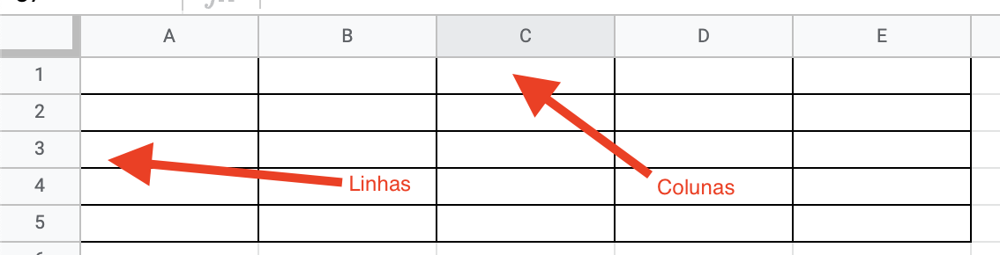

# Questionário

___

## **Perguntas Teste 1:**

Observe o código abaixo:

```python

# Imprime um número
# print(123)
 
"""
Estou adorando Python
"""
print('Agora sou dev.')
#
O que # (cerquilha) faz?
```

* ( ) Adiciona um item na lista.
* ( ) Imprime um valor na tela.
* ( ) Nada.
* (x) Faz o interpretador do Python ignorar o que vier após (comenta).
* ( ) Faz o interpretador do Python exibir o que vier após (imprimir).

Pergunta 2:
Observe o código abaixo:

```python
# Imprime um número
# print(123) 
""" Estou adorando Python """
print('Agora sou dev.')
#
```

O que você acha que será exibido na tela?

Dica: na dúvida, copie e cole o código no seu editor.

* (x) Agora sou dev.
* ( ) Imprimir um número.
* ( ) Estou adorando Python.

Pergunta 3:
Observe o trecho de código:

```python
"""
Estou adorando Python
"""
```

Escolha a opção correta!

* (x) Isso não é um comentário.
* ( ) Isso é um comentário.
* ( ) Isso não exite em Python.
* ( ) Nenhuma alternativa está correta.

___

## **Perguntas Teste 2:**

___

Pergunta 1:
Considerando o código abaixo:

```python
# Ei!
Print('Python')
```

O que seria exibido na tela?

* ( ) Python.
* ( ) Ei!
* (x) Um erro.

Pergunta 2:
Qual código exibiria o texto a seguir:

1. Explícito-é-melhor-que-implícito.
2. Simples-é-melhor-que-complexo.

Na dúvida, copie e cole o código no seu editor.

* (x)

```python
        print('Explícito' , 'é', 'melhor-que-implícito.', sep='-')
        print('Simples', 'é', 'melhor-que-complexo' sep='-' )
```

* ( )

```python
        print('Explícito' , 'é', 'melhor-que-implícito.', end='-')
        print('Simples', 'é', 'melhor-que-complexo' end='-' )
```

* ( )

```python
        print('Explícito' , 'é', 'melhor-que-implícito.')
        print('Simples', 'é', 'melhor-que-complexo')
```

Pergunta 3:
Todas as linguagens de programação têm características relacionadas com seus tipos de dados. Dentre essas características temos: tipagem estática, tipagem dinâmica, tipagem forte e tipagem fraca.

O Python se enquadra em duas dessas características. Quais são elas?

* ( ) Tipagem estática e dinâmica.
* ( ) Tipagem dinâmica e fraca.
* (x) Tipagem dinâmica e forte.
* ( ) Tipagem forte e fraca.

Pergunta 4:
O que significa tipagem dinâmica?

* (x) Que o tipo pode ser atribuído dinamicamente pelo Python.
* ( ) Que eu devo informar o tipo ao Python.
* ( ) que o Python não usa tipos.
* ( ) Nenhum alternativa.

Pergunta 5:
Strings são textos dentro de aspas. Podemos usar aspas simples ou duplas.

O que será exibido na tela se eu usar a string a seguir:

```python
print('Explícito', 'é', 'melhor " do que implícito')
```

* (x) Explícito é melhor " do que implícito.
* ( ) Um erro.
* ( ) Nada.

___

## **Perguntas Teste 3:**

___

Pergunta 1:
Qual o tipo de dado dos argumentos dentro da função print a seguir:

```python
print(11, 1.1, True)
```

* ( ) bool, int, float.
* ( ) float, int, bool.
* (x) int, float, bool.
* ( ) Nenhum alternativa está correta.

Pergunta 2:
Qual caractere é usado para separar as casas decimais em números de ponto flutuante?

* ( ) A vírgula.
* ( ) Espaço.
* ( ) Dois pontos.
* (x) Ponto.
* ( ) Ponto e vírgula.

Pergunta 3:
Considere a frase:

Se eu adicionar um sinal de menos (-) à esquerda de um número sem sinal, em Python esse número (que era positivo) se tornaria negativo! Ex.: 10 e -10.

* (x) Essa frase está correta.
* ( ) A frase está incorreta.
* ( ) Python não suporta números negativos.
* ( ) Apenas o tipo float pode ser negativo.

Pergunta 4:
Qual o valor usado para o tipo de dados boolean verdadeiro em Python?

* ( ) 1.
* ( ) true.
* ( ) False.
* (x) True.

Pergunta 5:
O tipo de dado bool representa apenas dois valores na programação: Sim e Não (Verdadeiro e Falso).

Expressões com dois sinais de igual (==), conferem se um valor é igual a outro valor e se eles são do mesmo tipo.

O que o código abaixo retornaria?

```python
print(10 == 10)
```

* (x) True.
* ( ) False.
* ( ) 0.
* ( ) 20.
* ( ) Nenhuma das alternativas.

___

## **Perguntas Teste 4:**

___

Pergunta 1:
Qual caractere é utilizado para criar comentários no seu código?

* ( ) //
* (x) #
* ( ) """e"""
* ( ) '''e'''
* ( ) Nenhuma acima

Pergunta 2:
O que o código abaixo faz?

`print('"Já sei!"')`

* (x) Mostra: "Já sei!" na tela.
* ( ) Mostra: 'Já sei!' na tela.
* ( ) Mostra: Já sei! na tela.
* ( ) Não faz nada.

Pergunta 3:
Quais os tipos de dados do trecho de código a seguir (na ordem):

```python
nome = "Luiz"
idade = 23
casado = True
altura = 1.80
```

* ( ) str, bool, float, int.
* (x) str, int, bool, float.
* ( ) str, float, bool, int.
* ( ) int, bool, str, float.
* ( ) Nenhuma opção.

Pergunta 4:
O que o código abaixo exibe?

```python
nome = "Luiz"
idade = 23
formato = '{1} tem {0} anos'
print(formato.format(nome, idade))
```

* ( ) Luiz tem 23 anos.
* (x) 23 tem Luiz anos.
* ( ) Formato.format(nome,idade).
* ( ) Nenhuma opção.

Pergunta 5:
O que o código abaixo exibe?

```python
nome = "Luiz"
idade = 23
formato = '{n} tem {i} anos'
print(formato.format(n=nome, i=idade))
```

* (x) Luiz tem 23 anos.
* ( ) 23 tem Luiz anos.
* ( ) um erro.
* ( ) Nenhuma opção.

Pergunta 6:
Qual o valor da variável "formato" no código abaixo?

```python
nome = "Luiz"
idade = 23
formato = f'{nome} tem {idade:.2f} anos'
```

* ( ) Luiz tem 23 anos.
* (x) Luiz tem 23.00 anos.
* ( ) Luiz tem 23.0 anos.
* ( ) 23 tem Luiz anos.

Pergunta 7:
Qual o resultado da expressão abaixo (o valor de resultado):

```python
numero_1 = 10
numero_2 = 20
resultado = numero_1 * numero_2
print(resultado)
```

* ( ) 100.
* ( ) 30.
* (x) 200.
* ( ) 2000.

Pergunta 8:
Escolha a frase **INCORRETA**

* ( ) + fas adição para int e float; também faz concatenação de duas strs.
* ( ) * faz a multiplicação entre int e float; também faz a replicação quando usando um int e str.
* (x) + faz adição para int e float; também faz concatenação entre int e str.
* ( ) / faz a divisão e sempre retorna um número de ponto flutuante.

Pergunta 9:
Como saber se um número é par ou ímpar?

* ( ) Não tem como. 
* (x) Da pra saber se um número é divisível por 2 usando resto da divisão (%).
* ( ) Da pra saber se um número é divisível por 2 usando a função format.
* ( ) Da pra saber se um número é divisível por 2 usando o f - strings.
* ( ) Da pra saber se um número é divisível por 2 usando as chaves { e }.

Pergunta 10:
Os operadores % (sinal de porcentagem) e ** (dois asteriscos) fazem:

* ( ) Porcentagem e potenciação.
* (x) Resto da divisão e potenciação.
* ( ) Resto da divisão e multiplicação.
* ( ) Porcentagem e multiplicação.

Pergunta 11:
É correto afirmar que Python é uma linguagem de tipagem dinâmica e forte?

* (x) Sim
* ( ) Não
* ( ) Depende

___

## **Perguntas Teste 5:**

___

Pergunta 1:
Considerando o código a seguir:

```python
if 0 and 1:
    print(True and 1)
```

O que será exibido na saída (tela)?

* ( ) 1.
* ( ) True.
* (x) Nada.
* ( ) True and 1.

Pergunta 2:
Considerando o código a seguir:

```python
if 1 and 1:
    print(True and 1 and False)
```

O que será exibido na tela?

* (x) False.
* ( ) 1.
* ( ) True.

___

## **Perguntas Teste 6:**

___

Pergunta 1:
Qual o resultado do código abaixo?

```python
variavel_a = 1 or 0
variavel_b = 0 or 1
print(variavel_a, variavel_a)
```

* (x) 1 1
* ( ) 0 1
* ( ) 1 0
* ( ) 0 0

Pergunta 2:
Qual o resultado do código abaixo?

```python
nome = 'Maria Carmo'
 
if ' ' in nome:
    print(f'O nome {nome} tem espaços.')
else:
    print(f'O nome {nome} NÃO tem espaços.')
```

*( ) O nome Maria Carmo NÂO tem espaços.
*(x) O nome Maria Carno tem espaços.

Pergunta 3:
É possível adicionar um if dentro de outro fazendo várias condições aninhadas. Com isso em mente, o que você acha que o código abaixo exibe na tela?

```python
numero = 10
 
if numero > 1:
    if numero > 2:
        if numero > 3:
            print('Número maior que 3')
        else:
            print('Número menor que 3')
    else:
        print('Número menor que 2')
else:
    print('Número menor que 1')
```

Na dúvida, copie ou escreva o código em seu editor.

* ( ) Número menor que 2.
* ( ) Número menor que 3.
* (x) Número maior que 3.
* ( ) Número menor que 1.

___

## **Perguntas Teste 7:**

___

Pergunta 1:
Qual o nome dado a um laço de repetição que roda eternamente na programação?

Ex.:

```python
while True:
    ...
```

* ( ) Laço de repetição.
* ( ) Cowboy's Iasso.
* (x) Loop infinito.
* ( ) Loop finito.
* ( ) Laço sem fim.
  
  Pergunta 2:
O que o código abaixo exibiria na tela?

```python
start = 0
end = 10
while start < end:
    print(start)
    start += 1
```

* (x) 0 1 2 3 4 5 6 7 8 9.
* ( ) 0 1 2 3 4 5 6 7 8 9 10.
* ( ) Um erro.

Pergunta 3:
O que o código abaixo exibiria na tela?

```python
start = 0
end = 10
while start < end:
    start += 1
    print(start)
```

* ( ) 0 1 2 3 4 5 6 7 8 9.
* ( ) Um erro.
* (x) 0 1 2 3 4 5 6 7 8 9 10.

Pergunta 4:
É comum usar laços de repetição aninhados (while dentro de while) para repetir alguma coisa dentro de uma repetição existente.

Para tabelas, temos linhas e colunas; para cada linha, posso ter n colunas. Por exemplo: para uma tabela de 5 linhas e 5 colunas, isso significa que eu tenho 5 repetições de coluna dentro de cada repetição de linha.



Sabendo disso: o que o código a seguir apresentaria na tela?

```python
linhas = 2
colunas = 2
 
linha = 1
while linha <= linhas:
    coluna = 1
    while coluna <= colunas:
        print(linha, coluna)
        coluna += 1
    linha += 1
```

* (x)
    1   1
    1   2
    2   1
    2   2
* ( )
    1   1
    2   2
* ( )
    1   1
    1   1

___

## **Perguntas Teste 8:**

___

Pergunta 1:
Qual o trecho inicial usado para criar a função "falar"?

* (x) def falar.
* ( ) function falar.
* ( ) fala().
* ( ) falar = def
* ( ) Nenhuma das opções.

Pergunta 2:
Por qual motivo devo criar funções?

* ( ) Para criar objetos em vários locais.
* (x) Para ter a possibilidade de replicar trechos em vários locais diferentes.
* ( ) Para criar a função Print em vários locais diferentes.

Pergunta 3:
Em qual momento uma função será executada?

* ( ) Ao digitar o nome da função + colchetes.
* (x) Ao digitar o nome da função + parênteses.
* ( ) Ao digitar o nome da função + sem parênteses.

Pergunta 4:
Funções podem usar parâmetros para receber valores. Parâmetro é o nome da "variável" dentro dos parênteses, argumento é o valor passado para o parâmetro no momento da execução da função.

Sabendo disso, o código a seguir exibe o que na tela?

```python
def multiplo_de(numero, multiplo):
    resultado = numero % multiplo == 0
    print(f'{numero} é múltiplo de {multiplo}?', end=' ')
    print(resultado)
 
 
multiplo_de(16, 8)
multiplo_de(15, 3)
multiplo_de(10, 2)
```

* ( )
    ->  16 é múltiplo de 8? False
    ->  15 é múltiplo de 3? False
    ->  10 é múltiplo de 2? False

* ( )
    ->  8 é múltiplo de 16? True
    ->  3 é múltiplo de 15? True
    ->  2 é múltiplo de 10? True

* (x)
    ->  16 é múltiplo de 8? True
    ->  15 é múltiplo de 3? True
    ->  10 é múltiplo de 2? True

___

## **Perguntas Teste 9:**

___

Pergunta 1:
Quando falamos em argumentos, estamos falando sobre os valores passados para as funções no ato da sua execução. Existem argumentos nomeados e argumentos posicionais.

Argumentos nomeados recebem o nome do parâmetro antes do valor, argumentos posicionais recebem apenas o valor para preencher o parâmetro na ordem.

Por qual motivo você usaria argumentos nomeados?

* ( ) É interessante usar argumentos nomeados para manter a ordem no envio de valores para a função.
* (x) É interessante usar argumentos nomeados poder alterar a ordem no envio para a função.
* ( ) É má prática de programação usar argumentos nomeados.
* ( ) Nenhuma opção.
  
Pergunta 2:
A regra é clara:

* (x) Você não pode enviar argumentos posicionais após argumentos nomeados.
* ( ) Você não pode enviar argumentos nomeados após argumentos posicionais.

___

## **Perguntas Teste 10:**

___

Pergunta 1:
É possível enviar valores padrão para parâmetros de função. Em qual momento esse valor é definido?

* (x) Na definição da função:

```python
    
    def funcao(a, b, c='Padrão'):
        ...

```

* ( ) Na execução da função:

```python
    
    def funcao(a, b, c):
        ...

    
    funcao(1, 2 c='Padrão')
```

___

## **Perguntas Teste 11:**

___

Pergunta 1:
Escopo é algo muito usado na computação para delimitar e proteger determinadas partes do código. Em Python, o único escopo que vimos até então foi o escopo de funções (existem outros).

Ao definir variáveis e outros nomes dentro de escopo de funções em Python, é correto afirmar que:

* (x) Esses nomes não estarão disponíveis fora do escopo da função (no escopo externo), mas estarão disponíveis em escopos mais internos (outras funções internas)
* ( ) Esses nomes não estarão disponíveis fora do escopo da função (no escopo externo), mas não estarão disponíveis em escopos mais internos (outras funções internas)
* ( ) Esses nomes não estarão disponíveis fora do escopo da função (no escopo externo), também não estarão disponíveis em escopos mais internos (outras funções internas).

Pergunta 2:
É possível alterar variáveis de escopo externo em escopo interno?

* (x) Sim, com a palavra global.
* ( ) Não.

Pergunta 3:
Em situações normais (sem uso da palavra global), definir duas variáveis de mesmo nome em escopo externo e interno:

* ( ) Gera erros.
* ( ) Define a mesma variáveis em todos locais do código.
* ( ) Não é possível fazer isso.
* (x) Define duas variáveis de mesmo nome em escopos separados. Uma não afetaria a outra.

